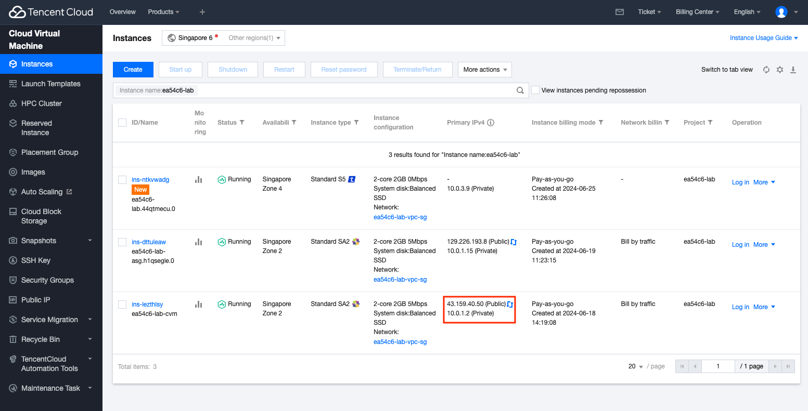
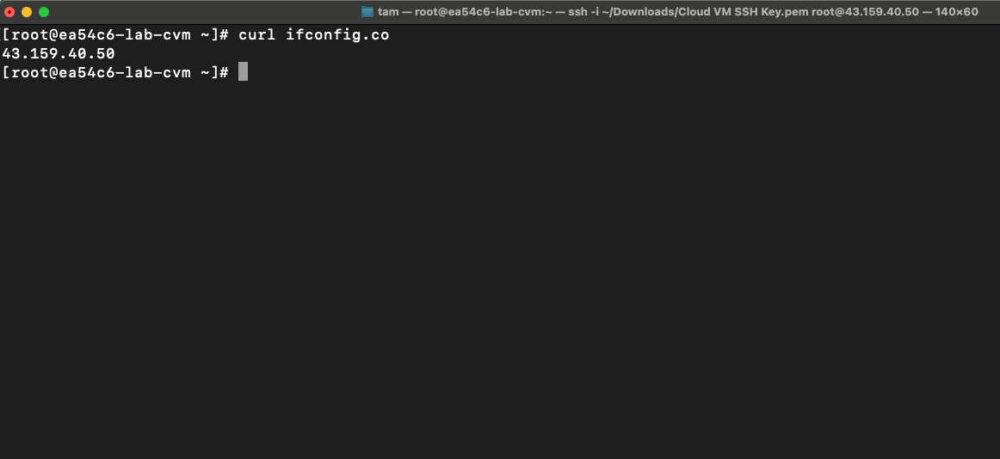
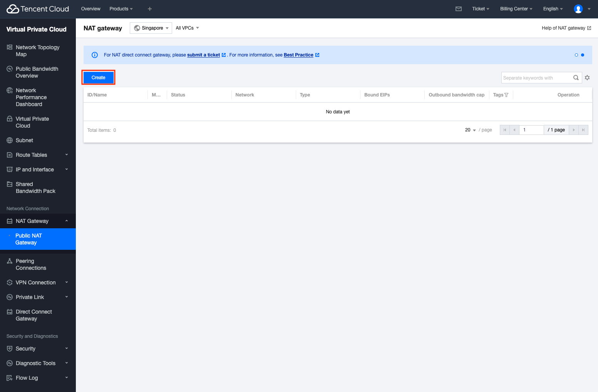
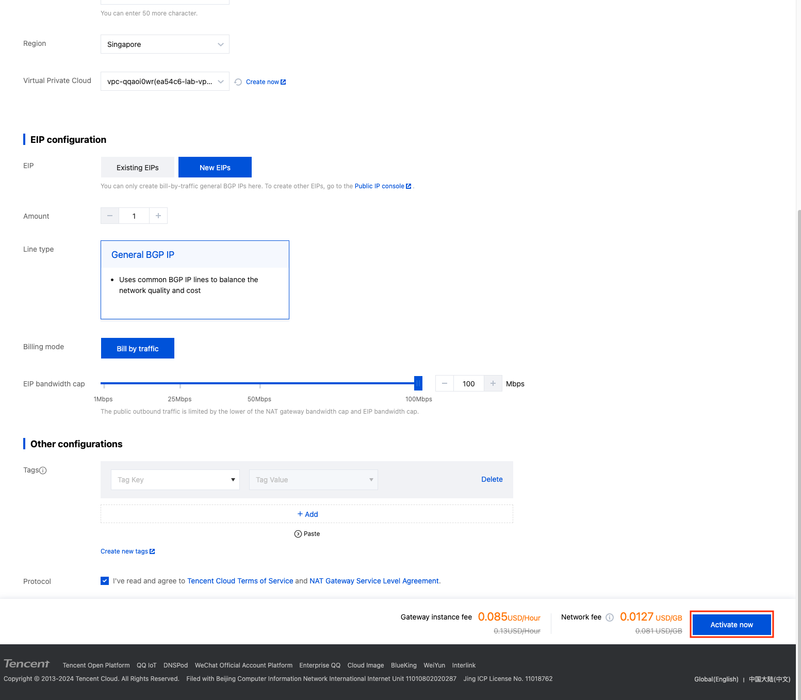
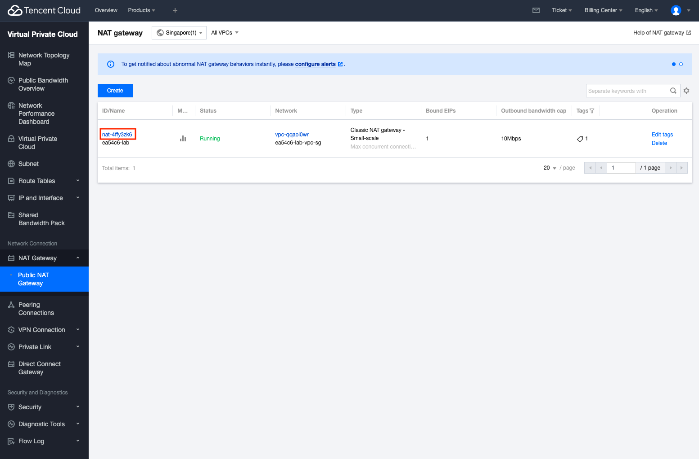
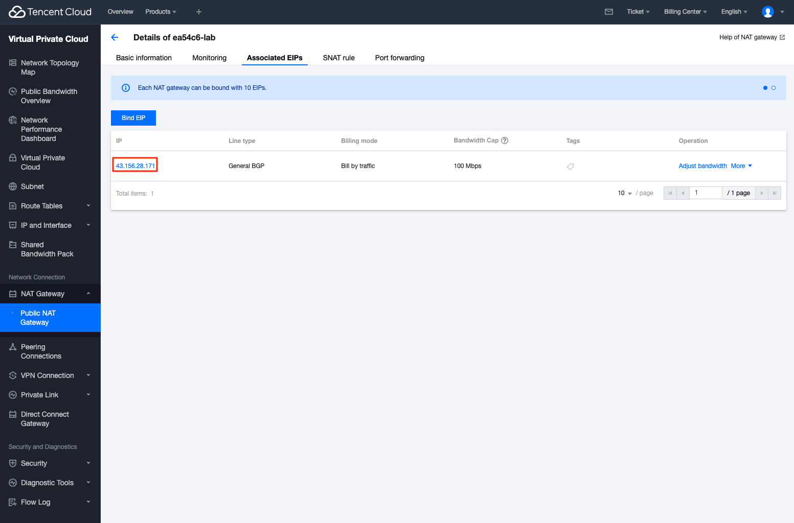
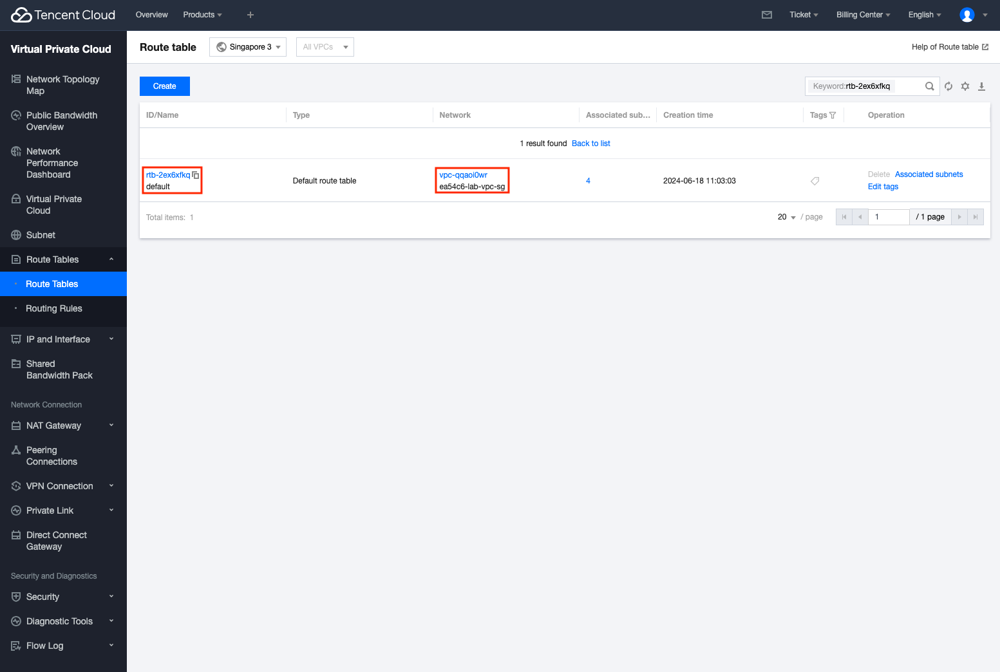
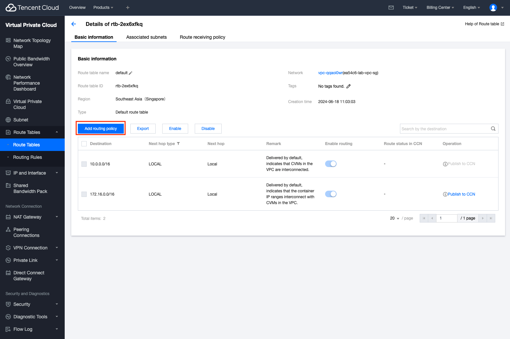
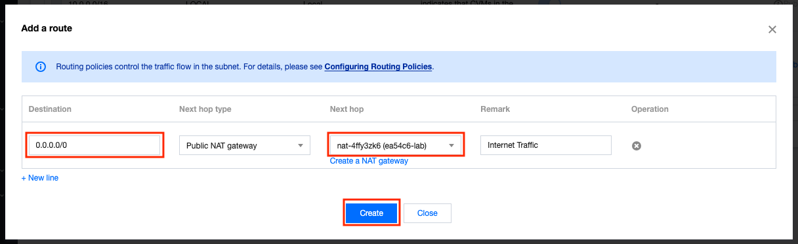

## Overview

In this section, we will be provisioning/configuring the following:
1. Purpose of NAT Gateway
2. Provisioning NAT Gateway
3. Configuring Route Table of Virtual Private Cloud
4. Testing NAT Gateway Public IP

In this section, we'll be provisioning an NAT gateway to proxy our traffic that is going from out internal network to the internet.

## 1. Purpose of NAT Gateway

In a typical production scenario, we usually would avoid attach Public IPs to internal parts of the Infrastructure. However, we can see below that from our previous deployments, some of our CVMs have a Public IP Address attached to them.

If we login to one of the CVMs to check our Public IP with the command `curl ifconfig.co`, we will see that our Public IP is the same as the on shown in the CVM Web console before.

What this also means is when we're making any request to public services on the internet, we're using the IP Address attached to each individual CVM Instance.

Although this might seem like a small problem, but in hind sight, this effectively exposes an additional attack surface to the internal service through its Public IP Address.

> Recall that if we detach the Public IP from the CVM Instance, this means the CVM Instance won't be able to communicate on the internet as it doesn't have a Public IP Address anymore.

In the next step, we will find out how we can avoid attaching Public IP Addresses to each of our services while still having internet access.

## 2. Provisioning NAT Gateway

In this section, we'll be showing how you can provision a NAT Gateway so that all traffic to the Public Internet uses the IP Addresses provided by the NAT Gateway, thereby decreasing the attack surfacing and giving us more control of the Public IPs we're using to call external services.

Head to the NAT Gateway product page and click on the **Create** button

Configure your NAT Gateway as desired, make sure to select the VPC that your infrastructure are all provisioned on currently.

After you have confirmed the configuration are as desired, click on the **Activate Now** button to create the NAT Gateway

You should now be able to see the NAT Gateway you've just provisioned. Click on the NAT Gateway to get more details about it.

Navigate to the Associated EIPs tab and you'll see a Public IP Address in the records. These are the Public IP Addresses the NAT Gateway will use when routing traffic to the Public Internet.

We'll now configure the NAT Gateway on the VPC's Route Table, click on the **Route Tables** tab and select **Route Tables**

## 3. Configuring Route Table of Virtual Private Cloud
Look for the route table associated with the VPC your infrastructure are provisioned on. For my example, my route table is called `default`

Once you've found the Route Table, click on it to configure it

Currently, we can see that we have 2 different routing policies in the Route Table, one for the CIDR Address of the VPC and another for the CIDR Address of the Tencent Kubernetes Engine's Private Subnet.

We'll now add a routing policy for the NAT Gateway, click on the **Add routing policy** button to add a new routing policy

Enter the following for the fields, be sure to select the NAT Gateway we've just created and ensure that the destination is set to `0.0.0.0/0`

What this routing policy means is, for all traffic that does not match the `10.0.0.0/16` or `172.16.0.0/16` CIDR, route it to the NAT Gateway.

Click on **Confirm** to create the route

We should now see the route we've just created in the Route Table

## 4. Testing NAT Gateway Public IP

Now head back to the frontend CVM instance and run the command to check your Public IP again. 

You can see that our Public IP has changed to the one attached to the NAT Gateway instead of the on attached to the CVM

Since we're now able to make request to the public internet now, we can remove all the External IPs associated with our instances.
> Note that we can't release the EIP associated with our CVM for the frontend as it uses its IP for the CNAME bindings of the domain

