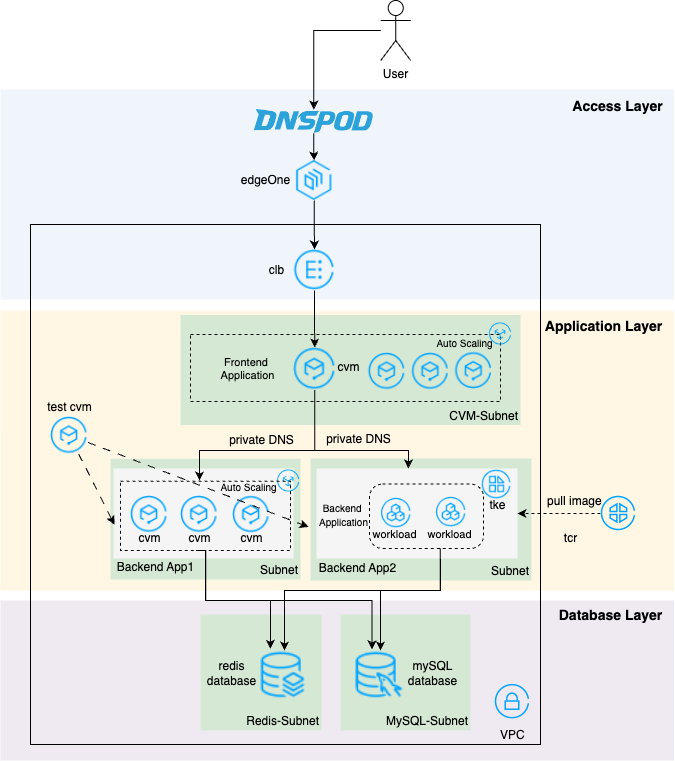
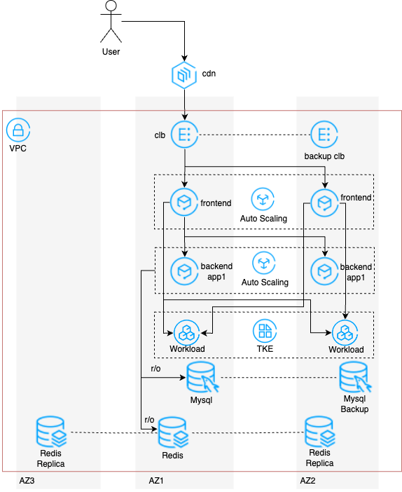

# 00 参数定义


以下参数在各步骤中生成，后续脚本在使用时需要将其值作为输入参数

> 规定： 这些参数都通过 export A=a 的形式定义，后续脚本中直接使用
>
> 因此注意将其值 export 入当前的会话中才能生效


| 参数名称           | 参数来源                           | 备注                      |
| ------------------ | ---------------------------------- | ------------------------- |
| SERVER_DOMAIN      | 预定义 app1.tamlab.net             | App1 服务域名             |
| SERVER_IP          | APP1 CVM IP address                | App1 云主机公网           |
| SERVER_PORT        | 预定义 80                          | App1 服务端口             |
| DATABASE_ENDPOINT  | CDB IP 地址                        | mysql 数据库地址          |
| DATABASE_PORT      | 预定义 3306                        | mysql 数据库端口          |
| DATABASE_USERNAME  | 预定义 root                        | mysql数据库用户名         |
| DATABASE_PASSWORD  | 预定义 P@ssw0rd                    | mysql数据库密码           |
| REDIS_HOST         | Redis IP 地址                      | redis数据库连接串         |
| REDIS_PORT         | 预定义 6379                        | redis数据库端口           |
| REDIS_PASSWORD     | 预定义 P@ssw0rd                    | redis数据库密码           |
| APP2_SERVER_DOMAIN | 预定义 app2.tamlab.net             | App2 服务域名             |
| FE_HTTP_IP         | Frontend HTTP CVM IP address       | HTTP 前端云主机公网       |
| FE_HTTPS_IP        | Frontend HTTP/HTTPS CVM IP address | HTTP/HTTPS 前端云主机公网 |
| FE_AS_IP           | Frontend AS CLB IP address         | 前端负载均衡公网          |
| FE_CDN_DOMAIN      | 预定义 fe.tamleb.net               | FE 接 EO 域名             |
|                    |                                    |                           |
|                    |                                    |                           |
|                    |                                    |                           |
|                    |                                    |                           |
|                    |                                    |                           |


```bash
export SERVER_DOMAIN=app1.tamlab.net
export SERVER_PORT=80
export DATABASE_ENDPOINT=<DATABASE_ENDPOINT>
export DATABASE_PORT=3306
export DATABASE_USERNAME=root
export DATABASE_PASSWORD=P@ssw0rd
export REDIS_HOST=<REDIS_HOST>
export REDIS_PORT=6379
export REDIS_PASSWORD=P@ssw0rd
export APP2_SERVER_DOMAIN=app2.tamlab.net
export FE_HTTP_IP=<FE_HTTP_IP>
export FE_HTTPS_IP=<FE_HTTPS_IP>
export FE_AS_IP=<FE_AS_IP>
export FE_CDN_DOMAIN=fe.tamleb.net
```

## 部署架构图



AZ分布部署架构图


