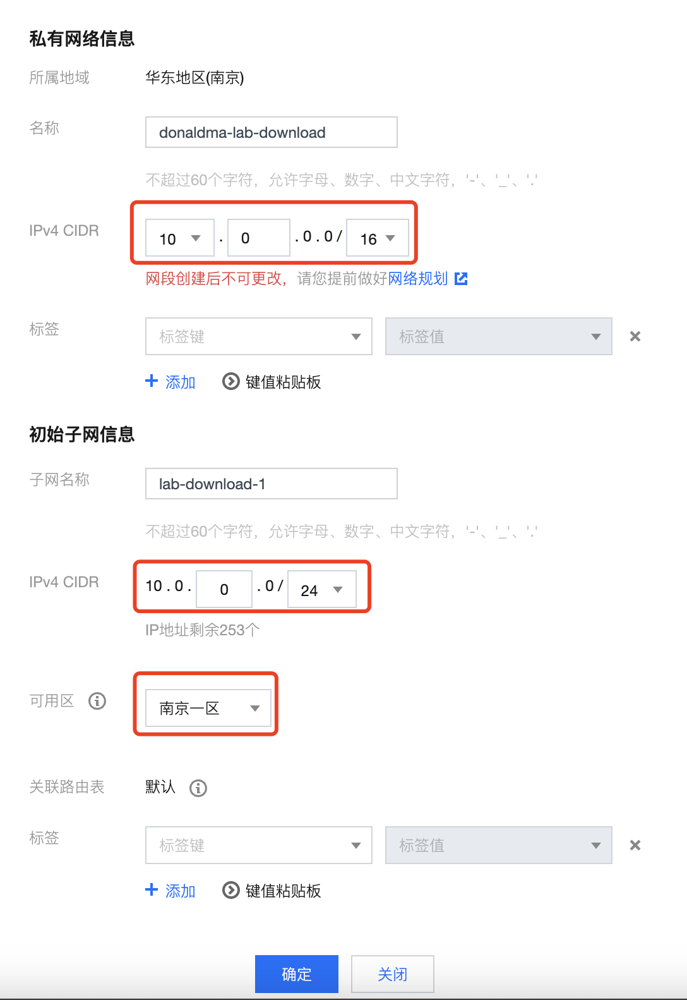
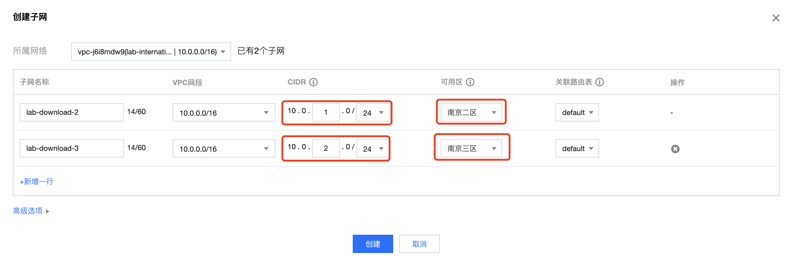
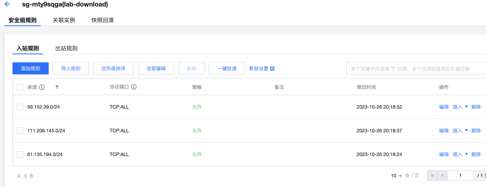
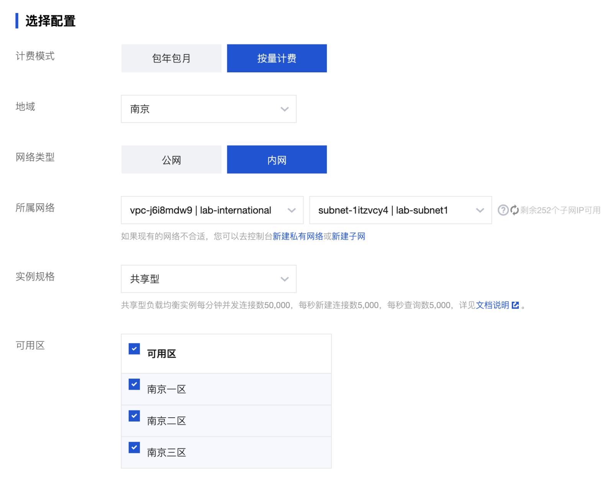
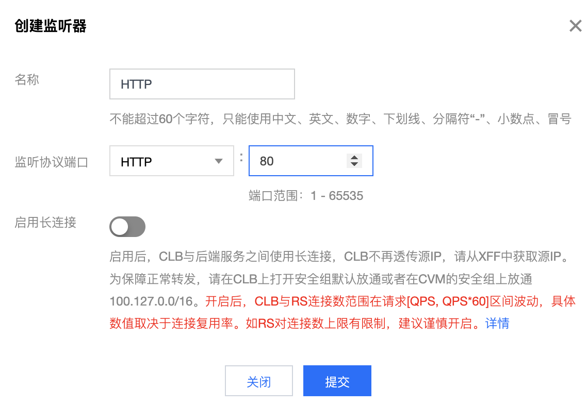
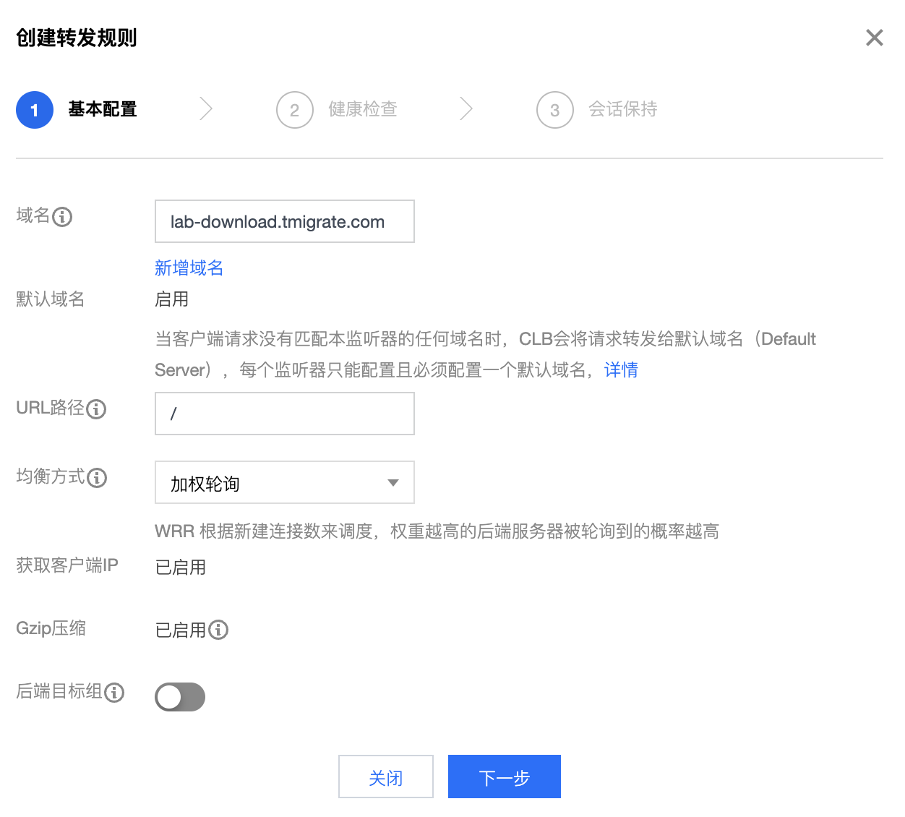

# 01 基础部署


## 部署网络

在VPC产品页创建私有网络，关注以下参数

| 参数        | 说明                                                         |
| ----------- | ------------------------------------------------------------ |
| VPC 名称    | 最好起一个唯一的名称，腾讯云允许VPC重名，重名的VPC在使用API时会造成混乱 |
| VPC CIDR    | 作为 demo，这个不需要重点关注，作为项目设计，必须严格遵循客户的网段标准进行设置 |
| Subnet CIDR | 控制台创建VPC时必须带一个初始子网，注意不要把整个VPC网段占尽 |
| Subnet AZ   | 选择一个可用区                                               |








## 创建安全组规则

### 入站规则

```bash
常用公司出口网段及内网网段
61.135.194.0/24
111.206.145.0/24
59.152.39.0/24
10.0.0.0/16
Terraform 格式配置
["ACCEPT#61.135.194.0/24#ALL#TCP",
"ACCEPT#111.206.145.0/24#ALL#TCP",
"ACCEPT#59.152.39.0/24#ALL#TCP",
"ACCEPT#10.0.0.0/16#ALL#TCP",
]
```


### 出站规则

一般都允许即可



## 部署负载均衡

在CLB页面创建负载均衡，主要关注以下参数

| 参数     | 说明                                  |
| -------- | ------------------------------------- |
| 计费模式 | 测试用例一般使用按量计费              |
| 网络类型 | 本用例需要一个内网类型CLB             |
| 所属网络 | 选择第一步中创建的VPC，选择第一个子网 |
| 可用区   | 勾选全部可用区                        |



在创建出来的CLB详情页，为CLB创建 HTTP listener 并配置一条转发规则

| 参数            | 说明                  |
| --------------- |---------------------|
| 监听端口        | HTTP:80             |
| 转发规则 - 域名 | {yourID}.tamlab.net |
| URL路径         | /                   |





### 输出变量

> ```
> export FE_AS_IP=<CLB 公网IP>
> ```

