# 02 Frontend 部署


## 云主机部署 HTTP 服务

#### 创建云主机

在CVM页面创建一个云主机，关注以下参数

| 参数     | 说明                              |
| -------- | --------------------------------- |
| 计费模式 | 测试用例一般使用按量计费          |
| 所属网络 | 选择01中创建的VPC，选择第一个子网 |
| 可用区   | 选择第一个可用区即可              |
| 操作系统 | 官方镜像 CentOS 7.9               |
| 安全组   | 选择刚创建的安全组                |
| 公网IP   | 免费分配独立公网IP，按流量计费    |
| 登录方式 | 密码，设置一个密码                |
| 主机名   | lab-frontend                      |

#### 通过控制台免密登录云主机

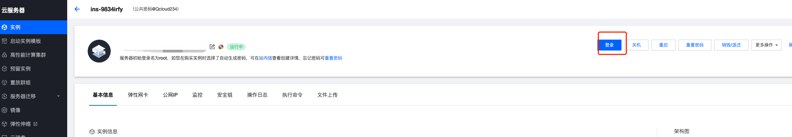


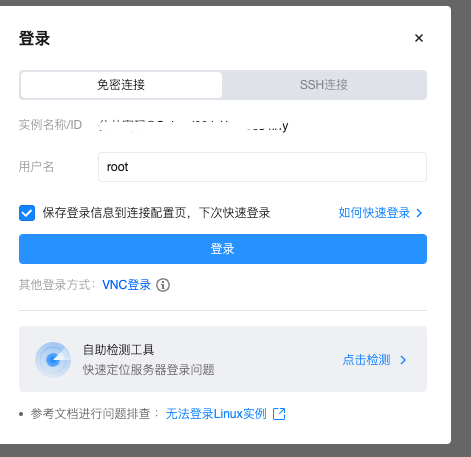


#### 安装 Nginx 

```bash
$ yum -y install nginx
```

#### 下载静态文件

```bash
$ mkdir -p /usr/share/nginx/html
$ wget "https://tcmigrate-1251956900.cos.ap-nanjing.myqcloud.com/course/lab/2024Q2/packages/build.tgz"
$ tar -zxf build.tgz --strip-components 1 -C /usr/share/nginx/html
```

#### 配置 Nginx 

```bash
cat > /etc/nginx/conf.d/default.conf <<EOF
server {
  listen 80; # Listen on port 80 (adjust if needed)

  # Access log configuration (adjust paths as needed)
  access_log /var/log/nginx/access.log combined;
  error_log /var/log/nginx/error.log;

  root /usr/share/nginx/html; # Adjust if your build output is in a different location

  location / {
    # try_files $uri $uri/ /index.html?$args;
    index index.html index.htm; # Add other fallback options if needed
  }

  location ~* \.(?:css|js|png|jpg|jpeg|gif|svg|woff|woff2|ttf|eot)$ {
    # Serve static files directly without rewriting
    add_header Cache-Control 'max-age=31536000'; # Optional: Cache static assets for a year
    add_header Content-Type application/json; # Or appropriate content type based on file extension
    access_log off;
  }
}
EOF

```

#### 启动 Nginx

```bash
systemctl enable nginx
systemctl start nginx

```

#### 访问前端

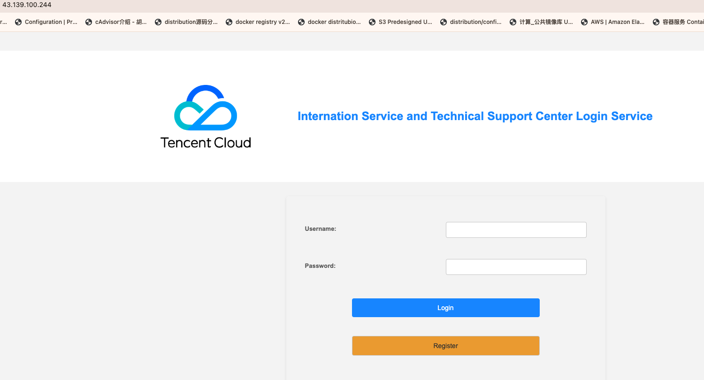


### 输出变量

> ```
> export FE_HTTP_IP=<CVM 公网IP>
> ```


## 云主机部署 HTTP/HTTPS 服务

#### 申请免费证书

https://console.tencentcloud.com/ssl/dsc/apply

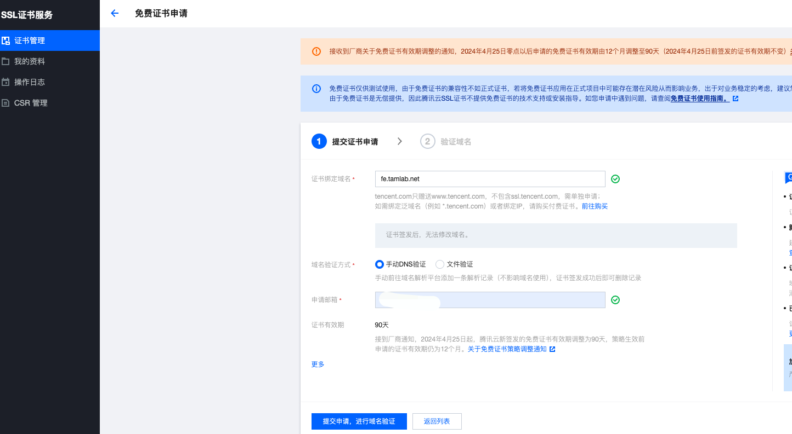


根据提示进行域名验证

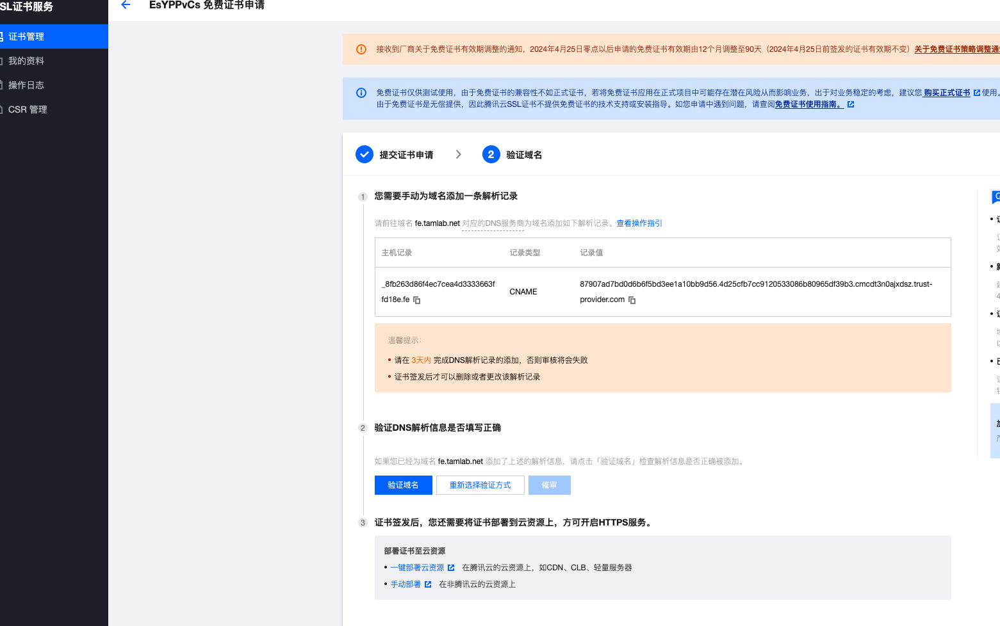

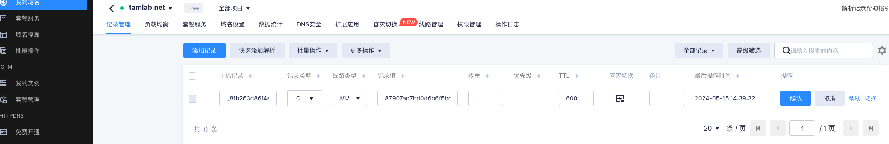


#### 等待证书审核

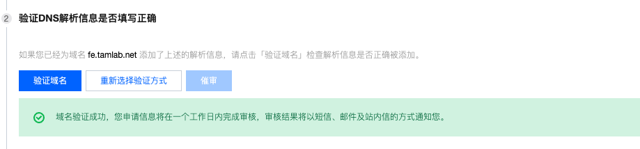


#### 下载证书


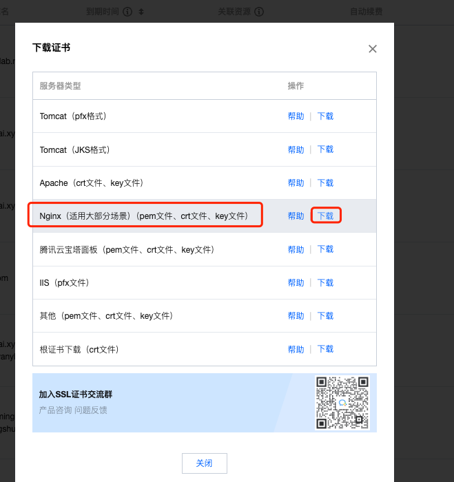

### 在 nginx 服务器上部署证书

将下载目录内的文件上传至 cvm 云主机 /usr/share/nginx/ 目录

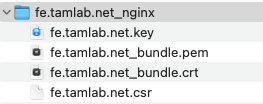


配置 nginx.conf

```bash
cat > /etc/nginx/conf.d/default.conf <<EOF
server {
  listen 80; # Listen on port 80 (adjust if needed)

  # Access log configuration (adjust paths as needed)
  access_log /var/log/nginx/access.log combined;
  error_log /var/log/nginx/error.log;

  root /usr/share/nginx/html; # Adjust if your build output is in a different location
  

  location / {
    try_files $uri $uri/ /index.html?$args;
    index index.html index.htm; # Add other fallback options if needed
  }

  location ~* \.(?:css|js|png|jpg|jpeg|gif|svg|woff|woff2|ttf|eot)$ {
    # Serve static files directly without rewriting
    add_header Cache-Control 'max-age=31536000'; # Optional: Cache static assets for a year
    add_header Content-Type application/json; # Or appropriate content type based on file extension
    access_log off;
  }
}
server {
  listen 443 ssl; 
  #请填写绑定证书的域名
  server_name fe.rebirthmonkey.com; 
  #请填写证书文件的相对路径或绝对路径
  ssl_certificate /usr/share/nginx/cert/nginx.crt; 
  #请填写私钥文件的相对路径或绝对路径
  ssl_certificate_key /usr/share/nginx/cert/nginx.key; 
  ssl_session_timeout 5m;
  #请按照以下协议配置
  ssl_protocols TLSv1.2 TLSv1.3; 
  #请按照以下套件配置，配置加密套件，写法遵循 openssl 标准。
  ssl_ciphers ECDHE-RSA-AES128-GCM-SHA256:HIGH:!aNULL:!MD5:!RC4:!DHE; 
  ssl_prefer_server_ciphers on;


  # Access log configuration (adjust paths as needed)
  access_log /var/log/nginx/access.log combined;
  error_log /var/log/nginx/error.log;

  root /usr/share/nginx/html; # Adjust if your build output is in a different location
  
    location / {
        proxy_pass http://127.0.0.1:80;
        proxy_set_header Host $host;
        proxy_set_header X-Real-IP $remote_addr;
        proxy_set_header X-Forwarded-For $proxy_add_x_forwarded_for;
        proxy_set_header X-Forwarded-Proto https;
    }
}
EOF
```


#### 通过 https 进行访问

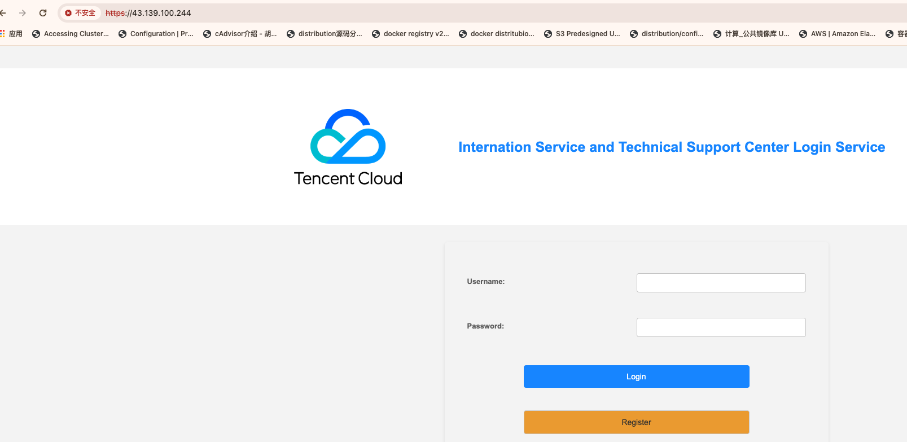

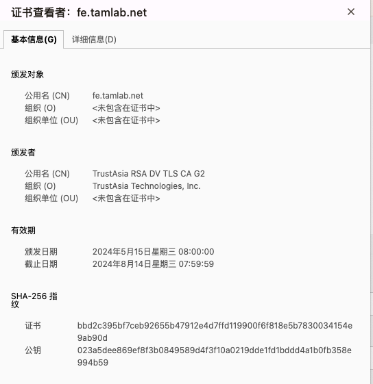


## 通过 AS 部署

### 部署弹性伸缩组

在AS产品页创建弹性伸缩启动配置和弹性伸缩组

a. 启动配置，关注以下参数

| 参数                | 说明                                              |
| ------------------- | ------------------------------------------------- |
| 名称                |                                                   |
| 计费模式            | demo 用按量计费或竞价实例均可，竞价实例有售罄风险 |
| 可用区              | 选择所有可用区                                    |
| 实例                | 一般选择 标准型SA2 1核1G或1核2G均可               |
| 镜像                | 公共镜像，CentOS 7.9 （启动脚本基于CentOS写的）   |
| 公网IP              | 不需要                                            |
| 安全组              | 选择上一步创建的安全组                            |
| 实例名称            |                                                   |
| 登录密码            | root 密码                                         |
| 高级设置-自定义数据 | 输入启动脚本                                      |


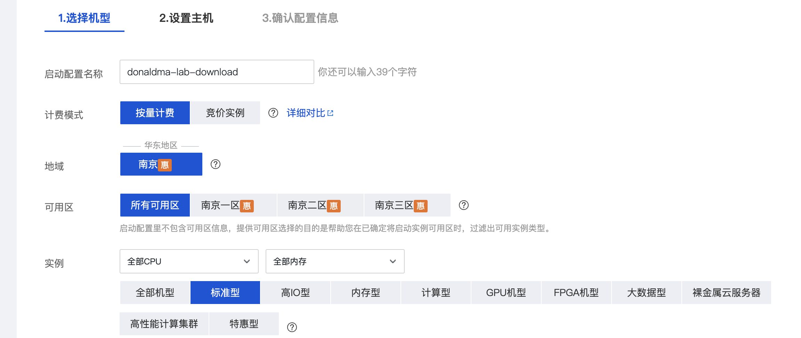


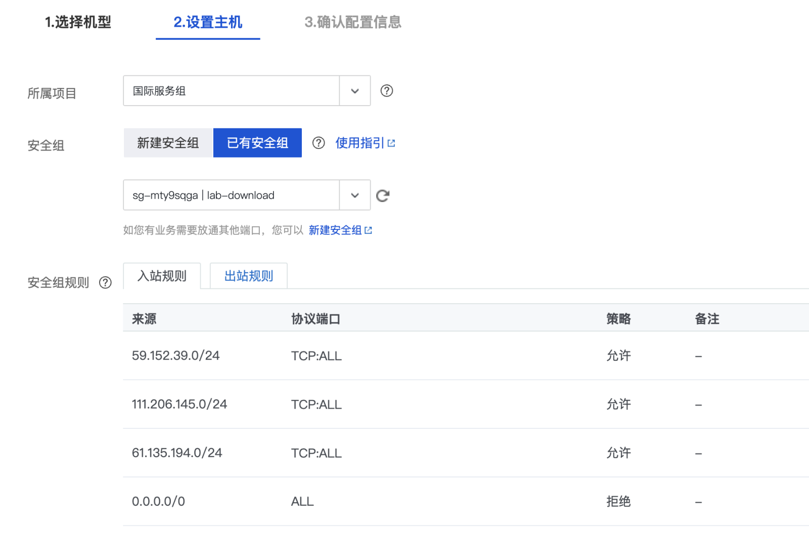

**注意**：上图中的“所属项目”最终并不会影响 CVM 的所属项目


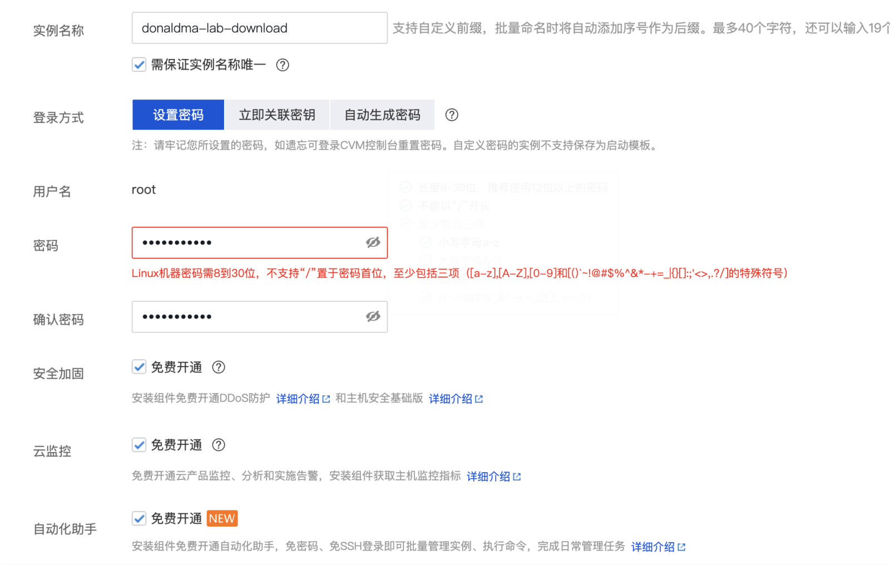

启动脚本

```bash
#!/bin/bash
yum -y install nginx
mkdir -p /usr/share/nginx/html
wget "https://tcmigrate-1251956900.cos.ap-nanjing.myqcloud.com/course/lab/2024Q2/packages/build.tgz"
tar -zxf build.tgz --strip-components 1 -C /usr/share/nginx/html
cat > /etc/nginx/conf.d/default.conf <<EOF
server {
  listen 80; # Listen on port 80 (adjust if needed)

  # Access log configuration (adjust paths as needed)
  access_log /var/log/nginx/access.log combined;
  error_log /var/log/nginx/error.log;

  root /usr/share/nginx/html; # Adjust if your build output is in a different location

  location / {
    # try_files $uri $uri/ /index.html?$args;
    index index.html index.htm; # Add other fallback options if needed
  }

  location ~* \.(?:css|js|png|jpg|jpeg|gif|svg|woff|woff2|ttf|eot)$ {
    # Serve static files directly without rewriting
    add_header Cache-Control 'max-age=31536000'; # Optional: Cache static assets for a year
    add_header Content-Type application/json; # Or appropriate content type based on file extension
    access_log off;
  }
}
EOF
systemctl enable nginx
systemctl start nginx
```

b. 创建伸缩组，关注以下参数

| 参数         | 说明                                                         |
| ------------ | ------------------------------------------------------------ |
| 名称         |                                                              |
| **所属项目** | 这里注意两点            1.     CVM将继承这个所属项目            2.     前端需要改进，目前只能先在左上角选择项目后再点击创建，才能选择到正确的项目组 |
| 最小伸缩数   | 1，弹缩不会小于这个数值                                      |
| 起始实例数   | 1                                                            |
| 最大伸缩数   | 3，弹缩不会大于这个数值                                      |
| 启动配置     | 选择上一步创建的启动配置                                     |
| 支持网络     | 选择第一步创建的VPC，并勾选所有子网                          |
| 负载均衡     | 选择上一步配置的负载均衡、监听器和规则                       |
| 实例端口     | 后端开启的是80端口                                           |
| 实例创建策略 | 多可用区打散，当实例数为3时，会均匀分散在三个子网里          |


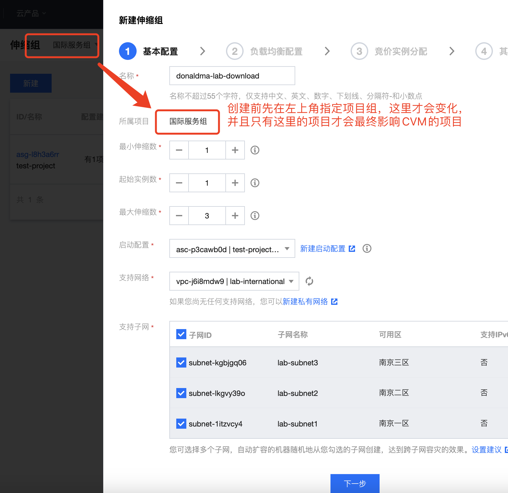

c. 配置弹性伸缩策略

在创建的弹性伸缩组详情页上点击“触发告警策略”

添加两条规则

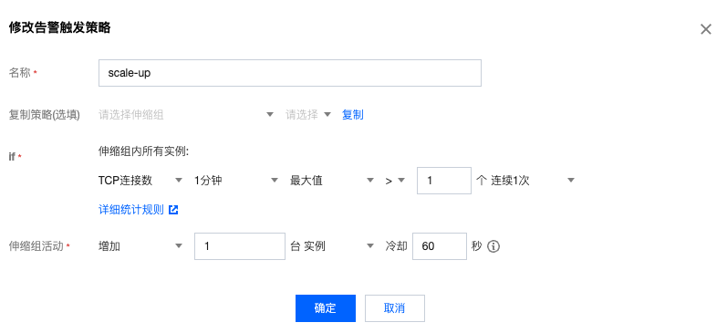

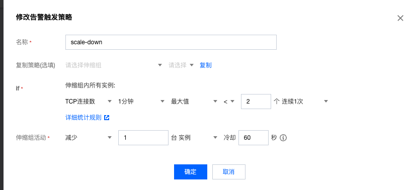


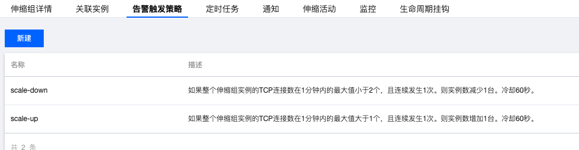


### 压测验证弹性伸缩

绑定 host  fe.tamlab.net 至 clb IP 地址

```bash
$ ab -c 30 -t 300 -n 30000 fe.tamlab.net
```

观察弹缩结果

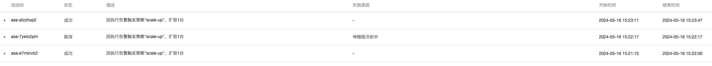