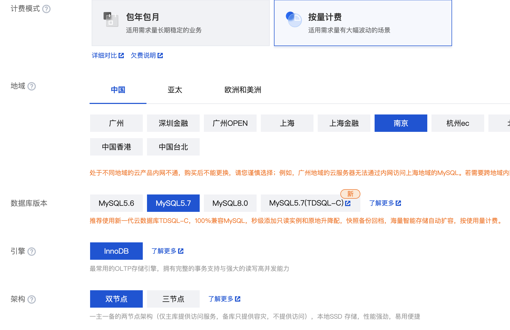
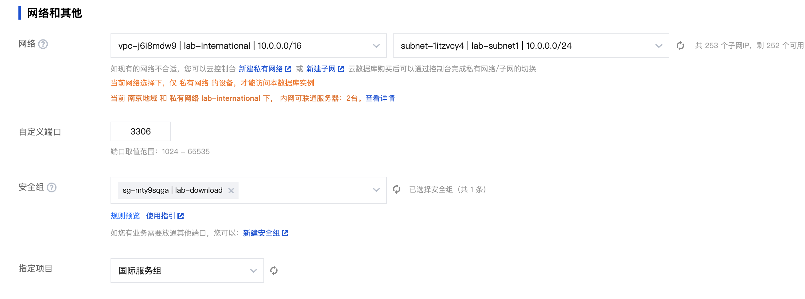

# 03 数据库部署


## **部署 CDB**

在CDB产品页面创建一个MySQL实例，关注以下参数


| 参数       | 说明                                             |
| ---------- | ------------------------------------------------ |
| 计费模式   | demo 使用按量计费                                |
| 数据库版本 | MySQL5.7                                         |
| 架构       | 使用双节点即可                                   |
| 主备可用区 | 注意为了实现容灾效果，要选择不同可用区           |
| 实例规格   | 内存不小于2000，硬盘不小于50，否则无法创建备节点 |
| 网络设置   | 选择第一步创建的VPC，选择第一个子网即可          |
| root密码   | 设置root密码，后面会用到  ${mysql_password}      |
| 实例IP地址 | 创建完成后从控制台读取，后面会用到 ${mysql_host} |






### 输出变量

> ```
> export DATABASE_ENDPOINT=<CDB 内网IP>
> ```

## 设置DB的Private DNS

@TODO madongdong


## **部署 Redis**

在Redis产品页创建 Redis实例，关注以下参数

| 参数             | 说明                                             |
| ---------------- | ------------------------------------------------ |
| 计费模式         | demo 使用按量计费                                |
| 架构             | 标准架构即可                                     |
| 内存容量         | 1GB即可，256M也行                                |
| 副本数量         | 1主2副本                                         |
| 启用多可用区部署 | 选三个可用区                                     |
| 网络设置         | 选择第一步创建的VPC，选择第一个子网即可          |
| 安全组           | 选择CVM的安全组即可                              |
| 设置密码         | 后面会用到 ${redis_password}                     |
| 实例IP地址       | 创建完成后从控制台读取，后面会用到 ${redis_host} |


### 输出变量

> ```
> export REDIS_HOST=<Redis 内网IP>
> ```


