# 06 CDN 部署


## 部署 TEO

#### **部署架构**

直接暴露公网方式，如 user1 路径所示

有 EdgeOne 保护的方式，如 user2 路径所示

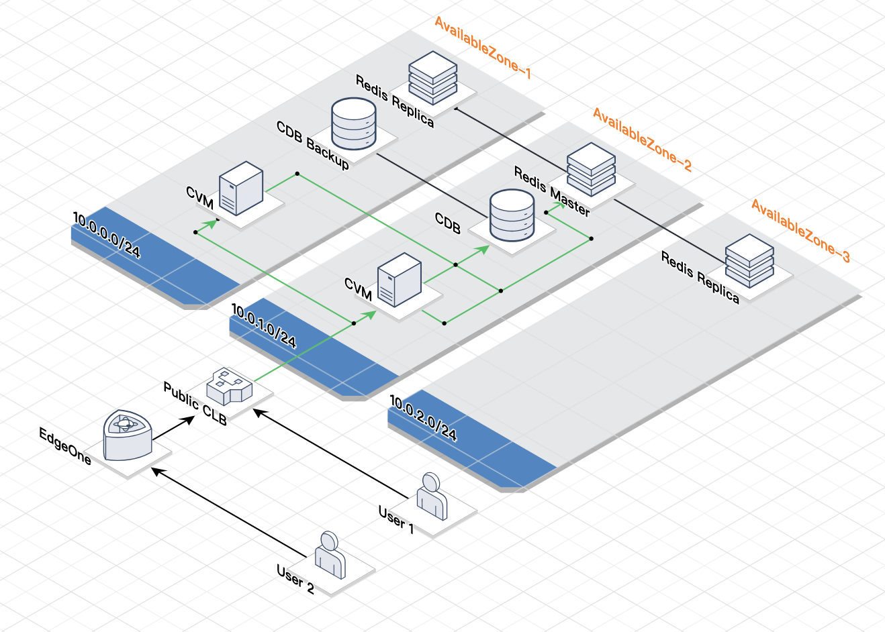


开启 User2 访问路径

| 域名  | www.tamlab.net                    |
| ----- |-----------------------------------|
| CNAME | www.tamlab.net.eo.dnse3.com. |


### 配置 TEO 进行动态加速

##### **TEO 添加站点**

在控制台 [登录 - 腾讯云](https://console.cloud.tencent.com/edgeone/zones/new/zone)

###### 添加 tamlab.net 站点 (如站点已存在可以跳过)

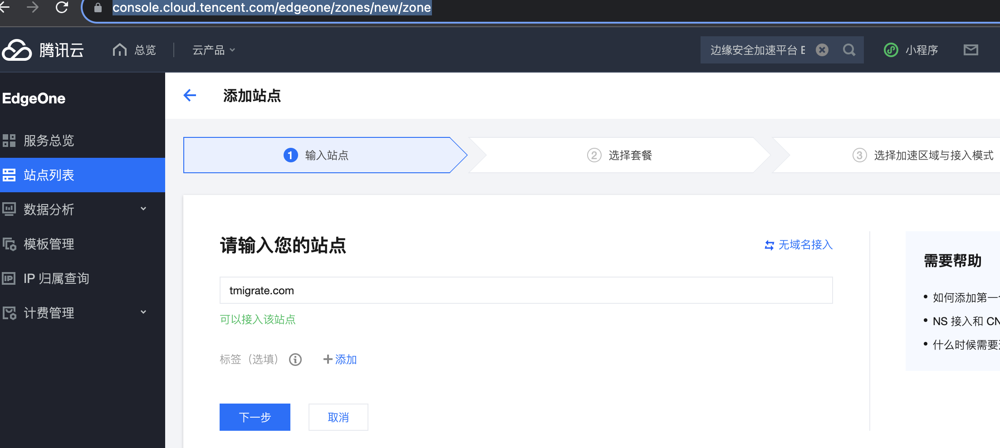

###### **选择已购买的套餐**

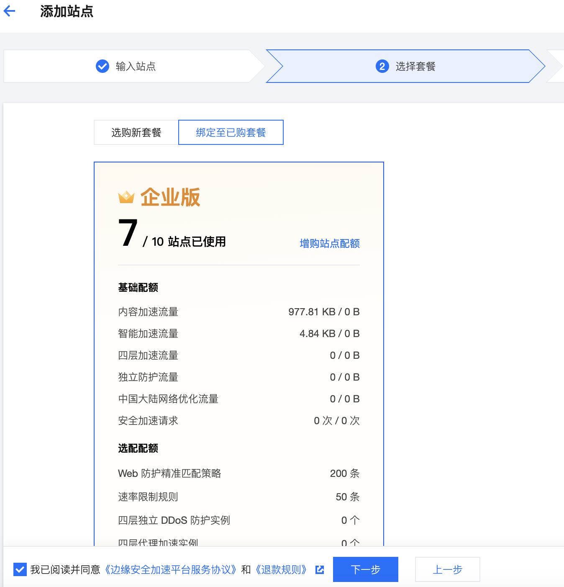

###### **选择中国大陆可用区，和CNAME接入方式**

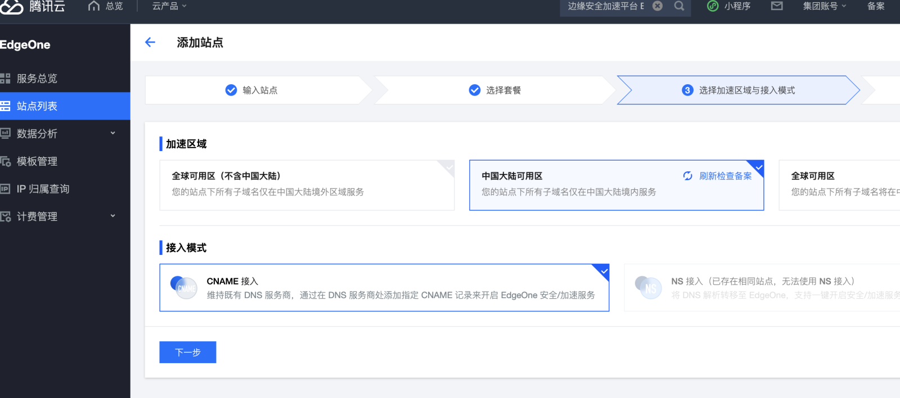

###### **在云解析加入归属权验证记录**

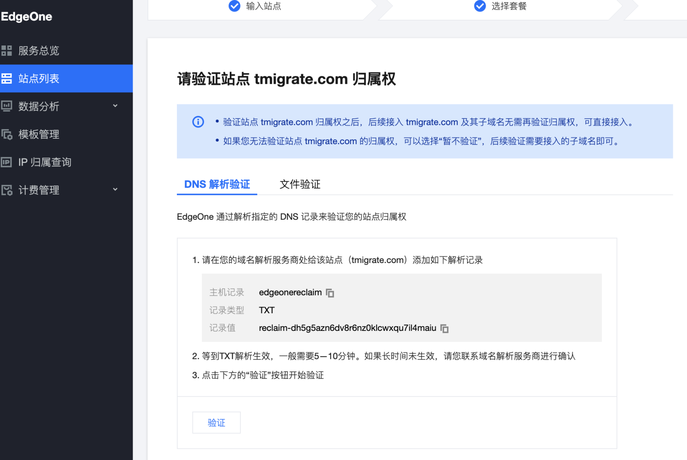

###### **在云解析加入归属权验证记录**
进入控制台 我的域名，进入云解析，找到相关域名主 tamlab.net (该域名通过DNSPod托管)

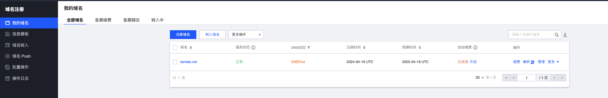
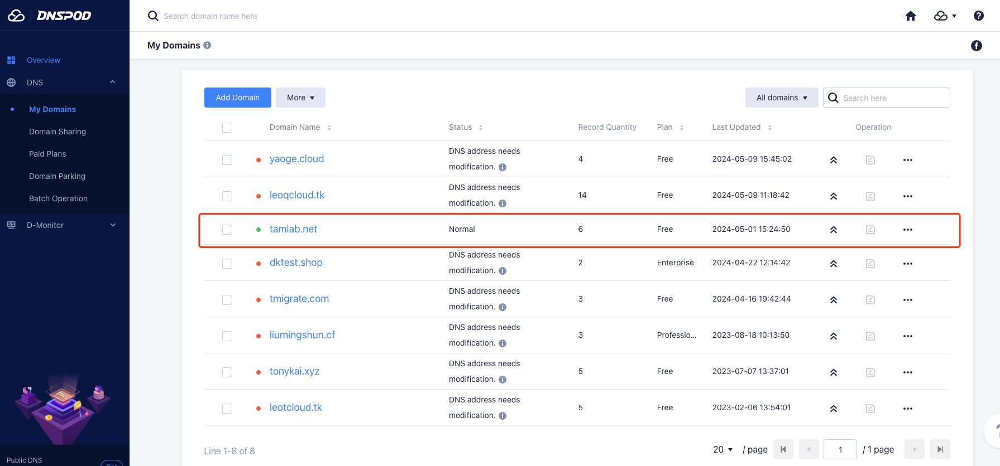

根据上图提示，添加一条TXT解析
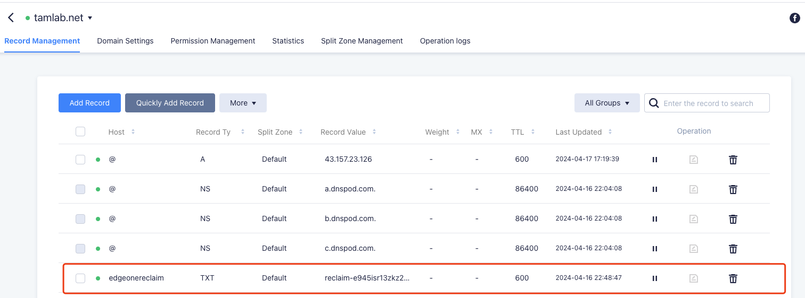

查看解析记录直至生效

```bash
 ~  dig TXT edgeonereclaim.tamlab.net                            ok | 15:33:49 

; <<>> DiG 9.10.6 <<>> TXT edgeonereclaim.tamlab.net
;; global options: +cmd
;; Got answer:
;; ->>HEADER<<- opcode: QUERY, status: NOERROR, id: 39165
;; flags: qr rd ra; QUERY: 1, ANSWER: 1, AUTHORITY: 0, ADDITIONAL: 1

;; OPT PSEUDOSECTION:
; EDNS: version: 0, flags:; udp: 1232
;; QUESTION SECTION:
;edgeonereclaim.tamlab.net.	IN	TXT

;; ANSWER SECTION:
edgeonereclaim.tamlab.net. 600	IN	TXT	"reclaim-e945isr13zkz297h8wfjgf5uh5apao3y"

;; Query time: 1236 msec
;; SERVER: 192.168.178.1#53(192.168.178.1)
;; WHEN: Tue May 14 15:34:11 CEST 2024
;; MSG SIZE  rcvd: 107


```


点击 TEO 界面上的验证按钮进行归属权验证

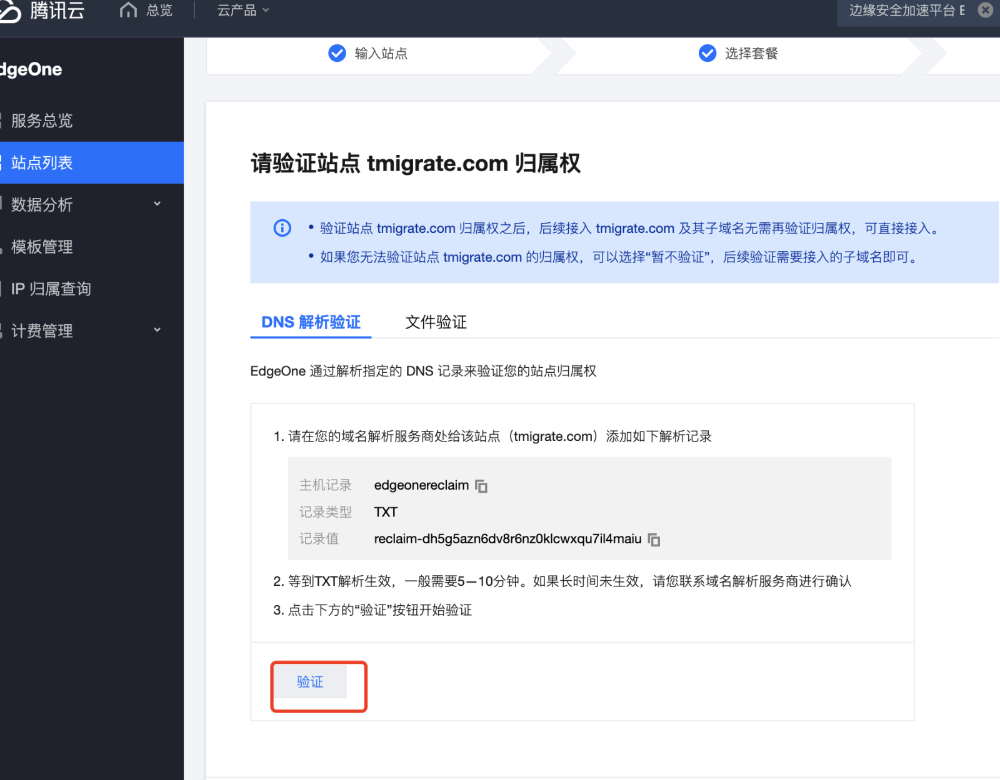

###### **添加站点完成**

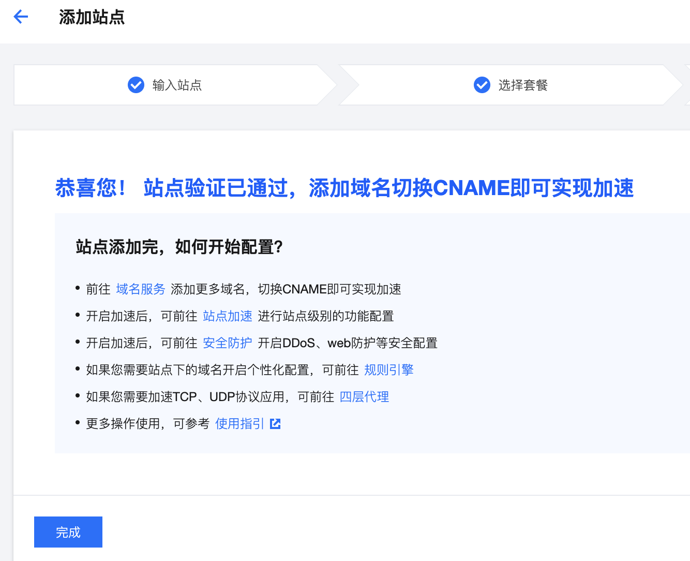


##### **管理域名**

###### **4.3.2.1 进入EO域名管理页面**

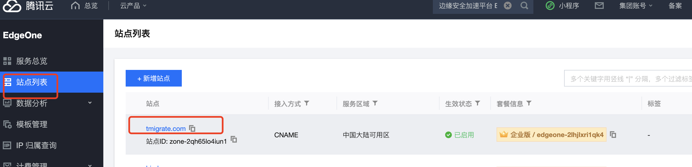

######  **添加域名**

######  

这里启用一个新子域名 test (此处子域名可以自行设置), 注意 CLB监听器里也要对应增加这个域名

源站指向4.2中配置的公网 CLB 的域名

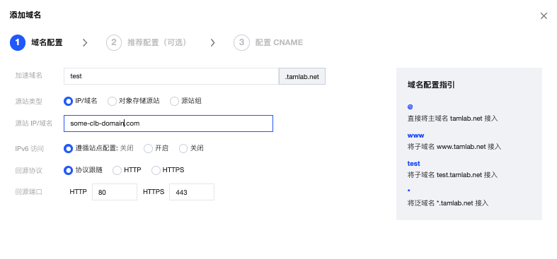

CLB 监听器配置

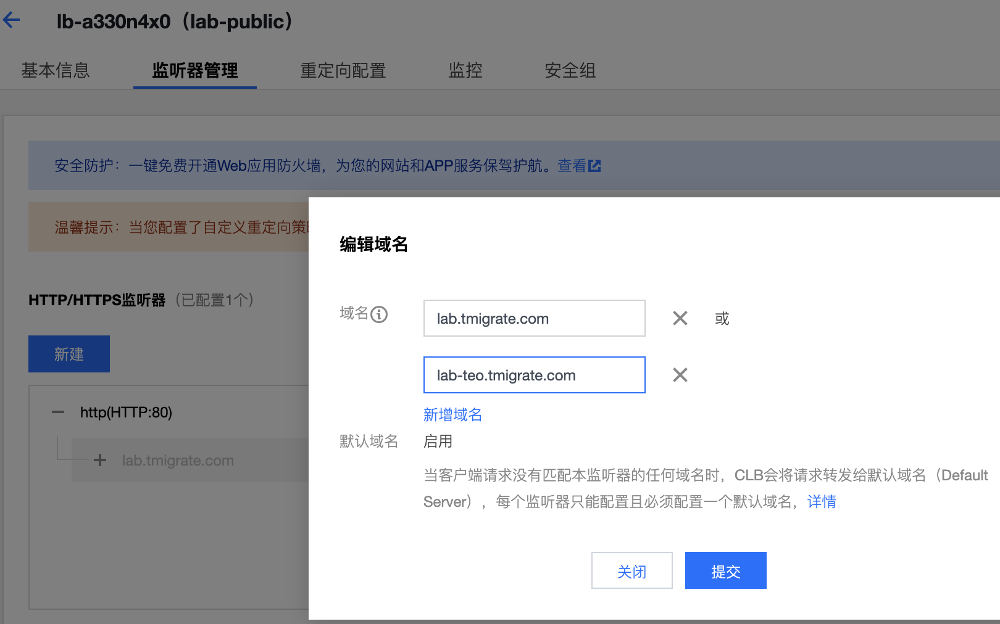


###### **在云解析DNSPod中完成域名解析**

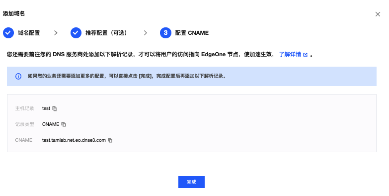


###### **待 TEO 部署完成**


###### **确认域名已生效**

在个人电脑上运行，直到有 A 记录出现

```bash
~  dig test.tamlab.net                                           ok | 15:41:53 

; <<>> DiG 9.10.6 <<>> www.tamlab.net
;; global options: +cmd
;; Got answer:
;; ->>HEADER<<- opcode: QUERY, status: NOERROR, id: 56360
;; flags: qr rd ra; QUERY: 1, ANSWER: 4, AUTHORITY: 0, ADDITIONAL: 1

;; OPT PSEUDOSECTION:
; EDNS: version: 0, flags:; udp: 1232
;; QUESTION SECTION:
;test.tamlab.net.			IN	A

;; ANSWER SECTION:
test.tamlab.net.		600	IN	CNAME	test.tamlab.net.eo.dnse3.com.
test.tamlab.net.eo.dnse3.com. 60	IN	A	43.152.186.103
test.tamlab.net.eo.dnse3.com. 60	IN	A	43.152.44.86
test.tamlab.net.eo.dnse3.com. 60	IN	A	43.175.236.165

;; Query time: 1035 msec
;; SERVER: 192.168.178.1#53(192.168.178.1)
;; WHEN: Tue May 14 15:42:06 CEST 2024
;; MSG SIZE  rcvd: 132
```

###### **验证部署结果**

在个人电脑上浏览器上访问加速域名


### 配置 TEO 进行静态加速

#### 配置 EO 源站

源站地址为 02 Frontend 部署的 CVM 或 AS-CLB 公网地址

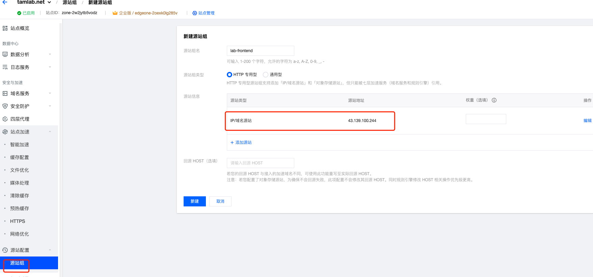

#### 配置 EO 访问域名

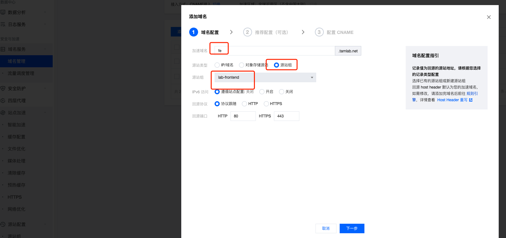


#### 配置 CNAME 解析记录


#### 在浏览器中访问

```
fe.tamlab.net
```


### 设置 HTTPS 访问方式

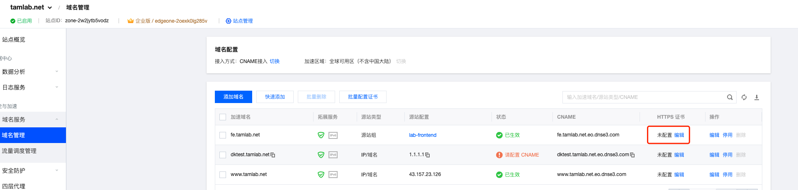

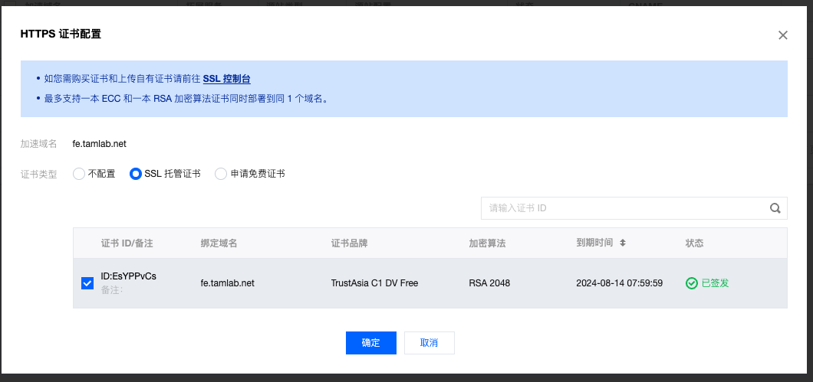

等待生效后访问域名

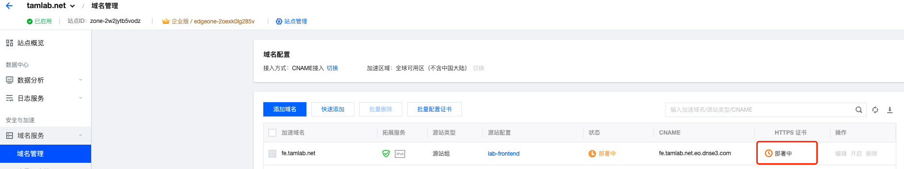

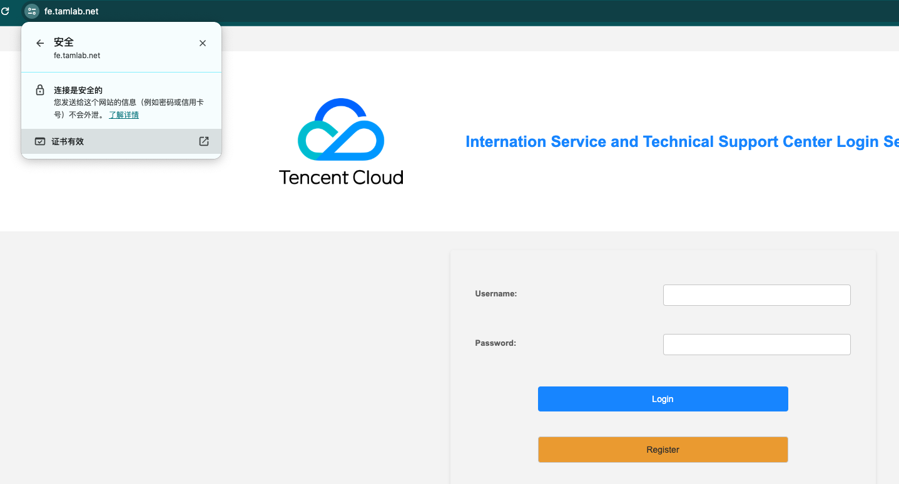