# 07 多AZ容灾切换


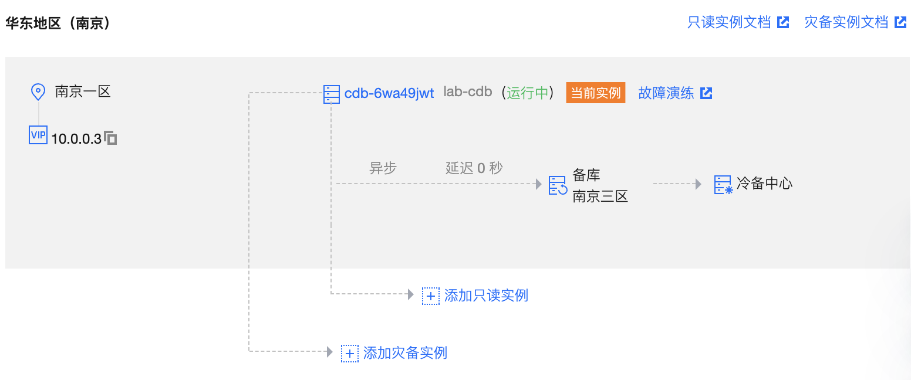

开始测试

```bash
# 登录测试机
$ ssh root@119.45.219.91  # 输入创建时设置的密码
$ export LB_ADDRESS=1.13.117.84    # 设置为 3.2.2.10 中的 clb 地址
$ while [ 1 ] ; do date; curl ${LB_ADDRESS}/mysql/read; sleep 1; done

```


##### **主备均不可用**

参考 [登录 - 腾讯云](https://console.cloud.tencent.com/cfg/exercise/detail?id=3942&regionId=33) (大客户售后账号)

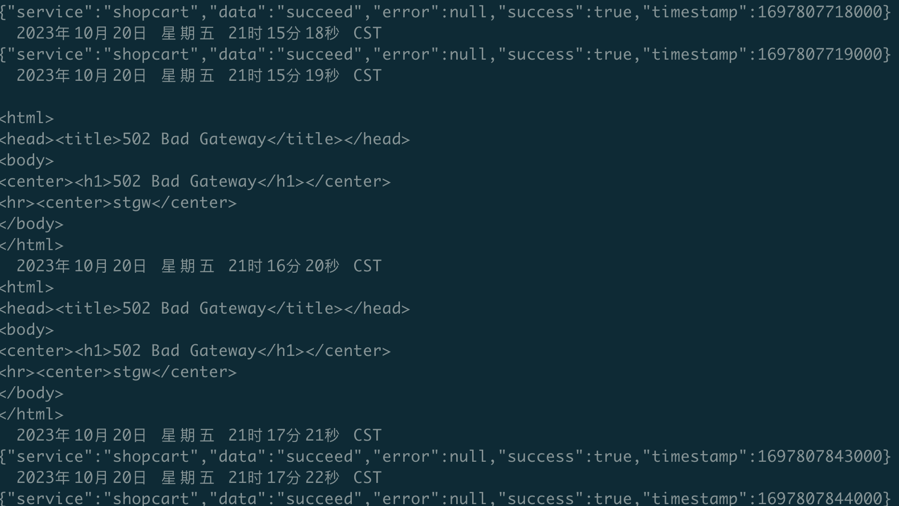

##### **主节点故障**

参考 [登录 - 腾讯云](https://console.cloud.tencent.com/cfg/exercise/detail?id=3942&regionId=33) (大客户售后账号)


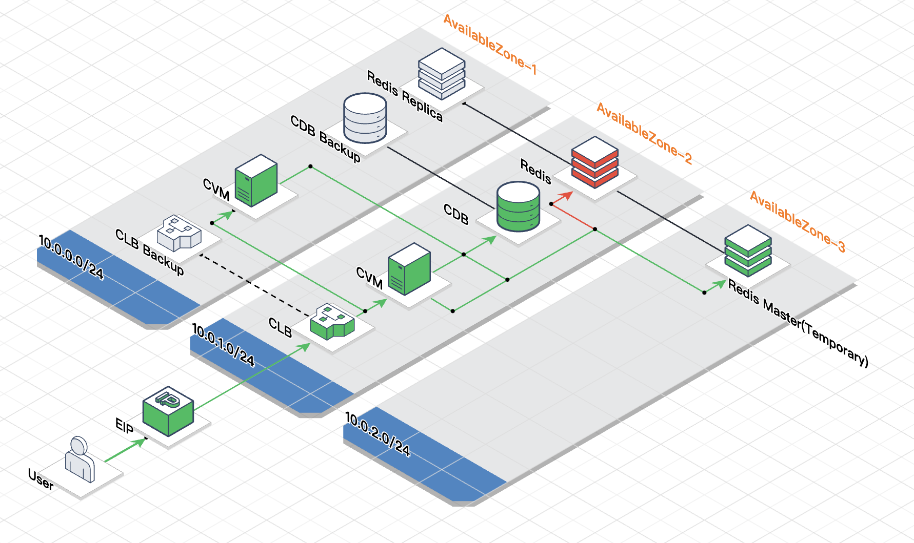


故障前

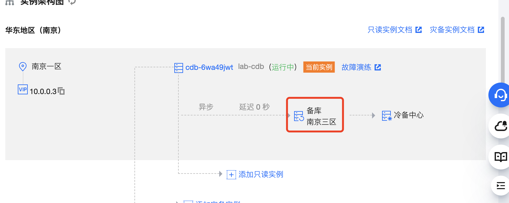

故障中

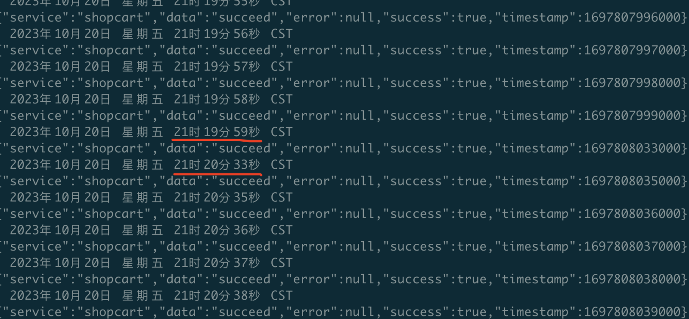

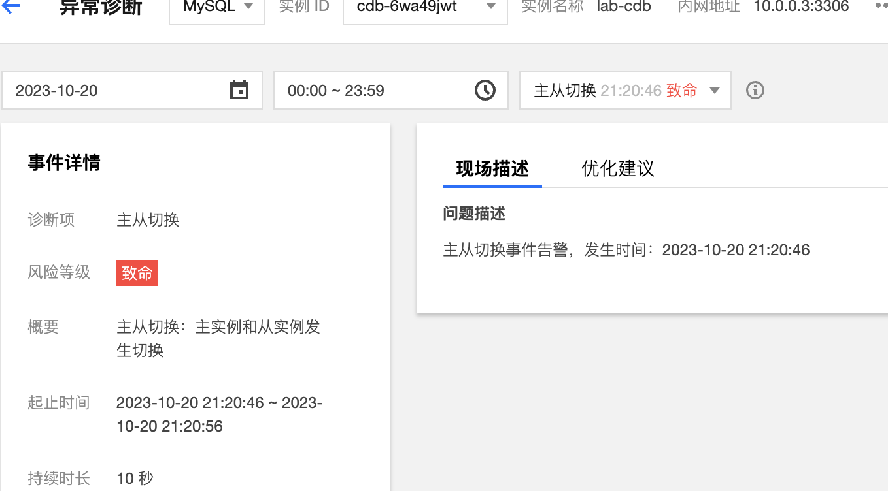

故障后

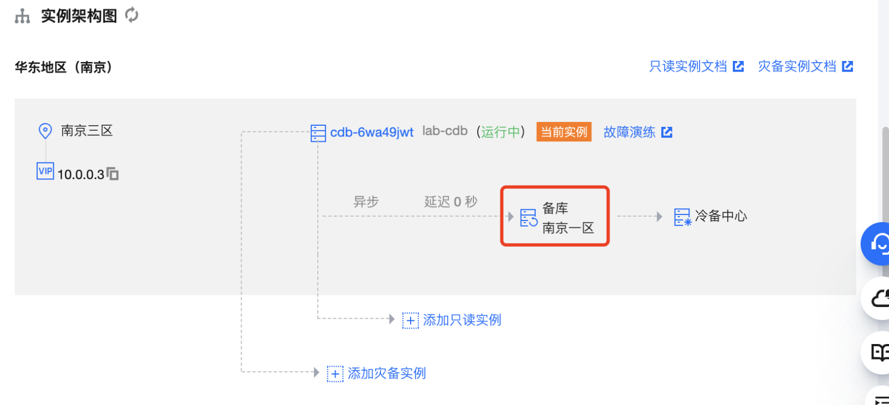

#####  **结论**

CDB-mysql 主节点故障，备库(跨可用区)可接替其工作，成为主库，需要手工再切换回去。

故障自动恢复时间约30秒


##  **Redis容灾切换**


```bash
# 登录测试机
$ ssh root@119.45.219.91  # 输入创建时设置的密码
$ export LB_ADDRESS=1.13.117.84    # 设置为 3.2.2.10 中的 clb 地址
$ while [ 1 ] ; do date; curl ${LB_ADDRESS}/redis/read; sleep 1; done
```

##### **Redis Proxy故障**

参考 [登录 - 腾讯云](https://console.cloud.tencent.com/cfg/exercise/detail?id=3941&regionId=33) (大客户售后账号)

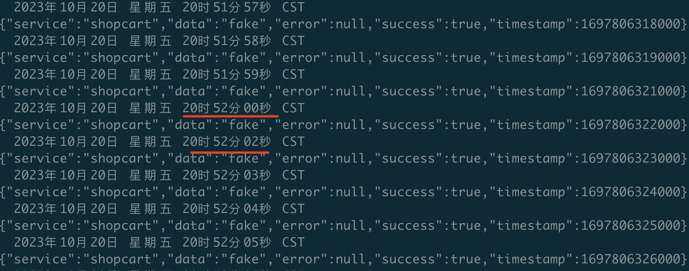

故障节点：

['d9ad1e7a833a568c0d5b5af9b7c9ecaeb1a00ed2', 'a957d11997801484164a07d6a38a7949767ab8f0']

故障前                           

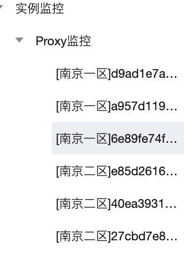

故障后

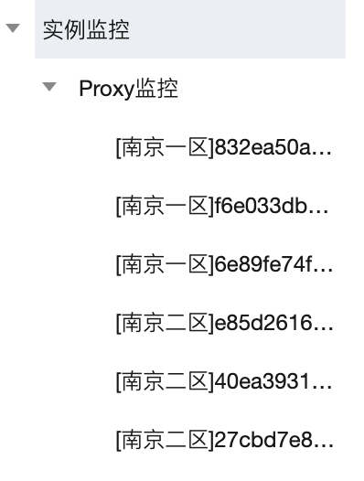

##### **主节点故障**

参考 [登录 - 腾讯云](https://console.cloud.tencent.com/cfg/exercise/detail?id=3941&regionId=33) (大客户售后账号)

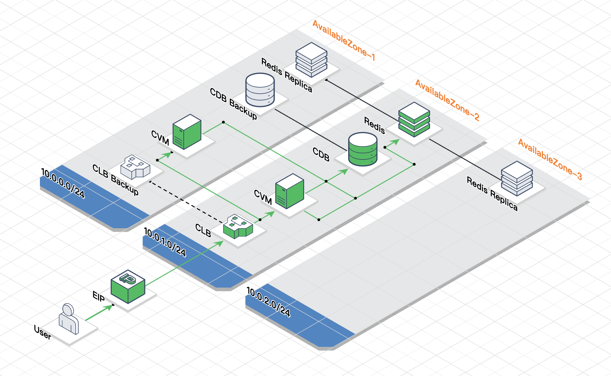


故障前

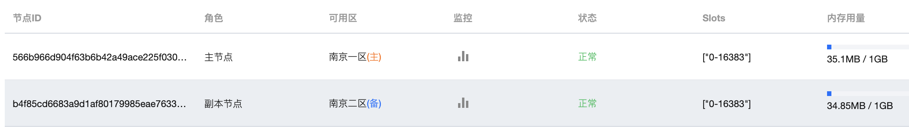

故障中


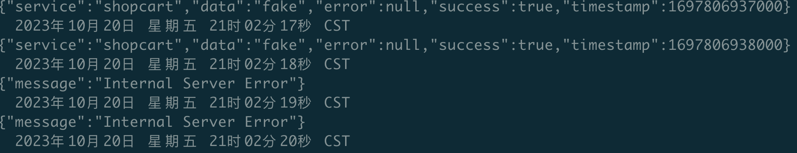

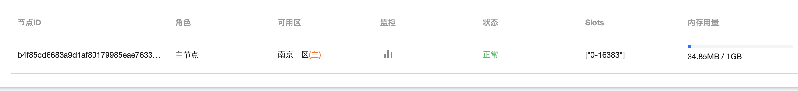

故障后

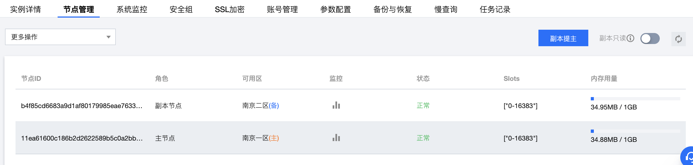

##### **结论**

Proxy故障客户端基本无感知(低负载情况)，故障实例被剔除，由新实例替代，无法模拟整个AZ不可用的情况

主节点故障，集群20秒不可用，随后备节点接替主节点工作。如果主节点可恢复，会切换回原可用区


#### **CLB 容灾切换**

##### **监听器不可用**

参考 [登录 - 腾讯云](https://console.cloud.tencent.com/cfg/exercise/detail?id=3943&regionId=33) (大客户售后账号)


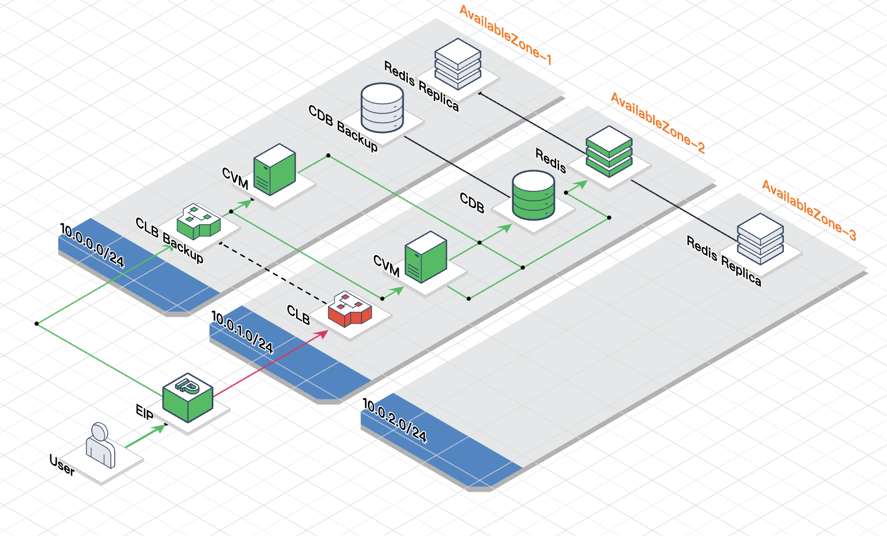

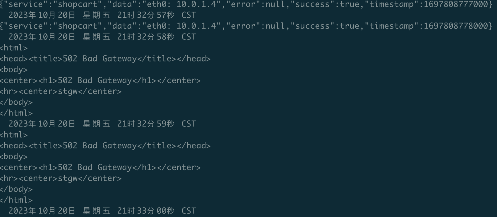

##### **结论**

暂时没有CLB AZ级故障的测试方案