# 00 创建日志集
注意：目前Tam Lab使用随机前缀来区分每个同学创建的资源，这里假设前缀为`oe9ghk`。

进入： https://console.tencentcloud.com/cls/topic?region=ap-singapore
点击【管理日志集】，在右侧弹出的Drawer中点击【创建日志集】，填写日志集名称，点击【确定】：

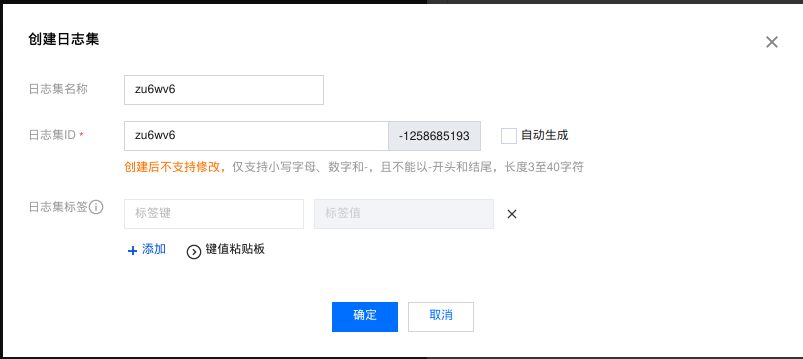

# 01 接入EdgeOne

## 确保EdgeOne配置

进入：https://console.tencentcloud.com/edgeone/zones 选择站点`tamlab.net`，在新页面左侧菜单中选择【域名管理】，点击【添加域名】，配置以下域名：

1. 前端站点：`oe9ghk-frontend.tamlab.net`，源站`oe9ghk-frontend-ap-singapore.tamlab.net`
2. app1：`oe9ghk-app1.tamlab.net`，源站`oe9ghk-app1-ap-singapore.tamlab.net`

## 创建日志主题
进入：https://console.tencentcloud.com/cls/topic?region=ap-singapore
点击【创建日志主题】，输入日志主题名称、ID，选择日志集，点击【确定】：
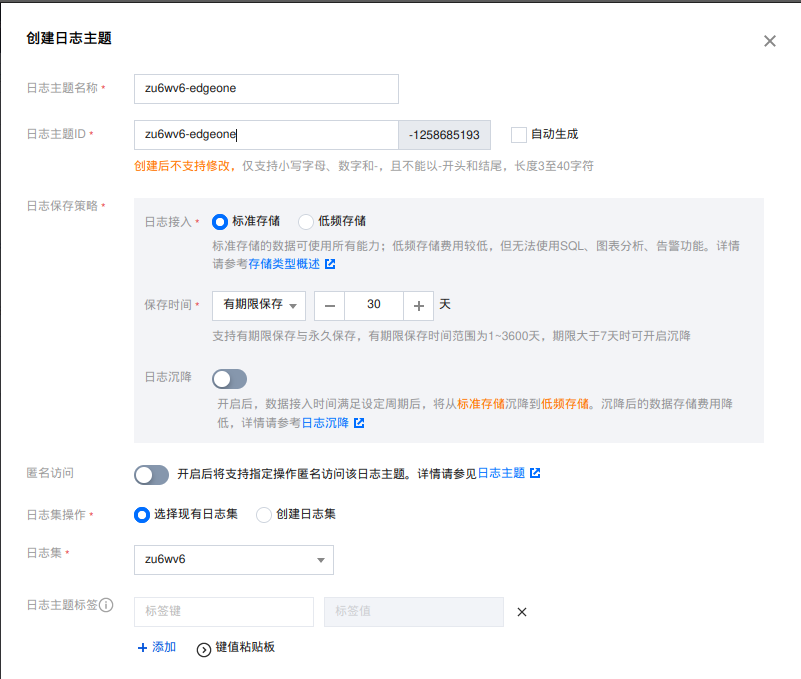

为frontend, app1 分别创建日志主题，如`oe9ghk-eo-frontend`，`oe9ghk-eo-app1`。

## 配置EdgeOne日志推送

进入：https://console.tencentcloud.com/edgeone/zones 选择站点`tamlab.net`，在新页面左侧菜单中选择【日志服务】，点击【实时日志】，
点击【新建推送任务】，填写表单，如下图：

1. 任务名称：以前缀开始，如`oe9ghk-frontend-acc`，`oe9ghk-app1-acc`
2. 日志类型：选择站点加速日志。如果还想推送其他日志，创建对应日志主题并重复本节睦州
3. 域名：选择前端站点的加速域名，如`oe9ghk-frontend.tamlab.net`。

注意：由于EdgeOne管理整个tamlab.net域名，请在配置推送任务时，选择正确的加速域名。

填写完成后，点击下一步，这里可以选择推送字段：

点击【下一步】，选择【日志分析服务 - 腾讯云日志服务（CLS）】，点击【下一步】，选择上一节创建的日志主题：
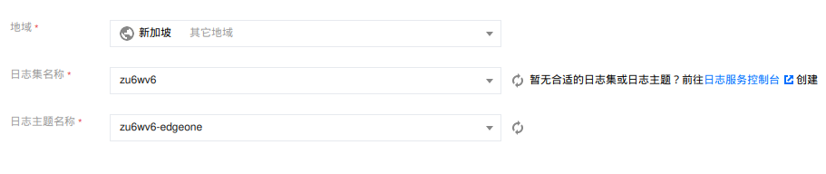

点击推送完成配置。在弹框中，点击【一键配置索引】，自动生成CLS索引。

为frontend, app1 分别创建日志主题分别完成日志推送配置。

# 02 接入CLB

## 创建日志主题

参考先前的步骤，为frontend, app1 分别创建日志主题，如`oe9ghk-clb-frontend`，`oe9ghk-clb-app1`。

## 配置CLB日志推送

进入 https://console.tencentcloud.com/clb/instance?rid=9

选择需要接入的CLB实例，进入详情页面，在【基本信息】中找到【访问日志（七层）】。点击标签`日志服务CLS` 旁边的标签按钮开启，弹框中选择正确的日志集和日志主题，点击【确定】。

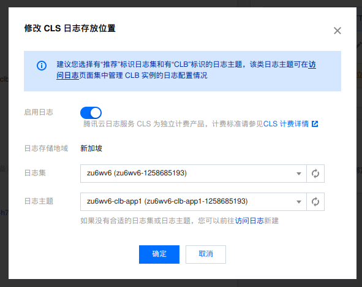

为frontend, app1 分别完成日志推送配置。

## 开启索引

CLB日志推送默认没有打开索引。进入 https://console.tencentcloud.com/cls/search ，选择CLB日志对应的主题。右侧会显示：

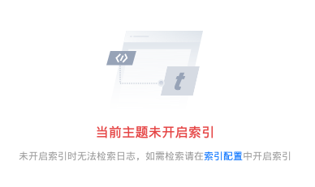

点击链接`索引配置`，在弹出的Drawer中，点击右上角的编辑：

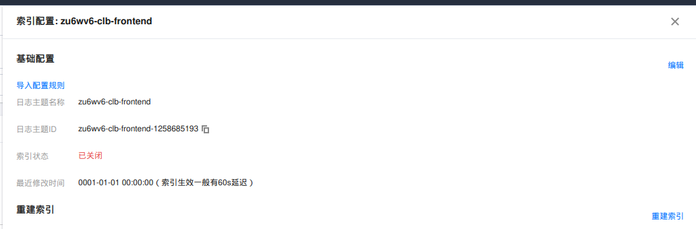

在表单中，确保索引状态为打开，开启【自动配置】，点击确定：

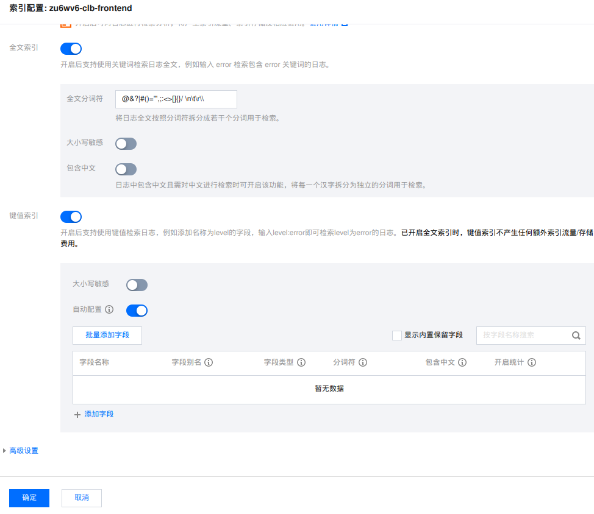

点击链接【重建索引】：

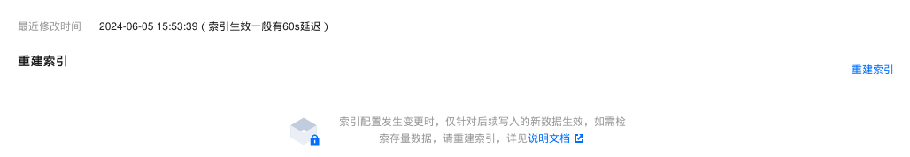

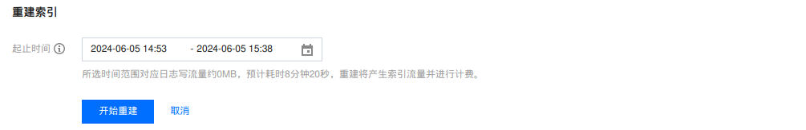

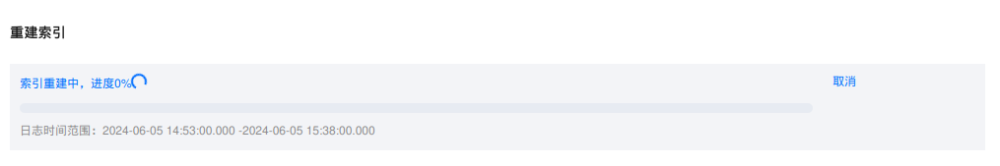

等待索引重建完成。

# 03 接入CVM

frontend, app1均为伸缩组管理的虚拟机上的应用，可以通过安装LogListener来抓取其产生的日志，并推送到CLS。

## 安装LogListener

进入 https://console.tencentcloud.com/cls/hosts?region=ap-singapore ，点击【云服务器实例批量部署】，勾选frontend, app1对应的CVM实例，
输入正确的SecretId、SecretKey，点击【下一步】

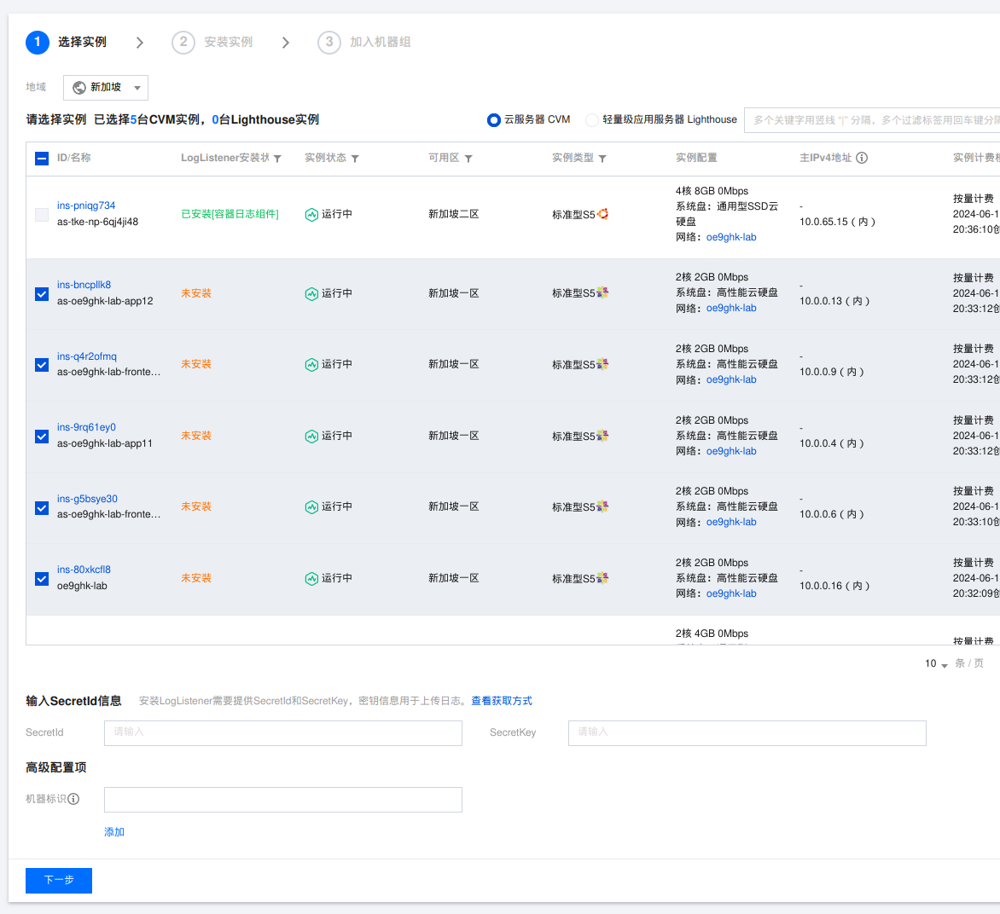

安装完毕后点击【下一步】，暂时不加入机器组。

## 创建机器组

进入 https://console.tencentcloud.com/cls/machinegroup?region=ap-singapore ，点击【新建】，填写机器组名称，选择刚刚安装LogListener的CVM实例，点击【确定】。

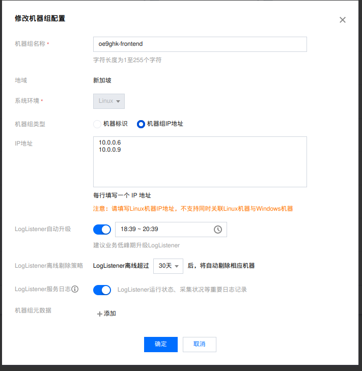

为frontend, app1分别创建机器组，如`oe9ghk-frontend`，`oe9ghk-app1`，填写伸缩组中的CVM实例的IP地址。

## 创建日志主题

参考前面的例子，创建对应的日志主题：`oe9ghk-cvm-frontend`，`oe9ghk-cvm-app1`。 

## 日志采集配置

点击新创建的日志主题的链接进入详情页面，进入【采集配置】选项卡，点击【新建】，选择frontend机器组，如下图：

点击下一步，由于frontend就是一个Nginx实例，其访问日志路径在  /var/log/nginx/access.log ，参考下图配置：

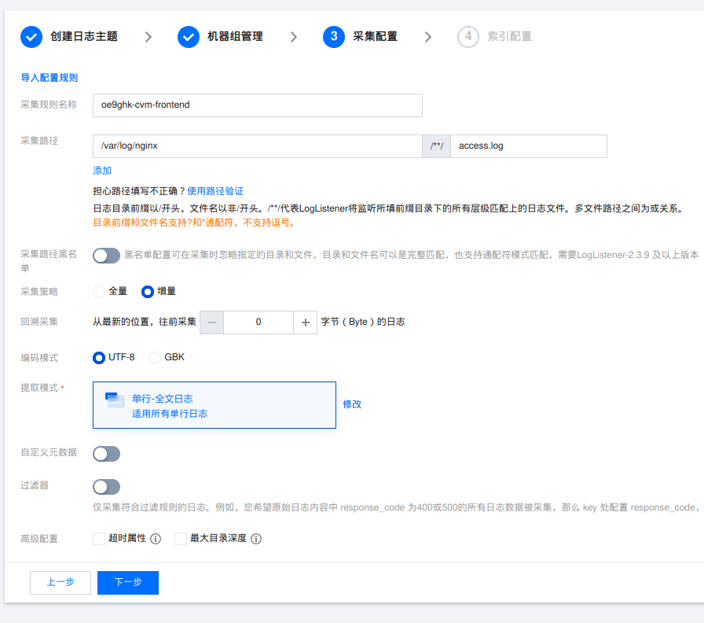

提示：通过配合设置Nginx访问日志格式 + 基于正则式的提取规则，可以将Nginx访问日志中的字段提取出来。

点击【下一步】，点击【提交】完成配置。

# 04 接入TKE

## 开启日志采集

进入 https://console.tencentcloud.com/tke2/loglistener/list?rid=9 ，进入日志规则配置页面。

如果出现横幅提示：

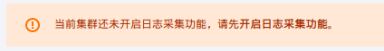

直接点击此横幅上面的文字，开启日志采集：

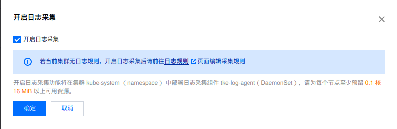

等待日志采集开启完成。

## 创建日志采集规则

日志采集开启完成后，点击【新建】按钮创建新的日志采集规则。规则名称设置为`oe9ghk`，选择日志集`oe9ghk`，自动创建主题，抓取除了`kube-system`之外的所有容器的标准输出：

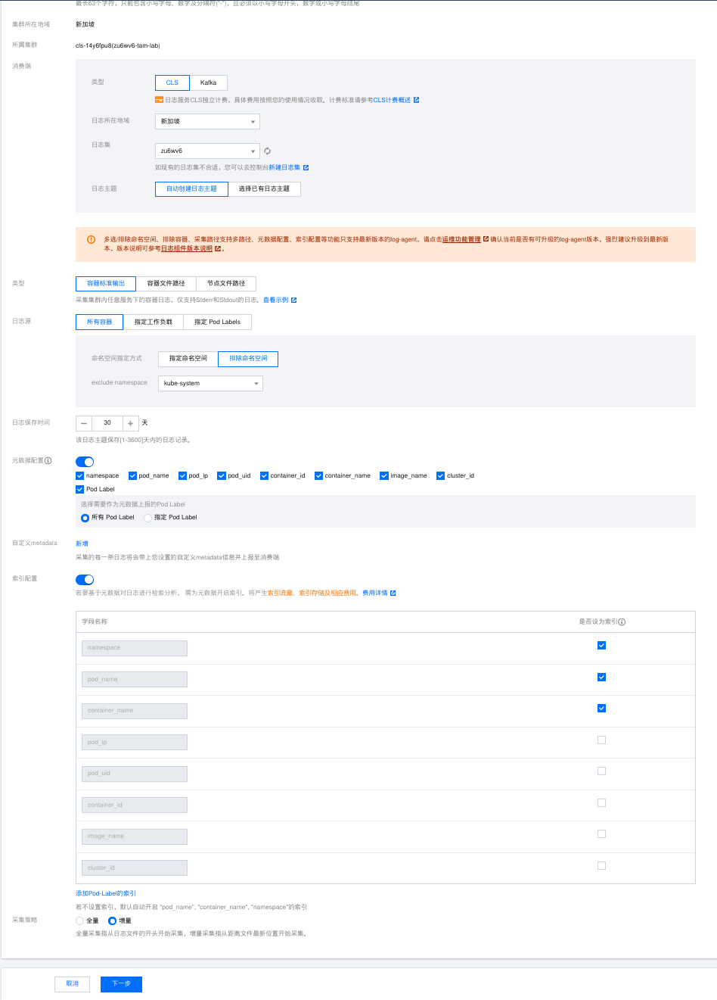

点击【下一步】，提取格式选择JSON，点击完成：

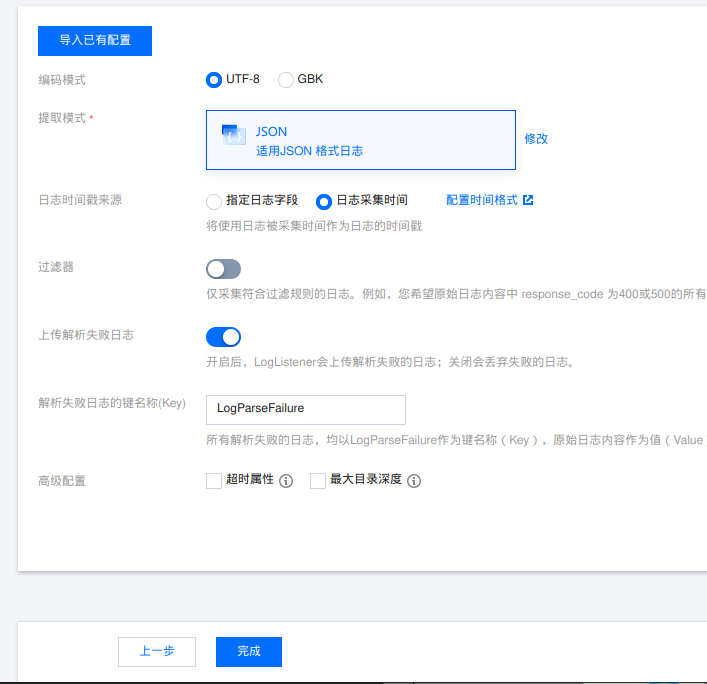

注意：如果应用程序没有按照标准输出格式输出日志，需要自定义提取规则，并在上一步中，过滤这些非JSON格式的日志的工作负载。

# 05 接入数据库

## 接入Redis

暂不支持接入CLS

## 接入CDB

目前支持将慢查询日志推送到CLS。

进入  https://console.tencentcloud.com/cdb/instance?rid=9 ，选择`oe9ghk_tam_lab`实例，进入详情页面。

点击【操作日志】选项卡，点击该选项卡中的【日志投递】，分别开启慢日志投递、错误日志投递：

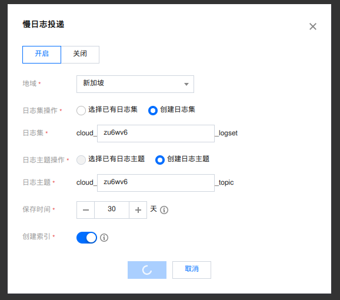

注意：不支持使用先前定义的`oe9ghk`日志集，需要手动创建日志集和主题。

# 06 日志检索

进入 https://console.tencentcloud.com/cls/search ，选择多主题，搜索框中输入 `oe9ghk`，即可聚合检索和Tam Lab相关的所有云产品、工作负载的日志：

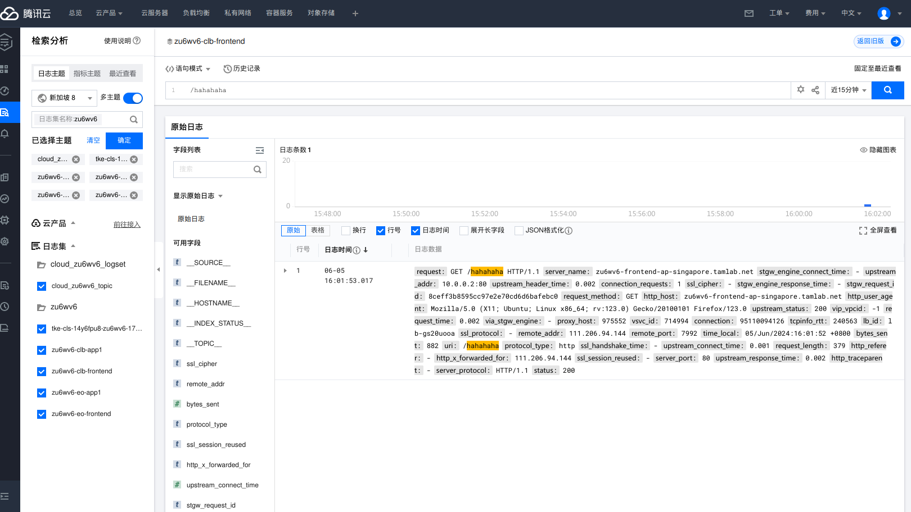
