# 监控告警简介

## 数据源

监控指标的数据来源主要包括：腾讯云产品指标（云产品监控）、APM、前端性能监控、云拨测、Prometheus这几类。 

对于应用程序自定义的指标，主要通过Prometheus收集。

## 可视化

### 云产品指标列表

腾讯云可观测平台为多种常用云产品提供了列表形式的监控数据。

目前支持的产品包括云服务器、块存储、CLB、云数据库（MySQL/TcaplusDB/Redis/MongoDB等）、NAT网关、VPN网关、带宽包/流量包、弹性公网IP、对象存储、文件存储等。

以云服务器为例，进入 https://console.tencentcloud.com/monitor/product/cvm?region=9 即可查看所有云服务器的监控数据，包括CPU利用率、内存利用率、网络流量等。


### 通过仪表盘实现可视化

进入 https://console.tencentcloud.com/monitor/dashboard/dashboards ，可以看到腾讯云原生的监控仪表盘列表。

在这里，可以查看或者设计各种监控图表，方面直观的展示云产品的监控数据。

注意：仪表盘模块不但支持云产品监控，还支持对接APM、前端性能监控、云拨测，以及Prometheus等数据源。如果您的应用程序产生的指标通过APM或者Prometheus收集，也可以在这里展示。

### 通过Grafana实现可视化

进入 https://console.tencentcloud.com/monitor/grafana?rid=9 ，可以创建托管的Grafana实例。

腾讯云为托管Grafana提供了大量插件，除了Prometheus之外，APM、云产品监控均可以通过Grafana展示。

托管Grafana提供了一种更加灵活的、符合很多云原生时代运维人员使用习惯的监控方式。


## 告警

### 告警途径

#### 腾讯云原生告警

##### 告警策略

进入 https://console.tencentcloud.com/monitor/alarm/policy 可以查看或新建告警策略。

所谓告警策略，就是告诉腾讯云监控系统，当什么指标达到什么阈值时，应该触发告警。在告警策略中支持设置通知频率、告警级别。

对于告警指标，通过多个层级来限制，具体来说包括：
1. 监控类型：指标的数据源类型，包括云产品监控、APM、前端性能监控、云拨测。
2. 策略类型：云产品指标的多级分类。或者其它三种数据源的指标分类
3. 告警对象/筛选条件：用于在选中的策略类型中，对具体的监控对象（例如云产品实例）进行筛选
4. 触发指标：告警的具体指标，例如CPU利用率、内存利用率、网络流量等

例如，我们可以设置：
1. 监控类型：云产品监控
2. 策略类型：云服务器/基础监控
3. 告警对象/筛选条件：实例ID=ins-hd2aydos
4. 触发指标：CPU利用率 在一分钟内的平均值 超过 95% ，连续5次如此，则每2小时告警一次

对应的告警策略配置界面如下：


告警策略必须关联一个通知模板，通知模板决定了告警发生时，如何通知干系人或第三方系统。

##### 通知模板

所谓通知模板，就是告诉腾讯云监控系统，当某个告警策略触发时，应该如何发送通知：
1. 通知类型：何种事件发生时，发送通知。支持告警发生、告警恢复
2. 发送给谁：通知的接收者，可以是腾讯云内的联系人、联系组，也可以是外部的接口回调、或者是投递到CLS日志主题。接收者是人时，支持邮件、短信、微信、电话等多种通知方式。

通知模板的配置界面如下：

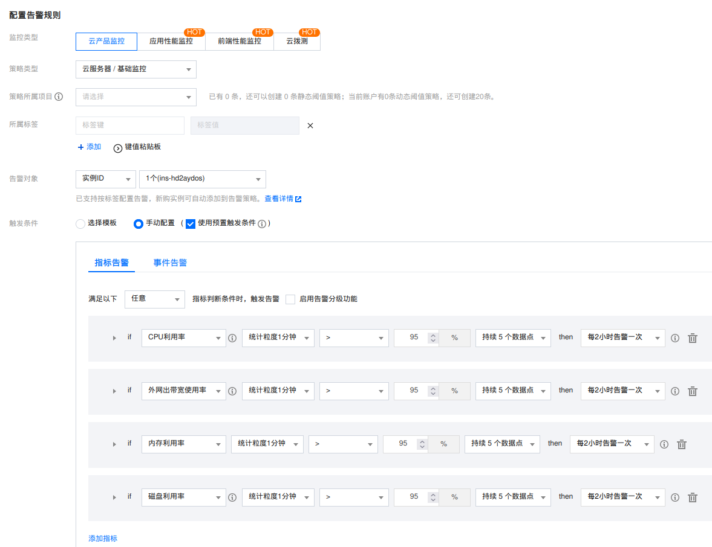


#### Prometheus告警

要使用Prometheus告警，首先需要购买一个托管Prometheus实例。 然后在实例详情页面的【告警管理】选项卡中，可以管理高级策略，查看告警历史。

##### 告警策略

和腾讯云原生告警机制不同。Prometheus的告警策略是基于PromQL语言的，可以自定义任意的告警规则，只要查询的指标存在于Prometheus的时间序列数据库中。

下面是一个当K8S集群CPU申请量过载时，触发告警的策略：

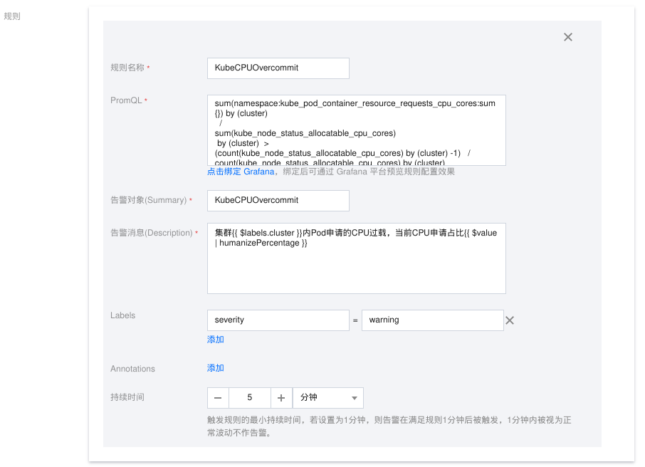

##### 告警通知

首先，Prometheus告警可以对接到腾讯云原生监控的“通知模板”，也就是说，Prometheus告警发生时，可以发送给腾讯云监控的联系人、联系组，投递到CLS、调用外部接口。

此外，Prometheus告警还支持投递通知给用户自建的Alert Manager，或者调用VPC内的任何Web Hook。

## 如何选型

需要根据客户团队的运维经验、监控需求、预算等多方面因素来选择监控和告警的方案。下面是一些参考：

1. 如何客户团队对云原生整个体系比较熟悉，且有一定的Prometheus使用经验，可以考虑使用Prometheus + Grafana做告警和可视化
2. 如果客户仅仅希望监控云上基础设施的状态，可以考虑使用腾讯云原生的告警管理能力、仪表盘
3. 托管的Prometheus、Grafana需要额外付费
4. 尽管托管Prometheus提供了云产品的插件，但是想写好基于PromQL的告警规则并不容易，文档不是很健全。所以对于云产品的告警，还是使用腾讯云原生的告警管理能力更加方便
5. 要实现应用自定义指标的告警，Prometheus是唯一的选择。如果是响应时间、吞吐量这些通用的应用层指标，可以考虑使用APM来自动生成

# 为TamLab配置监控和告警

注意：目前Tam Lab使用随机前缀来区分每个同学创建的资源，这里假设前缀为`6qgihx`。

## 配置Prometheus

进入：https://buy.tencentcloud.com/prometheus?rid=9 购买托管Prometheus实例，实例名称设置为`6qgihx`，VPC选择`6qgihx-lab`即TamLab的VPC。

注意：购买Prometheus实例可以通过Terraform完成，参考tamlab模块对应代码。

### 关联K8s集群

进入：https://console.tencentcloud.com/monitor/prometheus?rid=9 ，找到刚刚创建的Prometheus实例，操作栏选择【关联集群】。

可能需要您授权同意。授权后，点击【初始化】，初始化过程中会自动创建一个独占的、专门用于Prometheus数据采集的K8s集群：

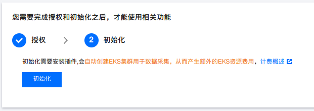

注意：上面创建的集群不是您的业务集群，而是Prometheus专用的集群，它会产生一定的费用。

点击选项卡【数据采集】，选择子选项卡【集成容器服务】。点击【关联集群】，选择TamLab的K8s集群：

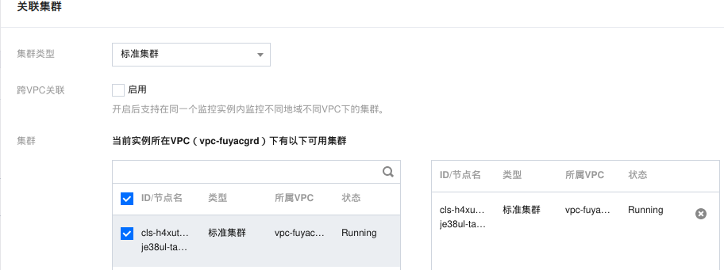

点击确定，即可完成Prometheus和K8s集群的关联。

默认情况下，从该集群采集的任何指标，均会带有标签：`cluster:cls-xxxxxxxx`即K8s集群的ID。Prometheus实例可以关联多个K8s集群，这个标签可以帮助您区分不同集群的指标。

### 关联Grafana

进入：https://console.tencentcloud.com/monitor/grafana 购买托管Grafana实例。

实例名称设置为`6qgihx`，VPC选择`6qgihx-lab`即TamLab的VPC。 设置密码，勾选【域名访问】，完成购买。

在Prometheus列表页，点击【绑定 Grafana】，选择刚刚购买的Grafana实例，完成Prometheus和Grafana的关联。

注意：购买和关联Grafana均可以通过Terraform完成，参考tamlab模块对应代码。

### 采集数据

#### 采集云产品指标

进入：https://console.tencentcloud.com/monitor/prometheus?rid=9 ，找到刚刚创建的Prometheus实例，第一列上的链接进入Prometheus实例详情页。

点击【数据采集】选项卡，选择子选项卡【集成中心】，选择【云监控】，点击【一键安装】，填写表单，即可集成云产品指标到Prometheus实例。

需要注意：您可以安装一个云监控集成实例，选择多个云产品类别，也可以安装多个云监控集成实例，每个实例选择一个云产品类别

#### 通过NodeExporter方式采集CVM指标

通过这种方式采集CVM指标，可以立即使用社区的Grafana模板，展示CVM的监控数据。

对于TamLab中以AS形式部署的frontend, app1，可以在user_data中加入以下脚本：

```bash
# Download and set up node_exporter
wget https://github.com/prometheus/node_exporter/releases/download/v1.3.1/node_exporter-1.3.1.linux-amd64.tar.gz -O /tmp/node_exporter-1.3.1.linux-amd64.tar.gz
tar -xvf /tmp/node_exporter-1.3.1.linux-amd64.tar.gz -C /usr/local/bin/
mv /usr/local/bin/node_exporter-1.3.1.linux-amd64 /usr/local/bin/node_exporter

cat > /etc/systemd/system/node_exporter.service <<EOF
[Unit]
Description=Node Exporter

[Service]
ExecStart=/usr/local/bin/node_exporter/node_exporter
User=root
Restart=always
Type=simple

[Install]
WantedBy=multi-user.target
EOF

systemctl daemon-reload
systemctl enable node_exporter.service
systemctl start node_exporter.service
systemctl status node_exporter.service
```

在AS实例中，执行`curl 127.0.0.1:9100/metrics`可以看到node_exporter的指标。

进入：https://console.tencentcloud.com/monitor/prometheus?rid=9 ，找到本次创建的Prometheus实例，进入实例详情页。
点击【数据采集】选项卡，选择子选项卡【集成中心】，选择【CVM云服务器】，点击【一键安装】，填写表单，即可集成CVM指标到Prometheus实例。

参考采集配置如下（使用标签过滤，仅仅包含本次TamLab创建的CVM）：

```yaml
job_name: cvm-node-exporter-6qgihx
metrics_path: /metrics
cvm_sd_configs:
- region: ap-singapore
  ports:
  - 9100
  filters:         
  - name: tag:tamlab
    values: 
    - 6qgihx
relabel_configs: 
- source_labels: [__meta_cvm_instance_state]
  regex: RUNNING
  action: keep
- regex: __meta_cvm_tag_(.*)
  replacement: $1
  action: labelmap
- source_labels: [__meta_cvm_region]
  target_label: region
  action: replace
  
```

经过一段时间后，应该看到Prometheus开始采集CVM的指标：

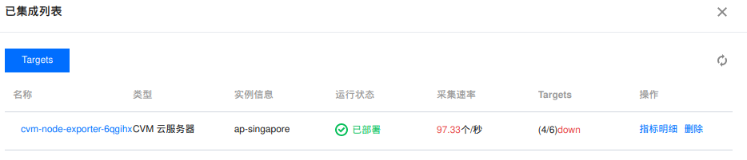


#### 采集CVM上运行的应用程序指标

您的应用程序需要基于Prometheus的SDK或者Exporter来采集指标。Prometheus的SDK支持多种语言，Exporter是一种独立的进程，可以通过HTTP接口提供指标。

TamLab中的app1是一个基于Gin框架的Go应用，并且已经和Prometheus集成，可以直接通过HTTP接口提供指标：
```bash
curl http://127.0.0.1:8888/metrics
```

直接参考上一节内容增加一个新的【CVM云服务器】集成即可。注意修改端口，和filter(标签过滤)。

更多细节，或者想通过Prometheus暴露更多关于app1的应用级指标，可以参考文档：https://www.tencentcloud.com/zh/document/product/1116/43215

#### 采集K8s集群和应用指标

一旦Prometheus和K8s集群关联，Prometheus会自动采集K8s集群的指标。这些指标包括：
1. cadvisor：容器级别的指标，包括CPU、内存、网络、磁盘等
2. eks-network：监控超级节点的网络性能和资源相关指标
3. kube-proxy：监控部署在非超级节点的Kubernetes Service通信和负载均衡运行状态
4. kubelet：监控非Serverless集群kubelet节点上的容器、pod的运行状态和资源情况
5. serviceMonitor/kube-system/kube-state-metrics：监控集群中资源对象的信息和状态
6. serviceMonitor/kube-system/node-exporter: 监控非Serverless集群节点主机的相关信息和运行状态

此外，您还可以自定任意数量的ServiceMonitor或者PodMonitor，来采集您的应用程序指标。 在Prometheus详情页面，点击【数据采集】选项卡，选择子选项卡【集成容器服务】,
点击操作栏的【数据采集配置】,【新建自定义监控】，填写表单，即可完成自定义监控的配置。下面是一个例子：

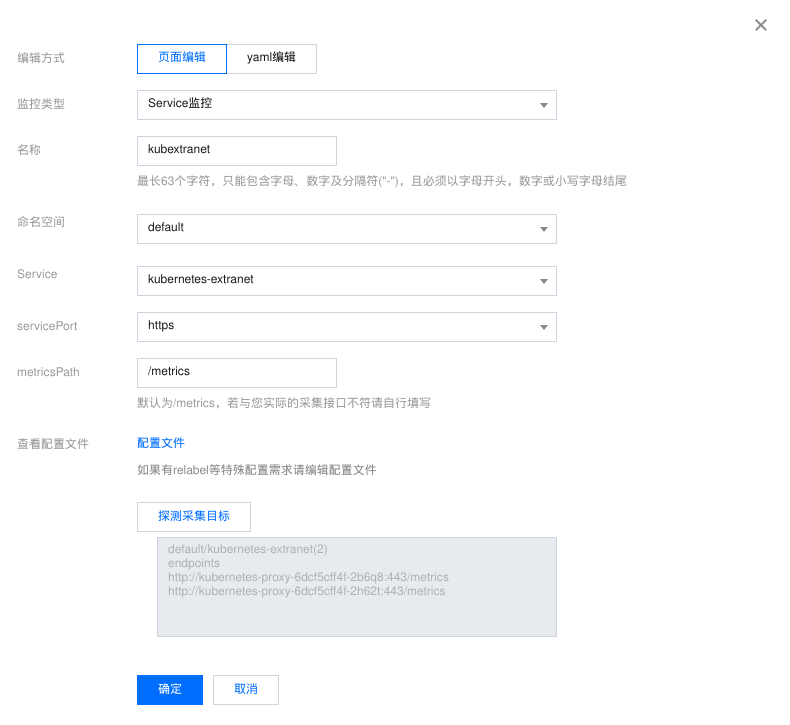


## 可视化配置

### 配置腾讯云仪表盘

进入：https://console.tencentcloud.com/monitor/dashboard/dashboards ，点击【新建仪表盘】。

在弹框中，点击保存，设置名称为`6qgihx`，即TamLab的前缀，点击确定：

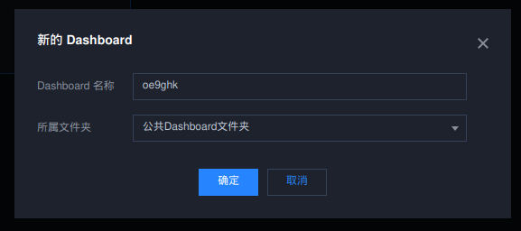

#### 云产品图表

本节以CVM为例，演示一下如何添加一个图表。

点击【新建图表组】按钮，将默认名称“默认图表组”改为“云产品监控“。

点击【新建】按钮，进入图表设计界面。在设计界面中选择云产品监控。参考下图，根据标签选择CVM并设置指标：

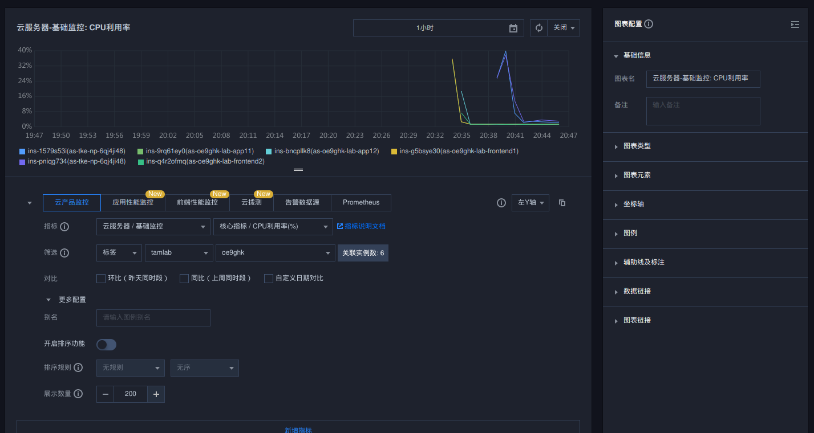

设计界面还有大量用于定制UI的表单项，这里不一一赘述。完成设计后， 点击保存。 点击返回按钮，在可以预览仪表盘：

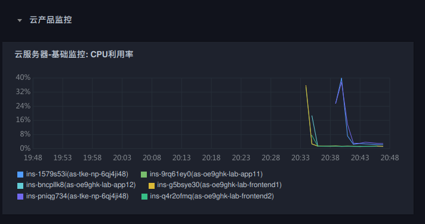


#### Prometheus图表

现在腾讯云原生仪表盘，支持接入Prometheus数据源。这样，您可以在腾讯云上获得风格一致的可视化体验。换一句话说，如果您使用托管或者自建Grafana，但是
仅仅使用托管Prometheus做为数据源，那么可以考虑弃用Grafana，使用腾讯云做可视化展示。

尽管如此，腾讯云仪表盘目前不具有结构化生成PromQL查询语句的能力，您可能还是倾向于在Grafana的UI中设计图表。

设计仪表盘时，新建图表，选择Prometheus数据源，填写PromQL查询语句，即可展示Prometheus的指标：


设计完成后，需要修改仪表盘的设置【模板变量】：

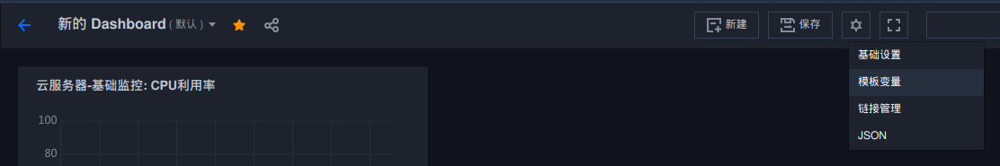

在新页面上点击：【初始化Prometheus预设变量】即可。


### 配置Grafana仪表盘

和社区Grafana用法一致。但是，托管Grafana提供了云产品监控的集成插件，直接提供预置仪表盘。

#### 云产品图表

在Prometheus列表页面，操作栏点击【集成中心】，可以在安装完Prometheus插件后，点击【Dashboards操作】，安装Grafana仪表盘。

安装完成后，即可获得一些预置的仪表盘，可以在Grafana中直接使用。例如下面这个是Prometheus【云监控】提供的CVM监控仪表盘：

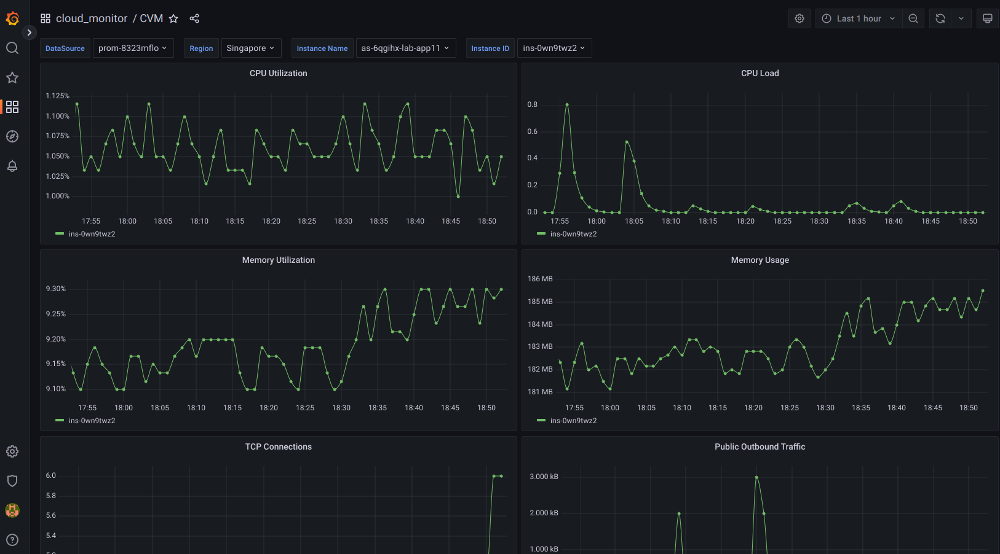

#### 应用程序图表

对于应用程序的图表，需要自己设计。在Grafana中，可以通过PromQL查询语言，设计出各种图表。

下面这个例子，是一个展示app1的QPS的图表。在Grafana中，我们显示抓取gin_request_total这一counter类型的指标，然后使用rate函数，计算出每秒的QPS，
最终基于instance标签进行聚合，得到每个实例的QPS。

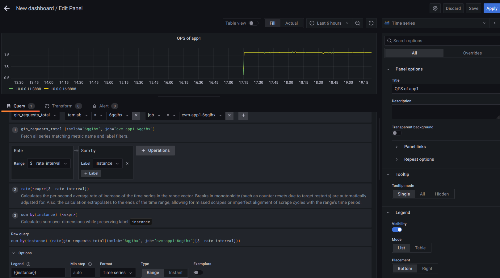


## 告警配置

### 配置腾讯云原生告警

#### 云产品告警

本节以CVM为例，演示如何配置一个告警策略。

进入：https://console.tencentcloud.com/monitor/alarm/policy ，点击【新建策略】。参考下图进行设置，注意通过标签来匹配本TamLab的CVM实例：


点击【下一步：配置告警通知】， 这里可以选择或者新建通知模板：

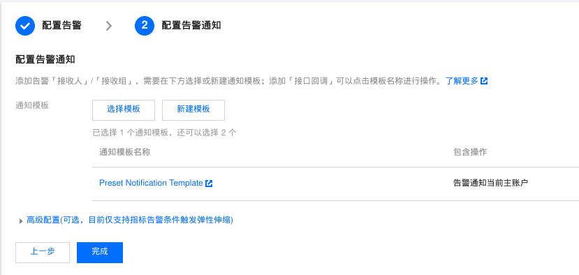

点击新建通知模板，参考下图进行设置，注意通知人更换为您自己，避免干扰到他人。去掉接口回调和CLS投递，只保留邮件通知：

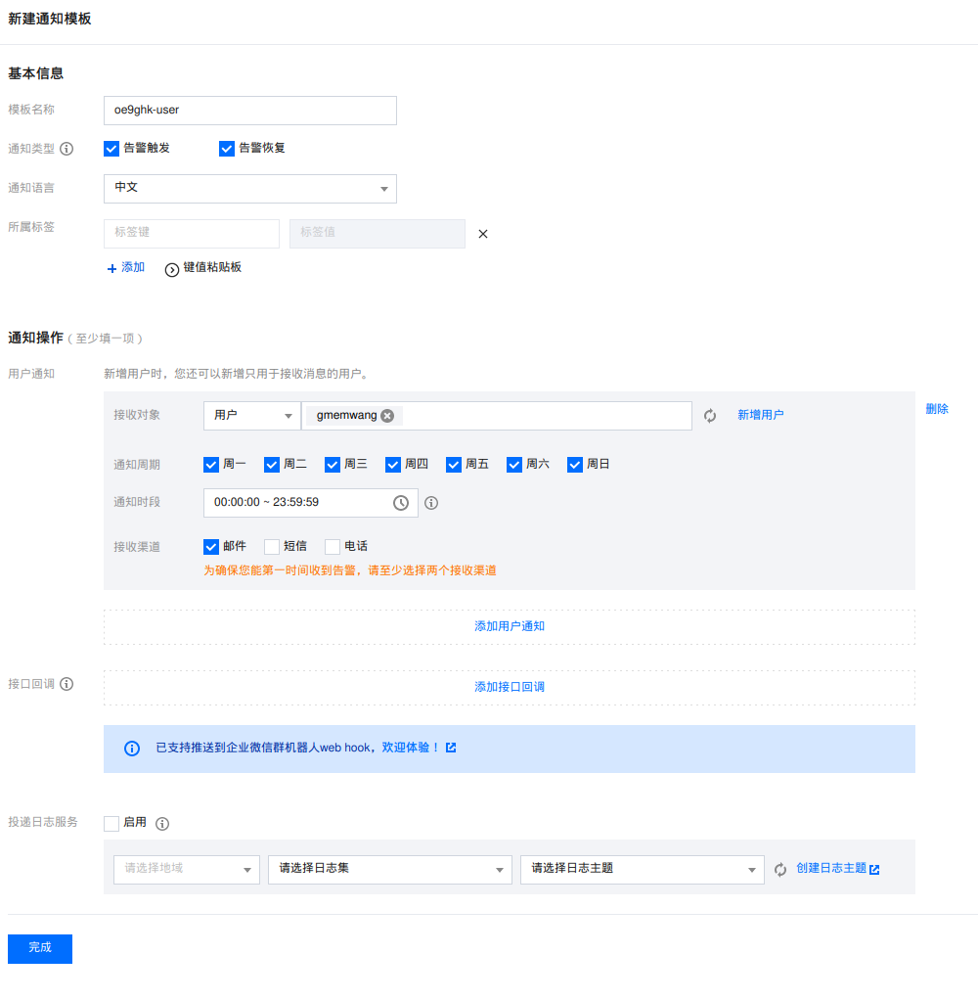

点击【完成】，返回到告警策略配置界面，点击【完成】，完成告警策略的配置。

注意：购买告警策略的配置可以通过Terraform完成，参考tamlab模块对应代码。

### 配置Prometheus告警

#### 云产品告警

本节以CVM为例，演示如何基于Prometheus配置一个告警规则。

##### 集成云产品指标到Prometheus

进入： https://console.tencentcloud.com/monitor/prometheus?rid=9 ，找到刚刚创建的Prometheus实例，第一列上的链接进入Prometheus实例详情页。

点击【数据采集】选项卡，选择子选项卡【集成中心】，选择【云监控】，点击【一键安装】，如下图：

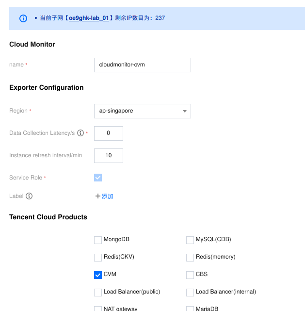

根据需要，勾选一个或多个云产品类别，最后点击保存即可。等待一段时间后，在集成中心的【已安装】段，可以看到：

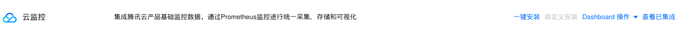

点击【查看已集成】，在弹出Drawer中点击指标明细，可以看到Prometheus已经开始采集云产品的指标：


##### 配置告警策略

进入： https://console.tencentcloud.com/monitor/prometheus?rid=9 ，找到刚刚创建的Prometheus实例，点击操作栏的【告警策略】，进入告警策略管理界面。

点击【新建告警策略】，参考下图进行设置：

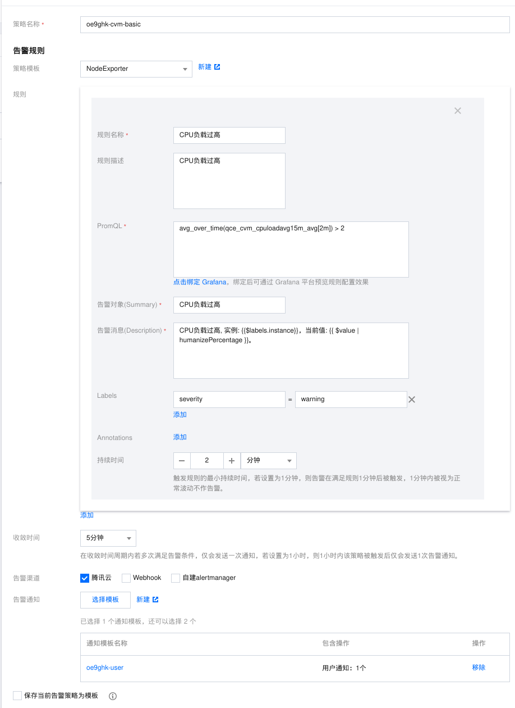

注意：告警渠道选择【腾讯云】，并且使用我们在上面的腾讯云原生告警中创建的通知模板。

点击保存即可。
