# 手动部署AWS资源
* [1.前置准备](#1-前置准备)

  * [资源组](#1-前置准备)
  * [IAM AccessKey](#1-前置准备)
* [2.VPC\&Subnets](#2-vpc--subnets)
* [3.配置跳板机](#3-配置跳板机)
* [4.安全组Security Groups](#4-安全组security-groups)
* [5.创建PostgreSQL](#5-创建postgresql)

  * [创建RDS Subnet Groups](#5-创建postgresql)
  * [创建PostgreSQL实例(1主1从)](#5-创建postgresql)
  * [创建PostgreSQL实例(只读副本)](#5-创建postgresql)
* [6.创建Redis](#6-创建redis)

  * [创建Parameter group](#6-创建redis)
  * [配置Parameter group](#6-创建redis)
  * [创建Redis实例](#6-创建redis)
* [7.创建MSK(Kafka)](#7-创建mskkafka)
* [8.部署EKS(TKE)](#8-部署ekstke)

  * [创建IAM](#8-部署ekstke)
  * [创建EKS](#8-部署ekstke)
  * [EKS连接方法](#8-部署ekstke)
  * [创建EKS Node Groups](#8-部署ekstke)
* [9.部署Auto Scaling](#9-部署auto-scaling)

  * [创建Launch Template](#9-部署auto-scaling)
  * [创建Auto Scaling Groups](#9-部署auto-scaling)
* [10.部署ingress controller](#10-部署ingress-controller)

> 说明：这里要先把后续章节反复用到的一些**核心基础资源**准备好。

---

## 1. 前置准备
为了完成后续资源的创建，可以首先准备一些必要资源：

### 资源组
为了方便进行资源分类与管理，在AWS上一般通过标签（Tags）给资源打标，**Resource Groups & Tag Editor**提供了按标签聚合查看与管理资源的方式。具体操作方法：

**创建资源组**  
   - 登录[AWS Resource Groupes Console](https://ap-southeast-1.console.aws.amazon.com/resource-groups/groups/new?region=ap-southeast-1)，或者通过控制台进入**Management & Governance → Resource Groups & Tag Editor**（或用顶部搜索），打开**Resource Group & Tag Editor**页面进入。
   - 在**Saved Resource Groups**区域点击**Create Resource Group**，或在左侧**Resources**导航下点击**Create Resource Group**。
   - 在**Grouping criteria**区域保持**All supported resource types**。新增一条标签：`Project = AWS-IaC`，点击**Add**。
    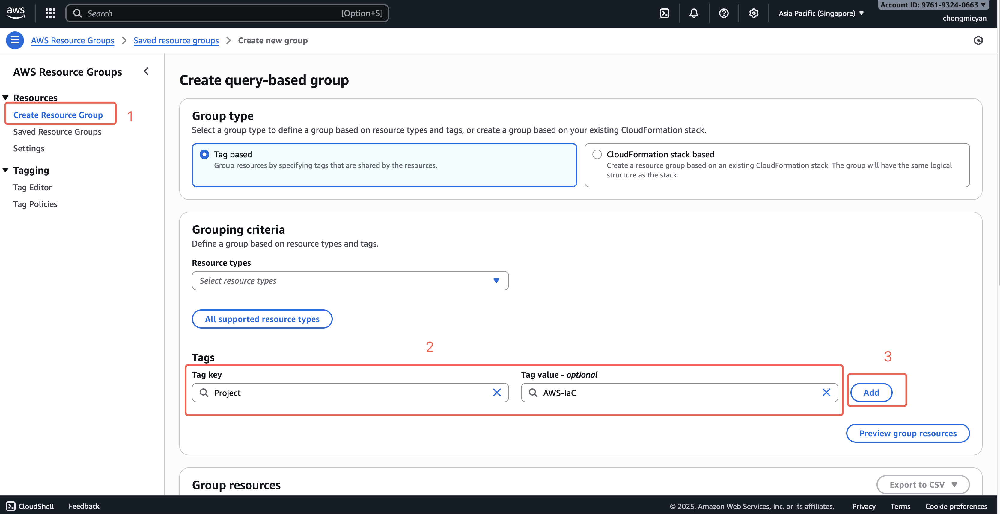
   - 在**Group details**区域，填写**Group name**：`Project-AWS-IaC`，可选填**Group description**，底部**Create group**创建完成。

创建资源如下：

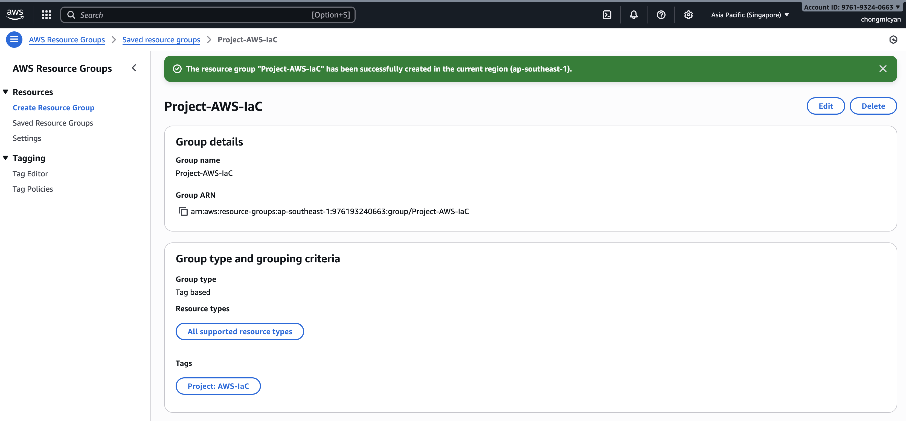

在后续实验中，我们将始终给资源打上`Project = AWS-IaC`标签，以便它们自动归入该资源组。

### IAM Access Key
**创建IAM Access Key**  
   - 登录[AWS IAM User Console](https://us-east-1.console.aws.amazon.com/iam/home?region=ap-southeast-1#/users)
   - 选中具体的操作人员：
   - 点击`Security credentials` > `Create access key`
   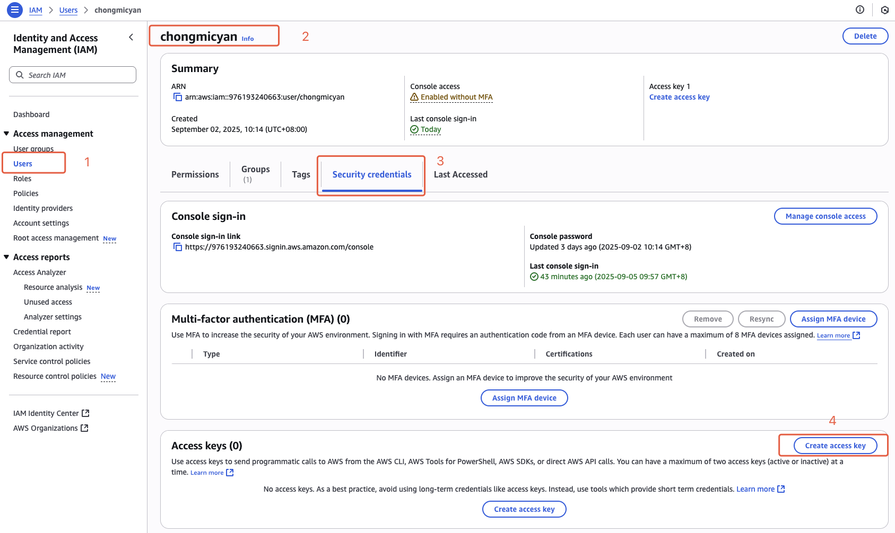
   - **Use case**：选择`Command Line Interface (CLI)`
   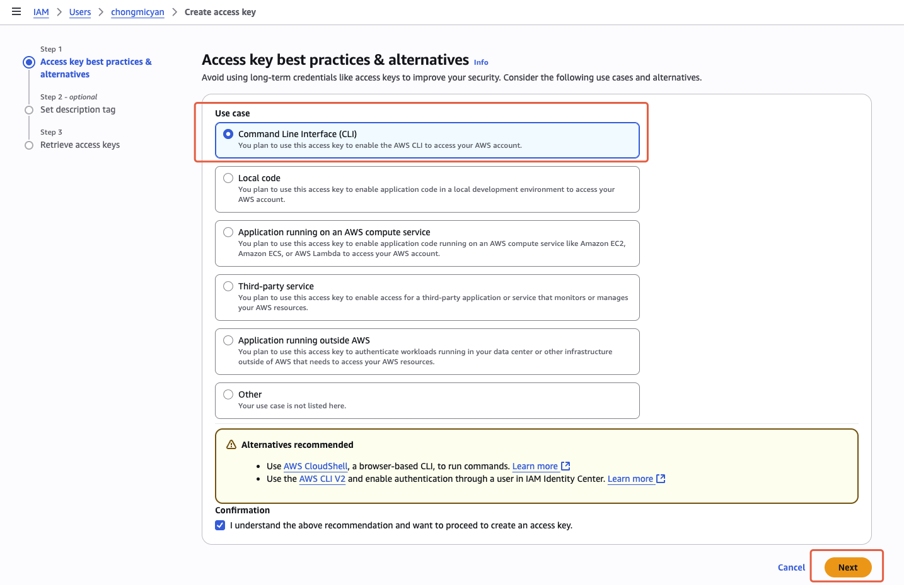
   - **点击next并安全保存access keys**
---

## 2. VPC & Subnets

VPC是AWS上的**隔离网络环境**；子网（Subnet）是VPC内的一段IP地址块。

创建VPC/子网时的一些典型参数如下：

| 参数                        | 说明                                     |
| ------------------------- | -------------------------------------- |
| VPC Name                  | 建议规范命名，避免多个同名VPC带来的误删风险。               |
| VPC CIDR                  | 示例使用`10.100.0.0/16`，实际根据企业网段规划设置。      |
| 可用区（AZ）                   | 子网需指定AZ；为高可用，建议在一个区域至少启用3个AZ。          |
| Subnet CIDR               | 控制台向导会要求至少创建一个子网；本示例创建2个AZ的公有/私有子网各一组。 |
| VPC Endpoint - S3 Gateway | 通过网关型VPC Endpoint访问S3，无需IGW/NAT。       |
| NAT Gateway               | 私有子网访问外网的出入口；本示例在1个AZ创建。               |

**创建VPC**  
   - 登录[AWS VPC Console](https://ap-southeast-1.console.aws.amazon.com/vpcconsole/home?region=ap-southeast-1#Home:)
   - 点击**Create VPC**。
   - 选择**VPC and more**。可以关闭`Auto-generate`以规范命名；设置IPv4 CIDR，如`172.16.0.0/16`。
   - 右侧**Preview**部分可以手动写入`vpc`和`subnet`的命名。
    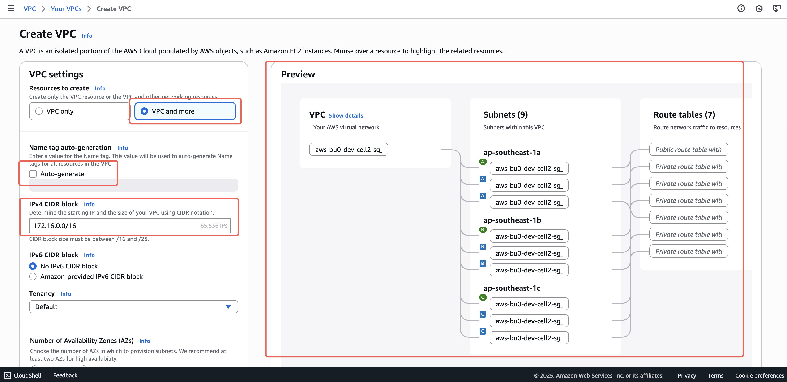
   - 左侧**Number of Availability Zones (AZs)** 选择`3`, **Number of public subnets** 选择`3`，**Number of private subnets**选择`6`, **Customize subnets CIDR blocks**部分分别写入**172.16.0.0/24~172.16.8.0/24**网段
    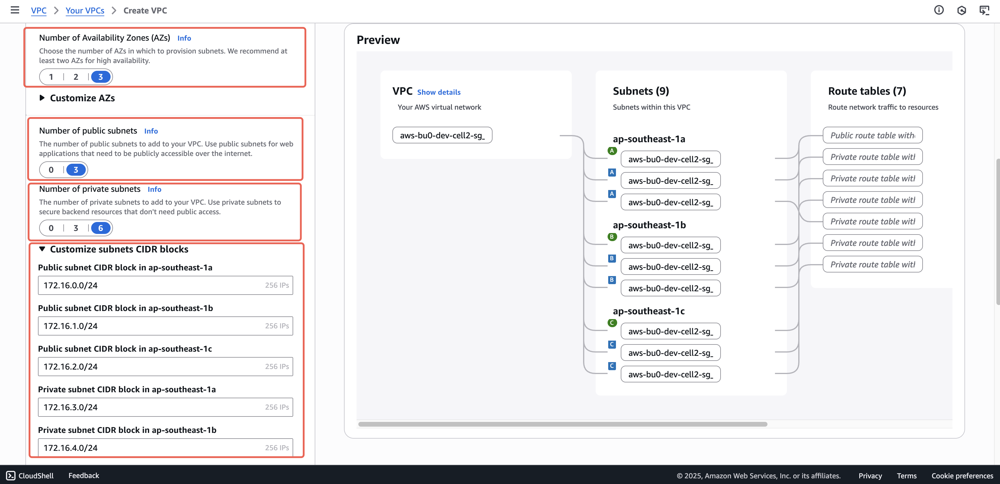
   - NAT选择**In 1 AZ**，VPC endpoints勾选**S3 Gateway**。在**Additional tags**中加上`Project=AWS-IaC`。
    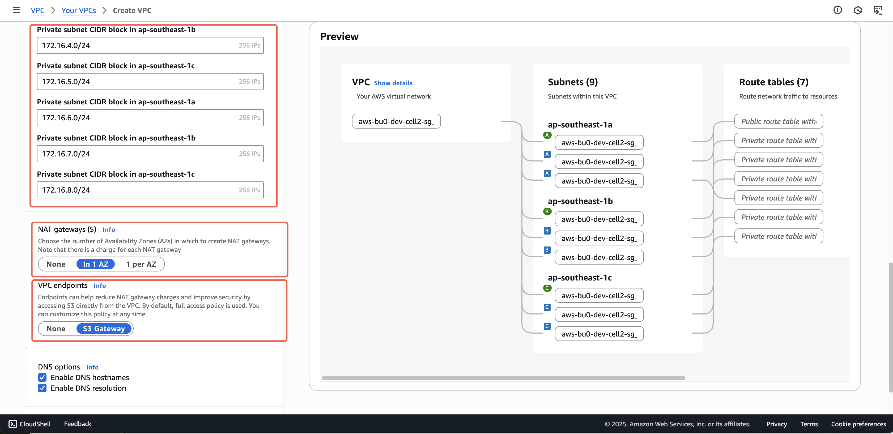

**创建Subnets**  
上述步骤创建**VPC and more**中只能根据AWS给的建议模版创建Subnets，为了创建更多的Subnets，可以在原VPC下进行添加：
   - 登录[AWS Subnets Console](https://ap-southeast-1.console.aws.amazon.com/vpcconsole/home?region=ap-southeast-1#subnets:)
   - 点击**Create subnet**。
   - **VPC ID**选择：`aws-bu0-dev-cell2-sg_vpc`。
   - **Subnets settings**：添加三个subnets，并且设置不同的`Availability Zone`，并补全`IPv4 subnet CIDR block`
   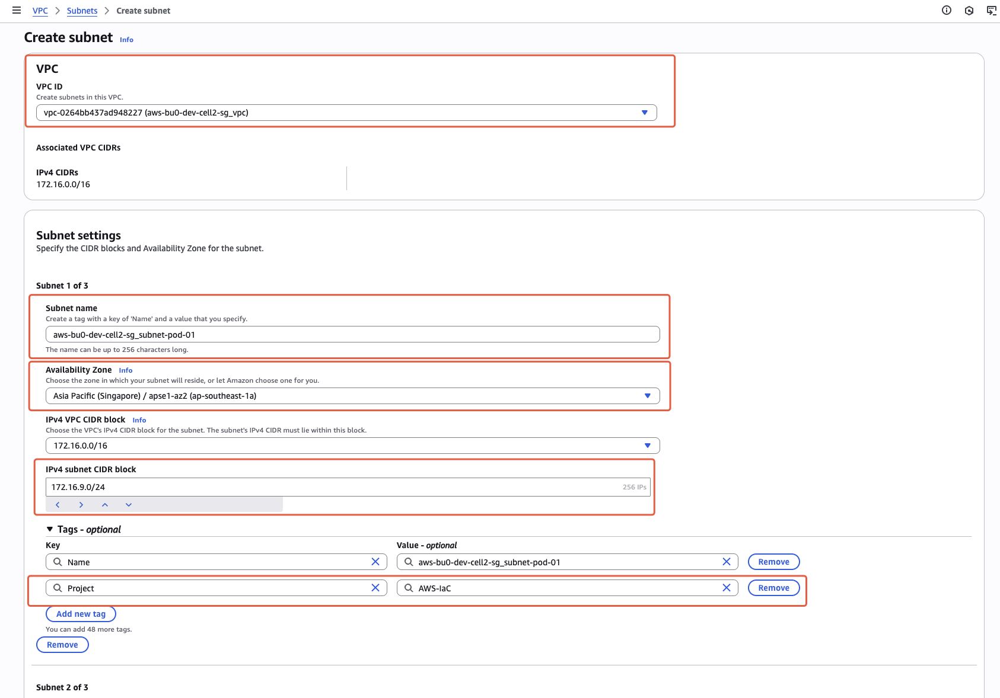

   - 对应VPC与subnet的命名和网段如下所示：
        **VPC名称**:`aws-bu0-dev-cell2-sg_vpc`
        **VPC网段**:`172.16.0.0/16`

        | 可用区(AZ) | 子网名称 | CIDR |
        | --- | --- | --- |
        | ap-southeast-1a | aws-bu0-dev-cell2-sg_subnet-mo_01 | 172.16.0.0/24 |
        | ap-southeast-1b | aws-bu0-dev-cell2-sg_subnet-mo_02 | 172.16.1.0/24 |
        | ap-southeast-1c | aws-bu0-dev-cell2-sg_subnet-mo_03 | 172.16.2.0/24 |
        | ap-southeast-1a | aws-bu0-dev-cell2-sg_subnet-db_01 | 172.16.3.0/24 |
        | ap-southeast-1b | aws-bu0-dev-cell2-sg_subnet-db_02 | 172.16.4.0/24 |
        | ap-southeast-1c | aws-bu0-dev-cell2-sg_subnet-db_03 | 172.16.5.0/24 |
        | ap-southeast-1a | aws-bu0-dev-cell2-sg_subnet-node_01 | 172.16.6.0/24 |
        | ap-southeast-1b | aws-bu0-dev-cell2-sg_subnet-node_02 | 172.16.7.0/24 |
        | ap-southeast-1c | aws-bu0-dev-cell2-sg_subnet-node_03 | 172.16.8.0/24 |
        | ap-southeast-1a | aws-bu0-dev-cell2-sg_subnet-pod_01 | 172.16.9.0/24 |
        | ap-southeast-1b | aws-bu0-dev-cell2-sg_subnet-pod_02 | 172.16.10.0/24 |
        | ap-southeast-1c | aws-bu0-dev-cell2-sg_subnet-pod_03 | 172.16.11.0/24 |
完成创建后VPC信息如下图所示：
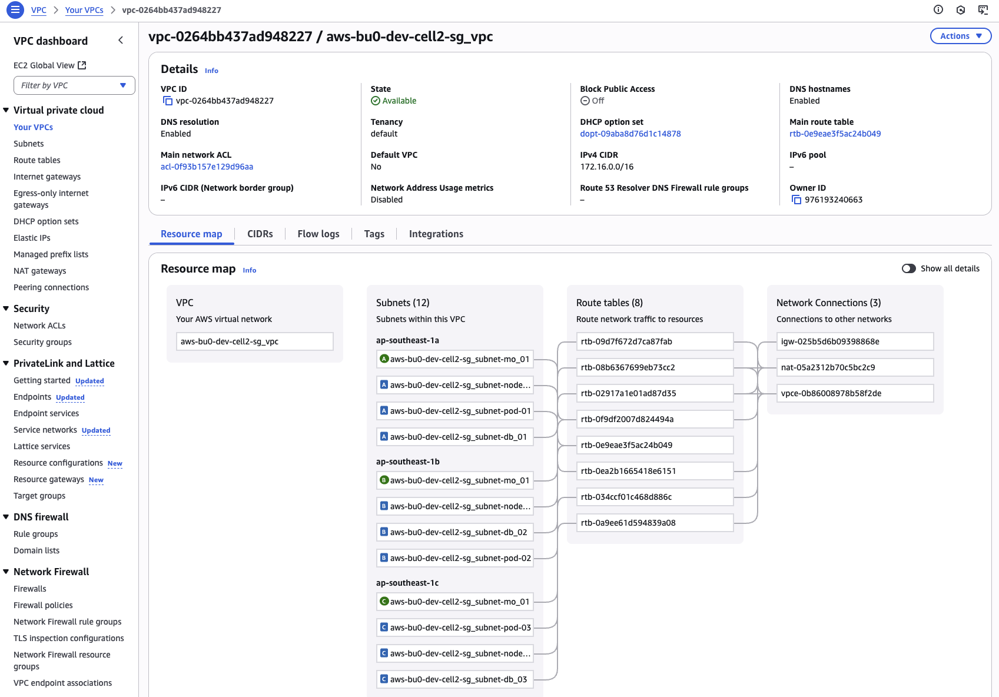

---

## 3. 配置跳板机

为了方便进行应用部署以及内网集群连通，可以创建跳板机以帮助我们访问资源。
**创建Key Pairs**  
   - 登录[AWS Key Pairs Console](https://ap-southeast-1.console.aws.amazon.com/ec2/home?region=ap-southeast-1#KeyPairs:)
   - 点击**Create key pair**。
   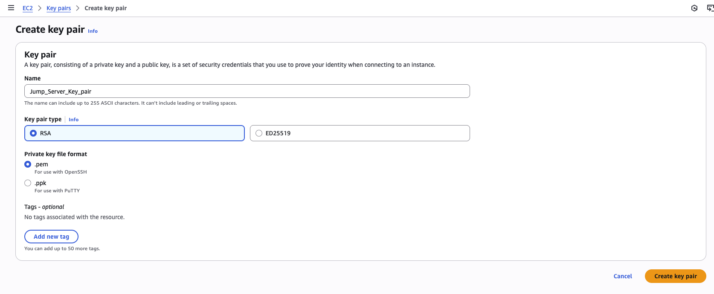 


**创建跳板机**  
   - 登录[AWS Instance Console](https://ap-southeast-1.console.aws.amazon.com/ec2/home?region=ap-southeast-1#Instances:)
   - 点击**Launch Instances**。
   - 填入Name:**aws-bu0-dev-cell2-sg_instance**，操作系统选择`Ubuntu`，镜像选择`Ubuntu Server 22.04 LTS`，Instance type选择`t3.small`。
   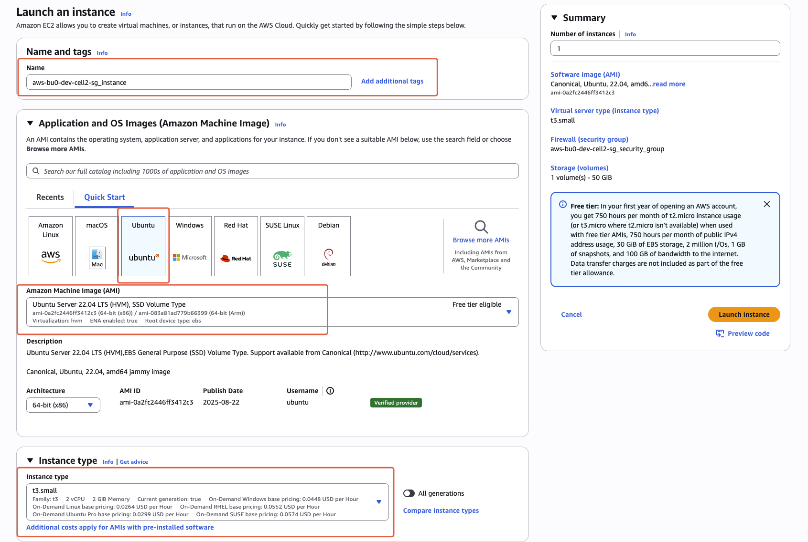
   - 可以根据需求选择**Key Pair**：`Jump_Server_Key_pair`。
   - Network settings设置：VPC选择`aws-bu0-dev-cell2-sg_vpc`,subnet选择`aws-bu0-dev-cell2-sg_subnet-mo_01`，Auto-assign public IP
    选择`Enable`安全组可以选择`existing secruity group`默认安全组(下个部分会详细修改安全组内容)
   - 调整主机Configure storage如图
    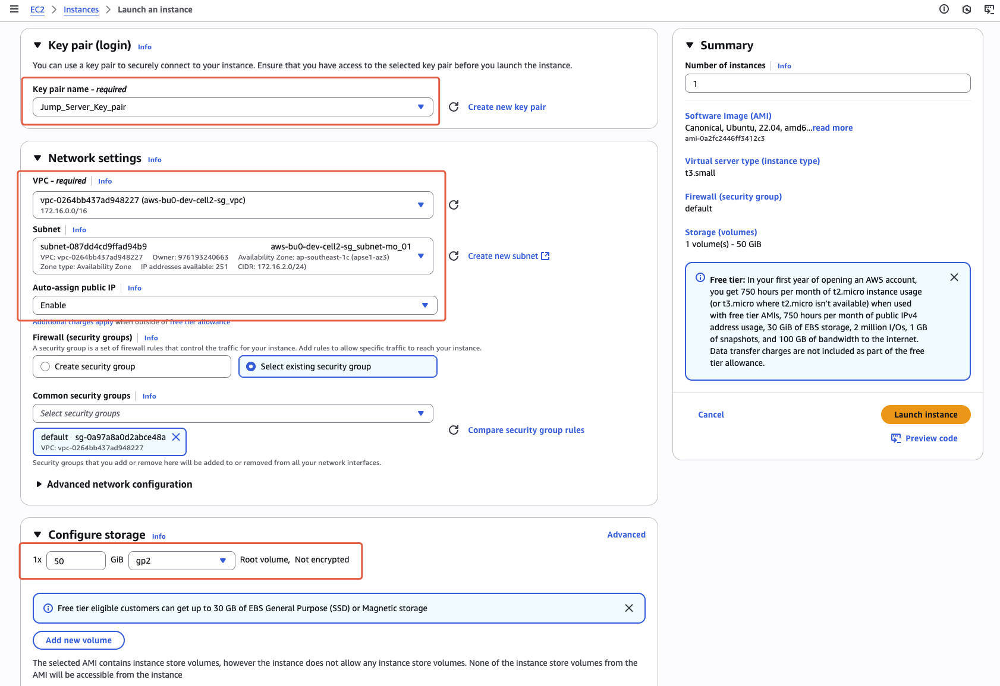
   - 查看跳板机公网IP为`18.143.160.189`

## 4. 安全组（Security Groups）

### 默认安全组

创建VPC时会自动生成一个**默认安全组**。它允许同安全组内的资源互访。
> 若资源创建时未显式关联安全组，默认会关联该VPC的默认安全组。

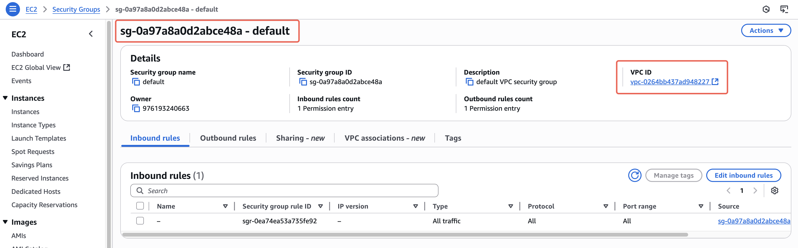
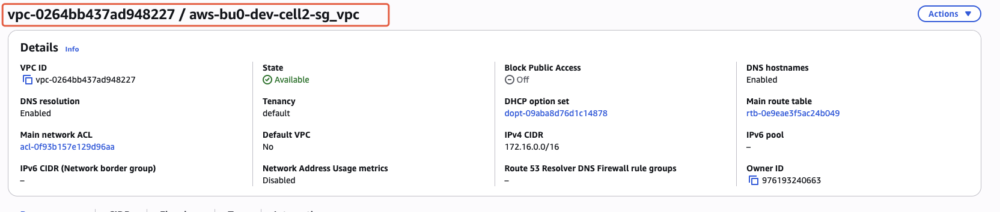

### 自定义安全组

为了方便进行应用网段管理以及后续跳板机放通连接，可以通过自定义安全组的方式完成访问控制。
**创建自定义安全组**  
   - 登录[AWS SecurityGroups Console](https://ap-southeast-1.console.aws.amazon.com/vpcconsole/home?region=ap-southeast-1#SecurityGroups:)
   - 点击**Create security group**。
   - 填入Name:**aws-bu0-dev-cell2-sg_security_group**，写入Description信息，并且VPC选择`aws-bu0-dev-cell2-sg_vpc`。
   - Inbound设置放通如下网段的All Traffic：`跳板机IP.0/24, 43.163.97.0/24, 61.135.194.0/24, 111.206.145.0/24, 59.152.39.0/24, 180.78.55.0/24, 111.206.94.0/24, 111.206.96.0/24, 43.132.141.0/24, 203.149.215.0/24, 203.149.194.0/24`
   - Outbound设置放通所有流量
   - Tags可以选择标签：`Project = AWS-IaC`
    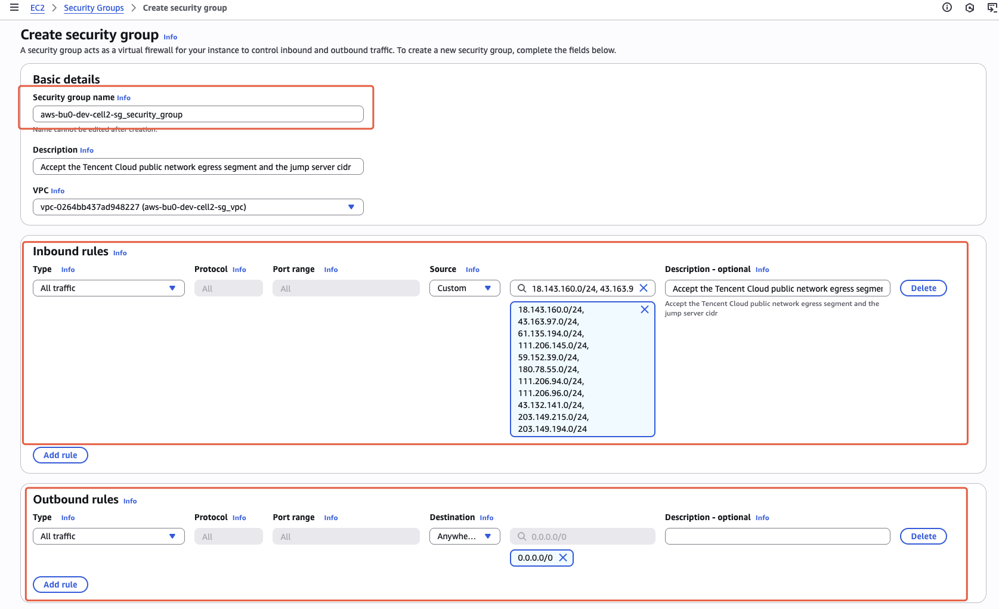

#### 更换跳板机安全组

为了能从公网上安全SSH到跳板机，需要更换跳板机的安全组。

**更换跳板机安全组**  
   - 登录[AWS Instance Console](https://ap-southeast-1.console.aws.amazon.com/ec2/home?region=ap-southeast-1#Instances:)
   - 选择跳板机：**aws-bu0-dev-cell2-sg_instance**。
   - 进入跳板机实例页面：点击`Actions` > `Security` > `Change security groups`
    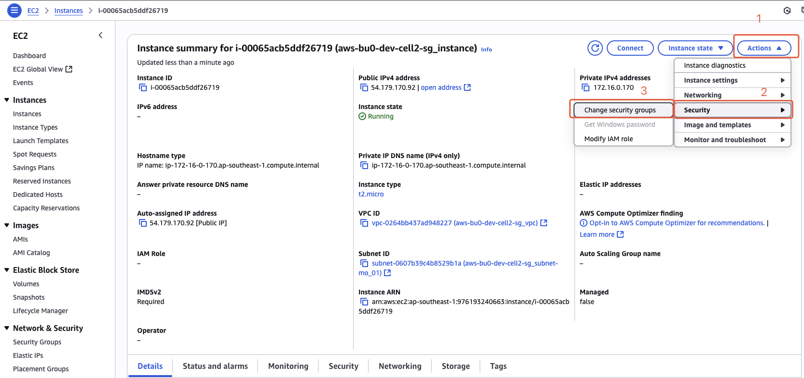
   - 进入更改安全组页面，先`Remove`解绑原先安全组，🔍选择自定义安全组，点击`Add security group`添加安全组，最后`Save`
    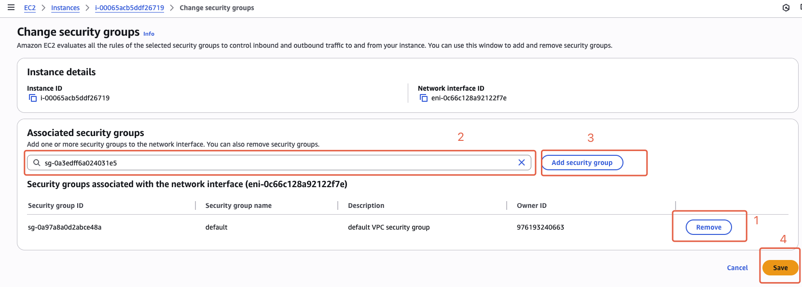

**连接方法**
```bash
# Locate your private key file. The key used to launch this instance is Jump_Server_Key_pair.pem
# [local host]
chmod 400 @/path/to/Jump_Server_Key_pair.pem

# Connect to your instance using its Public DNS: ec2-18-143-160-189.ap-southeast-1.compute.amazonaws.com
ssh -i @/path/to/Jump_Server_Key_pair.pem ubuntu@ec2-18-143-160-189.ap-southeast-1.compute.amazonaws.com
```

---

## 5. 创建PostgreSQL

### 创建RDS Subnet groups
RDS Subnet Group是RDS实例的子网候选池，保证RDS能在指定的VPC内跨AZ部署。

**配置RDS Subnet groups**  
   - 登录[AWS RDS Subnet groups Console](https://ap-southeast-1.console.aws.amazon.com/rds/home?region=ap-southeast-1#db-subnet-groups-list:)
   - 点击**Create DB subnet group**。
   - 填入Name:**aws-bu0-dev-cell2-sg-RDS-subnet-group**，写入Description信息，并且VPC选择`aws-bu0-dev-cell2-sg_vpc`。
   - Availability Zones：选择`ap-southeast-1a,ap-southeast-1b和ap-southeast-1c`
   - Select subnets：只选择`aws-bu0-dev-cell2-sg_subnet-db_01,aws-bu0-dev-cell2-sg_subnet-db_02和aws-bu0-dev-cell2-sg_subnet-db_03`
   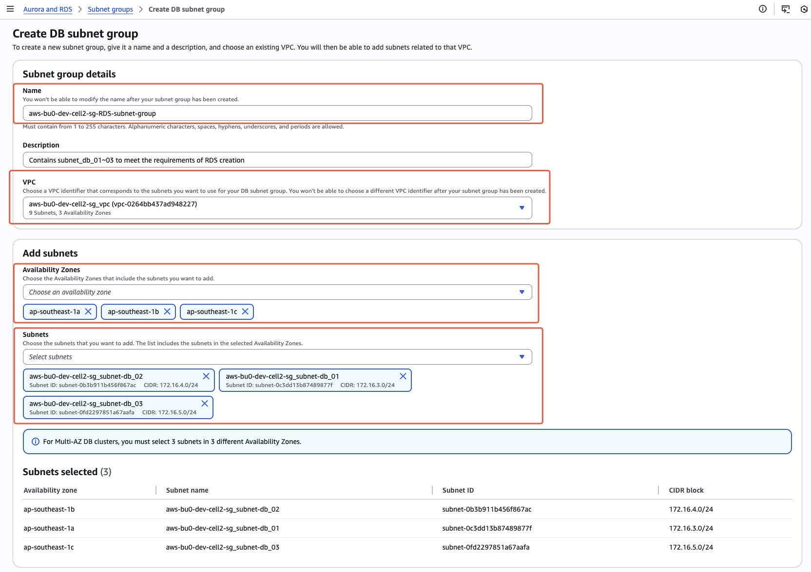
   
### 创建PostgreSQL实例

以下步骤创建AWS 一主一从+只读数据库的PostgreSQL配置，其中从节点是只读节点。

**创建PostgreSQL实例(1主1从)**  
   - 登录[AWS Aurora and RDS Console](https://ap-southeast-1.console.aws.amazon.com/rds/home?region=ap-southeast-1#)
   - 点击**Create a database**。
   - 选择创建`Standard create`，Engine options选择`PostgreSQL`，默认最新版本即可。
   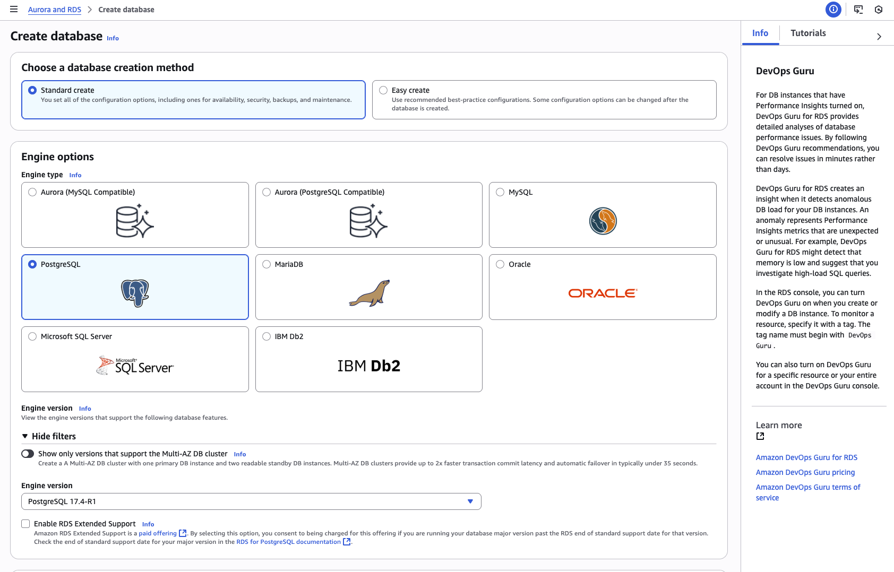
   - Template选择`Production`，Availability and durability - Deployment options选择`Multi-AZ DB instance deployment (2 instances)`即会创建一主一从配置。
   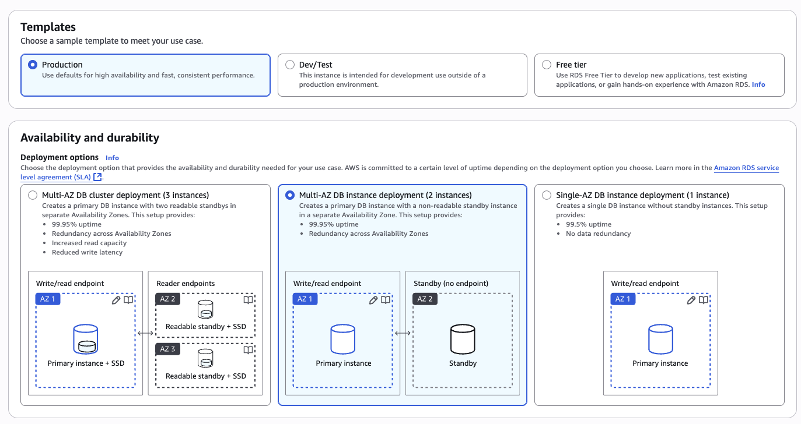
   - 填入DB instance identifier:**aws-bu0-dev-cell2-sg-pg**，Master username填入`pgadmin`并选择`Self managed`，填入自选的Master password，对标腾讯云的PostgreSQL规格，Instance configuration选择`Burstable classes (includes t classes)`并选择`2C4G`规格主机`db.t3.medium`。
   
   - 配置Storage：Storage type可以根据需求选择如General Purpose SSD，Allocated storage=`100GiB`
   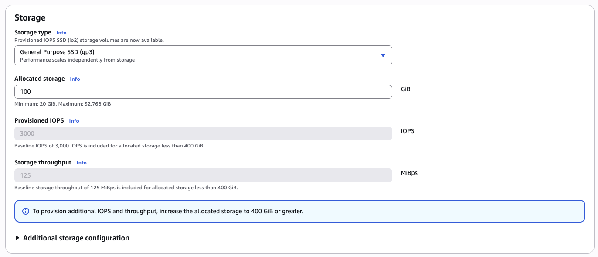
   - Connectivity中选择DB创建的VPC：**aws-bu0-dev-cell2-sg_vpc**，选择上一操作中创建的DB subnet group：**aws-bu0-dev-cell2-sg-RDS-subnet-group**，并选择自定义安全组：**aws-bu0-dev-cell2-sg_security_group**，其余选项默认即可。
   
   - Tags可以选择标签：`Project = AWS-IaC`
   - 其余选项如监控，可以根据需求配置。

**创建PostgreSQL实例(只读副本)**  
   - 登录[AWS Database Console](https://ap-southeast-1.console.aws.amazon.com/rds/home?region=ap-southeast-1#databases:)
   - 点击`aws-bu0-dev-cell2-sg-pg`进入刚创建的数据库，进行只读实例创建。
   - 点击右上角`Actions` > `Create read replica`
   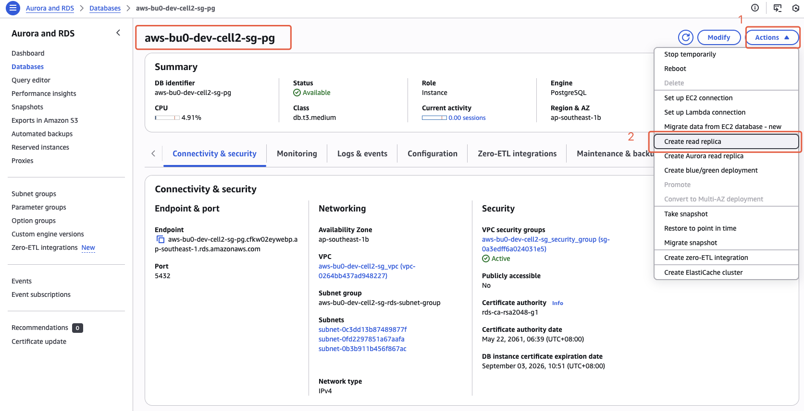

   - 填入DB instance identifier:**aws-bu0-dev-cell2-sg-pg-ro**，Instance configuration选择`Standard classes (includes m classes)`,可以选择`4C16G`规格主机`db.m5.xlarge`或`8C32G`规格主机`db.m5.2xlarge`，配置Storage：Storage type可以根据需求选择如General Purpose SSD，Allocated storage=`100GiB`
   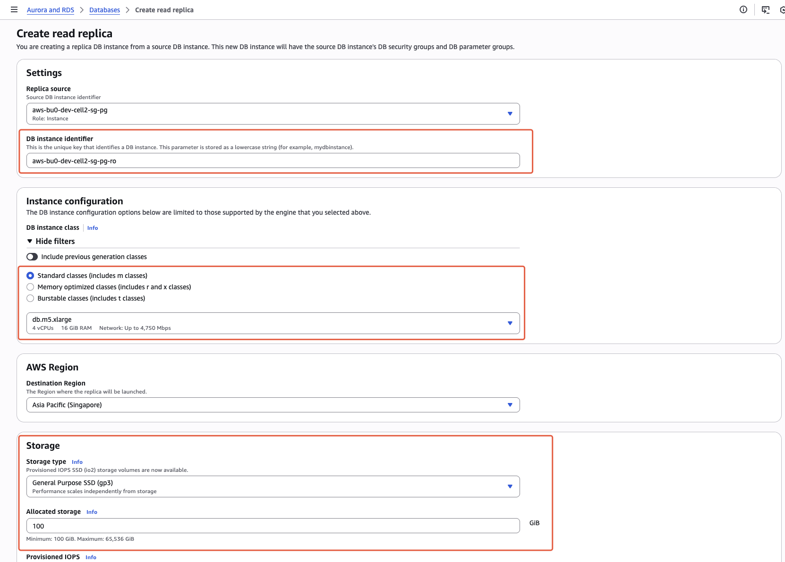
   - Availability - Deployment options选择`Single-AZ DB instance deployment (1 instance)`即会创建单个只读实例。选择对应的**DB subnet group**，其中**Availability Zone**可以根据已有的资源调整(通过以创建数据库的`Region & AZ`和`Configures-Secondary Zone`可以查看主从节点的可用区，选择第三个创建只读实例)
   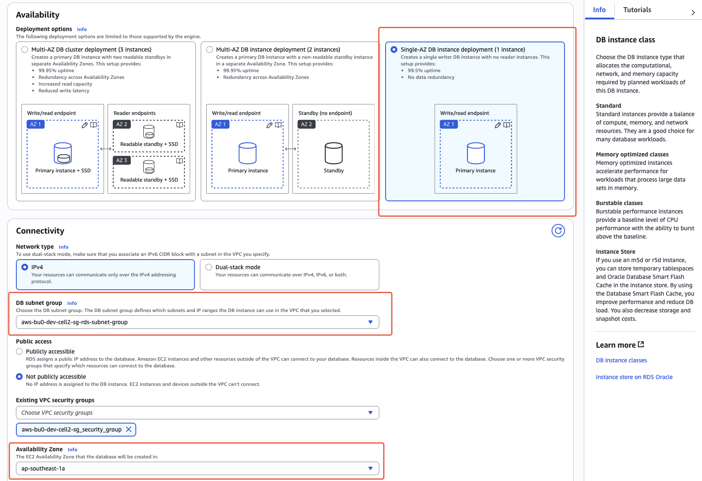
   - Tags可以选择标签：`Project = AWS-IaC`
   - 其余选项如监控，可以根据需求配置。

---

## 6. 创建Redis

### 创建Parameter group
创建Redis实例之前，可以优先配置`Parameter group`参数，相当于一组Redis.conf的参数集合。对于生产环境方便进行运维和调整配置，包含：
 - 设置合适的maxmemory-policy，避免OOM崩溃
 - 调整持久化策略（是否开启AOF，RDB频率）
 - 优化连接超时参数

**创建Parameter group**  
   - 登录[AWS Parameter group Console](https://ap-southeast-1.console.aws.amazon.com/elasticache/home?region=ap-southeast-1#/parameter-groups)
   - 点击**Create parameter group**。
   - 填入Name:**aws-bu0-dev-cell2-sg-db-parameter-group**，写入Description信息，Family选择管理的redis版本，此处选择`redis6.x`。
   - Tags可以选择标签：`Project = AWS-IaC`
   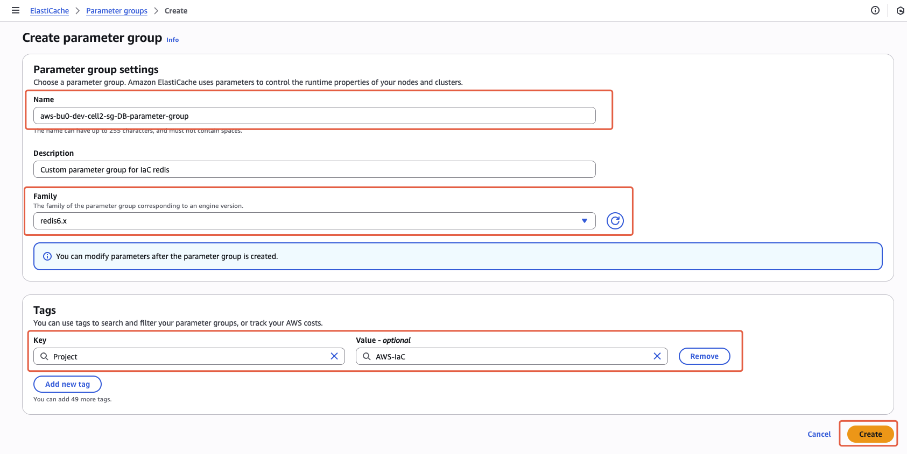
   
**配置Parameter group**  
   - 点进进入创建的Parameter group：**aws-bu0-dev-cell2-sg-db-parameter-group**
   - 点击**Edit parameter values**
   - 进入Parameters编辑页面：搜索`cluster`，将其中的`cluster-allow-reads-when-down`,`cluster-enabled`和`cluster-require-full-coverage`的Value设置为`yes`
   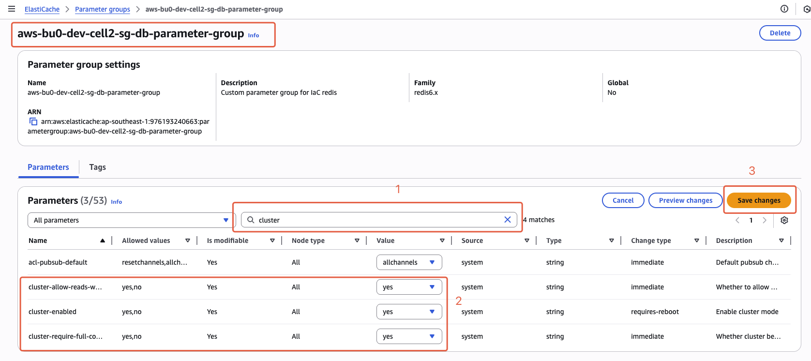

### 创建ElastiCache Subnet groups
ElastiCache Subnet Group是Redis实例的子网候选池，保证Redis能在指定的VPC内跨AZ部署。

**配置ElastiCache Subnet groups**  
   - 登录[AWS ElastiCache Subnet groups Console](https://ap-southeast-1.console.aws.amazon.com/elasticache/home?region=ap-southeast-1#/subnet-groups)
   - 点击**Create DB subnet group**。
   - 填入Name:**aws-bu0-dev-cell2-sg-redis-subnet-group**，写入Description信息，并且VPC选择`aws-bu0-dev-cell2-sg_vpc`。
   - Select subnets：只选择`aws-bu0-dev-cell2-sg_subnet-db_01,aws-bu0-dev-cell2-sg_subnet-db_02和aws-bu0-dev-cell2-sg_subnet-db_03`
   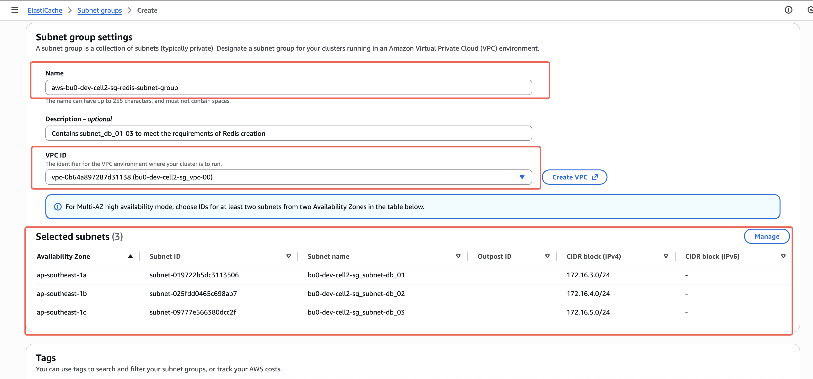

### 创建Redis实例

以下步骤创建Redis Cache。

**创建Redis**  
   - 登录[AWS Redis Console](https://ap-southeast-1.console.aws.amazon.com/elasticache/home?region=ap-southeast-1#/redis)
   - 点击**Create cache**。
   * **Engine options**选择：`Redis OSS`。
   * **Deployment option**选择：`Design your own cache`（自己指定节点类型、数量和分片配置）。
   * **Creation method**选择：`Cluster cache`（自定义所有参数，支持集群模式）。
   * **Cluster mode**选择 **Enabled**，开启集群模式（Redis 集群分片存储，支持水平扩展和高可用）。
   * **Cluster info：Name**填写：`aws-bu0-dev-cell2-sg-redis`
   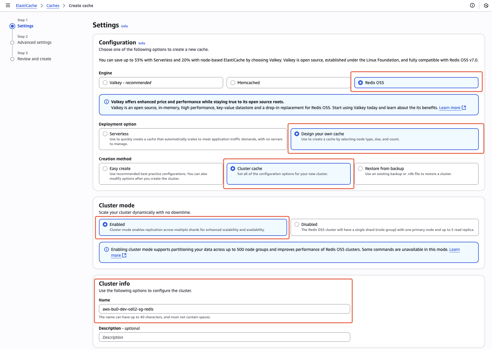

   * **Location**选择：`AWS Cloud`（将集群部署在AWS云上）。
   * **Multi-AZ**选择：`Enable`（启用多可用区部署，跨AZ自动故障转移，提高高可用性）。
   * **Engine version**选择：`6.2`（与腾讯云Redis6.2版本对标）。
   * **Port**填写：`6379`（Redis默认端口）。
   * **Parameter groups**选择：`aws-bu0-dev-cell2-sg-db-parameter-group`（自定义参数组，用于控制运行时配置）。
   * **Node type**选择：`cache.m5.large`（6.38 GiB内存，网络性能较高，接近腾讯云单节点4GB的规格）。
   * **Number of shards**填写：`3`（配置3个分片，匹配腾讯云Redis集群3分片架构）。
   * **Replicas per shard**填写：`1`（每个分片1个副本，形成主从架构，保证高可用）。
   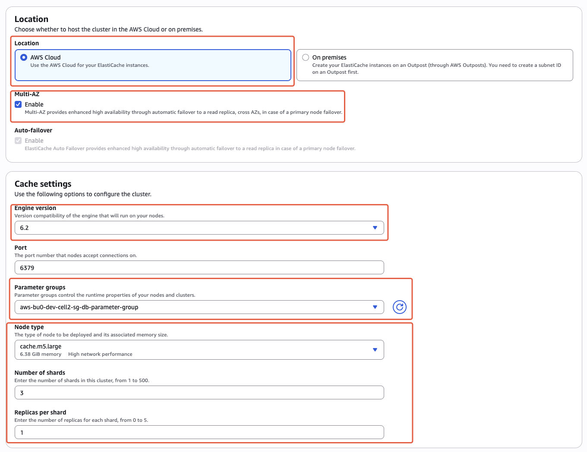

   * **Network type**选择：`IPv4`（默认即可，Redis集群只需IPv4访问）。
   * **Subnet groups**选择：已有的`aws-bu0-dev-cell2-sg-redis-subnet-group`（无需新建，直接复用之前的子网组即可）。
   * **Associated subnets**自动包含了3个可用区的子网：
      * ap-southeast-1a → `aws-bu0-dev-cell2-sg_subnet-db_01`
      * ap-southeast-1b → `aws-bu0-dev-cell2-sg_subnet-db_02`
      * ap-southeast-1c → `aws-bu0-dev-cell2-sg_subnet-db_03`
   * **Availability Zone placements**保持默认：
      * **Slots and keyspaces** → `Equal distribution`（系统会自动将16,384个slot均分到3个分片）。
      * **Availability Zone placements** → `No preference`（默认即可，系统会自动在不同AZ分布节点，保证高可用）。
      * **Shard分布** → 默认均匀分配，每个分片的Primary/Replica都保持`No preference`。
   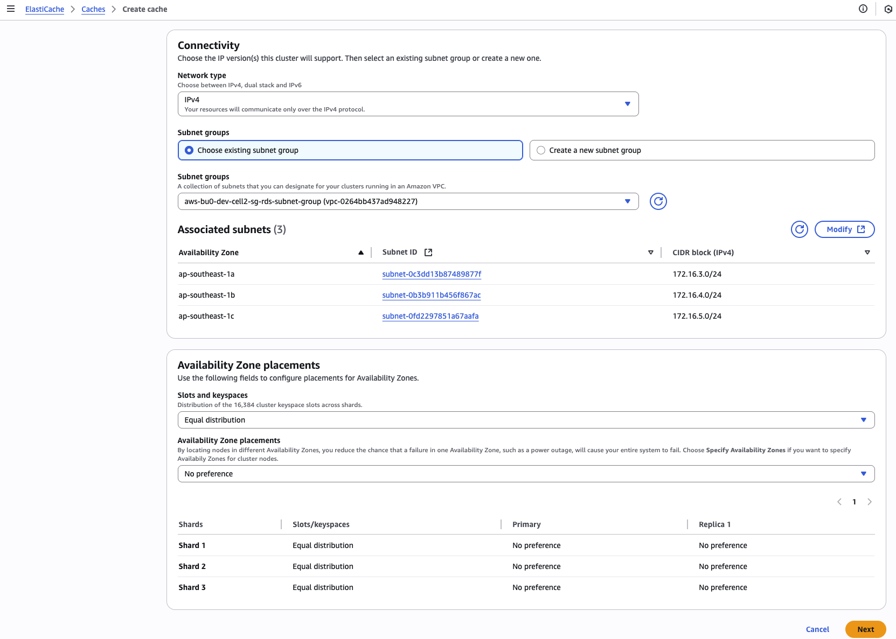

   * **Security**：可以根据应用需求配置`Encryption at rest`或`Encryption in transit`（用于保护数据在Redis中的安全以及传输过程安全）。
   * **Selected security groups**选择：已有的`aws-bu0-dev-cell2-sg_security_group`。
   * **Backup**：开启`Enable automatic backups`并选择**Backup retention period**为`1`。
   * 其余内容可根据需求配置：开启**日志监控**或配置**tag**。
   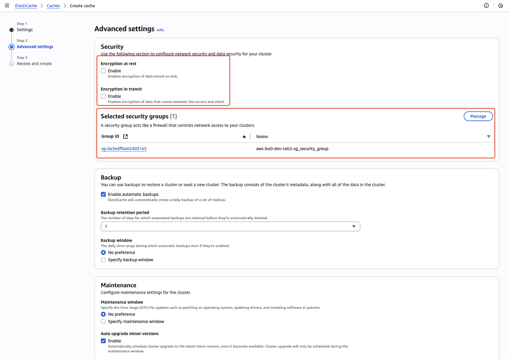


## 7. 创建MSK(Kafka)

以下步骤创建Kafka Cluster。

**创建MSK**  
   - 登录[AWS MSK Console](https://ap-southeast-1.console.aws.amazon.com/msk/home?region=ap-southeast-1#/clusters)
   - 点击**Create cluster**。

   * **Creation method**选择：`Custom create`（自定义创建，允许设置安全、可用性以及自定义配置）。
   * **Cluster name**填写：`aws-bu0-dev-cell2-sg-MSK`。
   * **Cluster type**选择：`Provisioned`（预置模式，需要指定broker数量和存储）。
   * **Apache Kafka version**选择：`3.8.x`（推荐版本）。
   * **Metadata mode**选择：`ZooKeeper`（使用Zookeeper管理集群元数据）。
   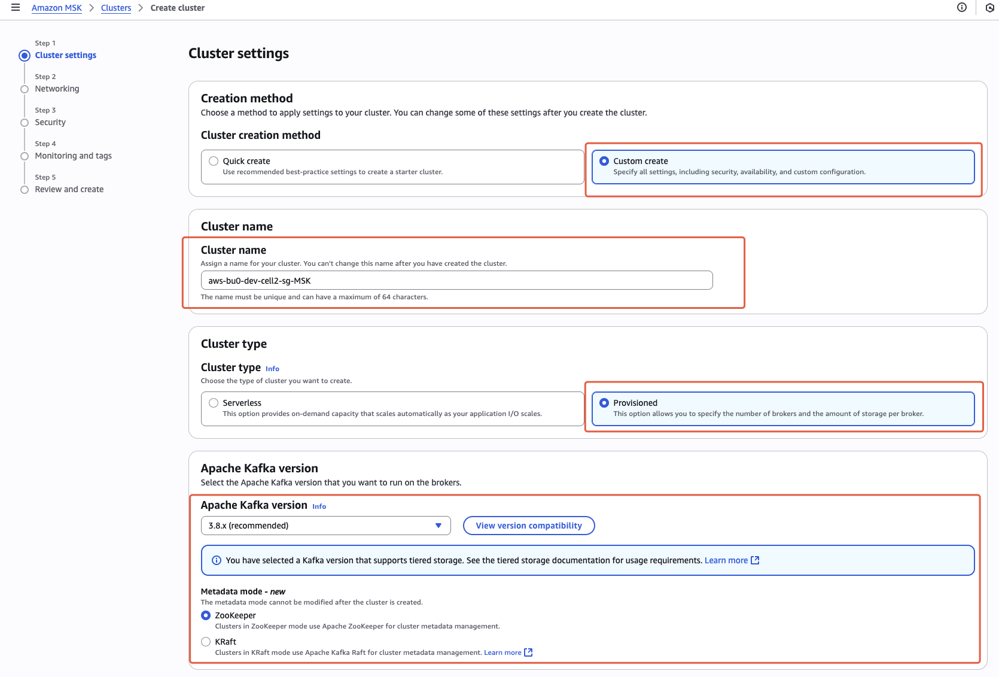
---

   * **Broker type**选择：`Standard brokers`（适用于所有Kafka版本的标准Broker）。
   * **Broker size**选择：`kafka.t3.small`（2 vCPU / 2 GiB内存 / Up to 5 Gbps 网络性能）。
   * **Number of zones**选择：`2`（Broker分布在两个可用区）。
   * **Brokers per zone**填写：`1`（每个可用区1个Broker，总计2个Broker）。
   * **Storage**填写：`200 GiB`（每个Broker使用200GiB存储）。
   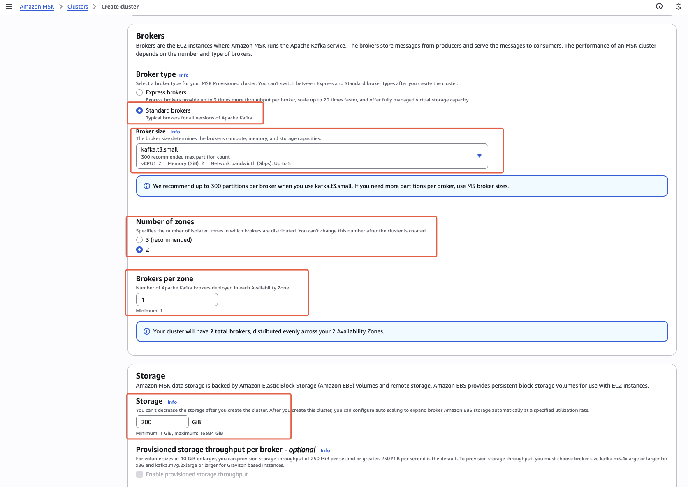

---
   * **VPC**选择：`aws-bu0-dev-cell2-sg_vpc`。
   * **First zone**选择：`ap-southeast-1a`，子网：`aws-bu0-dev-cell2-sg_subnet-db_01`。
   * **Second zone**选择：`ap-southeast-1b`，子网：`aws-bu0-dev-cell2-sg_subnet-db_02`。
   * **Public access**保持默认：`Off`（不对公网开放，仅VPC内可访问）。
   * **Security groups in Amazon EC2**通过**Browse**可以搜索已有安全组，选择`aws-bu0-dev-cell2-sg_security_group`
   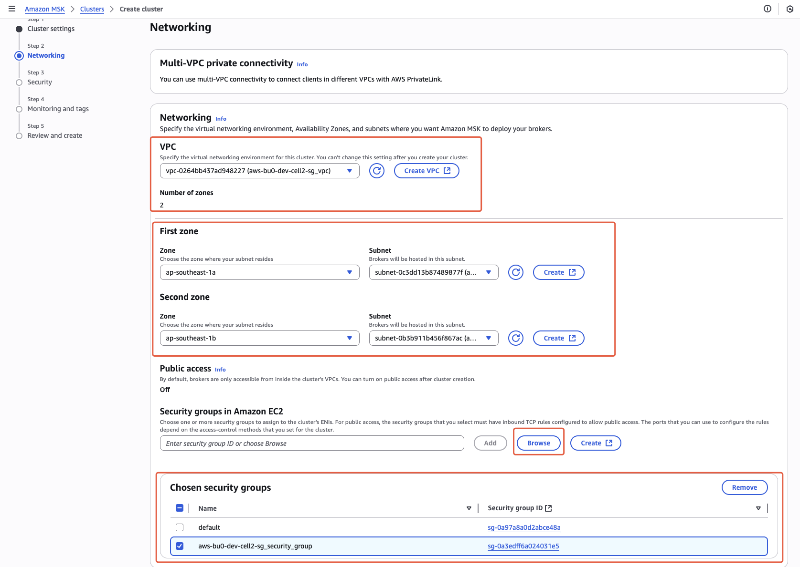

---
   * **Security配置**：保持默认即可
   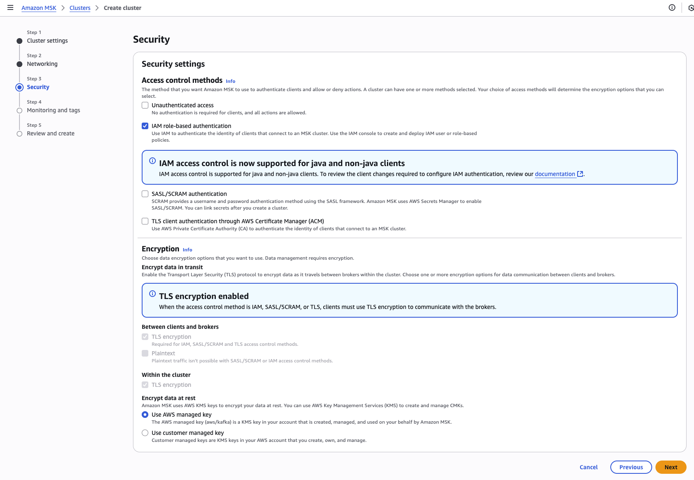

---
   * **Monitoring and tags配置**：可根据需求调整tag，其他部分保持默认即可
   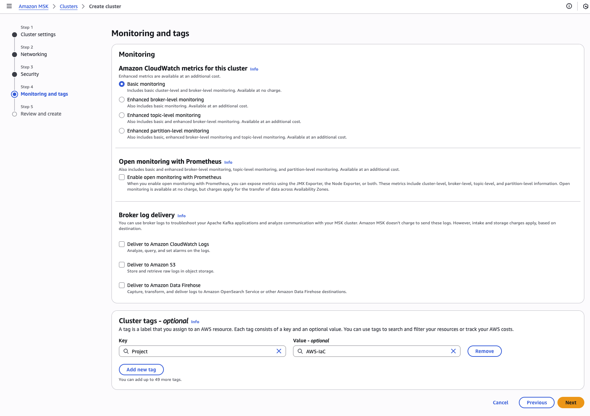


## 8. 部署EKS(TKE)

以下步骤创建Amazon Elastic Kubernetes Service。


### 创建IAM
**创建EKS Auto Cluster Role**
   - 登录[AWS IAM Console](https://us-east-1.console.aws.amazon.com/iam/home?/roles#/roles)
   - 点击**Create role**。
   * **Select trusted entity**选择：`AWS service`
   * **Use case**下拉选择：`EKS`,并选择`EKS - Auto Cluster`(允许集群Kubernetes控制平面代表您管理AWS资源。)
   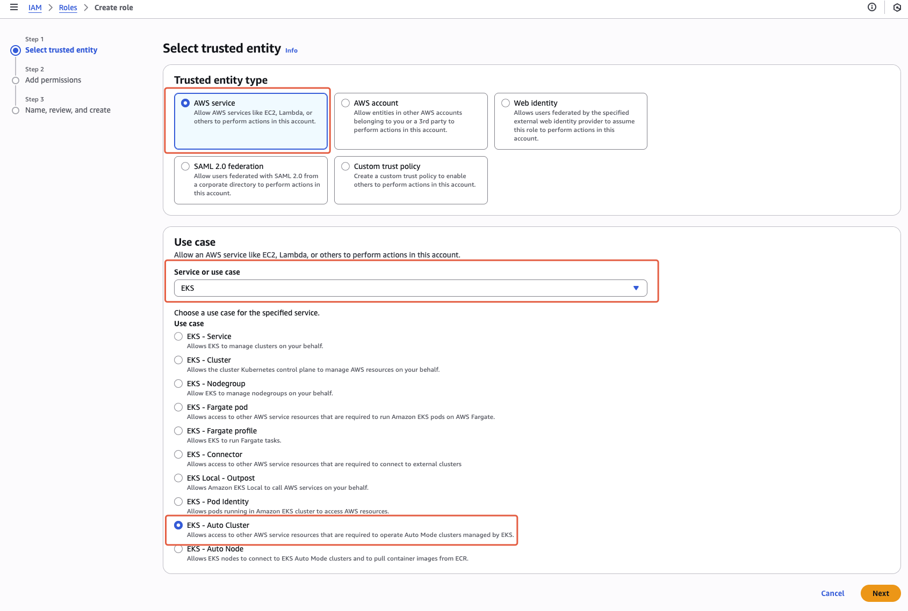
---
   * **Add permissions**默认即可
   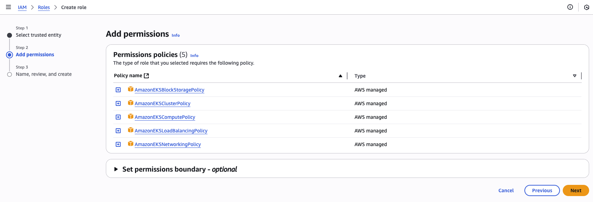
---
   * **Role name**填写：EKS-Auto-Cluster-Role
   * **Select trusted entities**：会自动生成。
   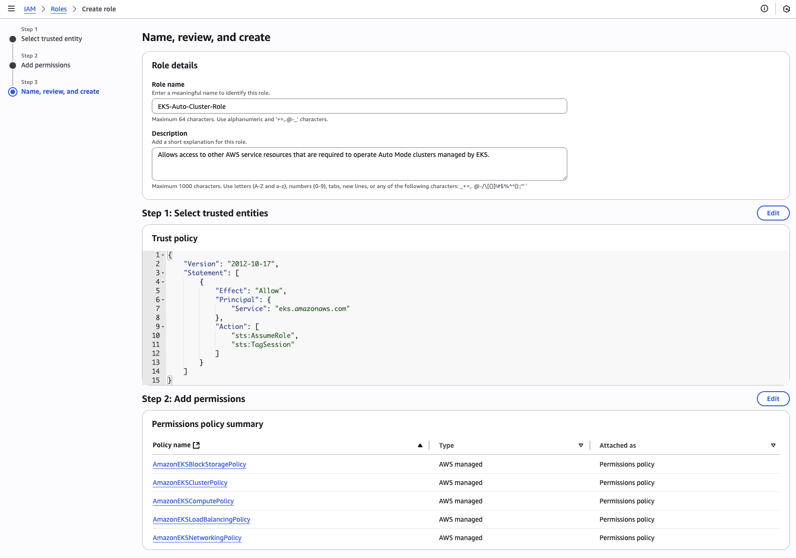

**创建EKS Node Role**
   - 登录[AWS IAM Console](https://us-east-1.console.aws.amazon.com/iam/home?/roles#/roles)
   - 点击**Create role**。
   * **Select trusted entity**选择：`AWS service`
   * **Use case**下拉选择：`EKS`,并选择`EKS - Auto Node`(允许集群Kubernetes进行Node控制)
   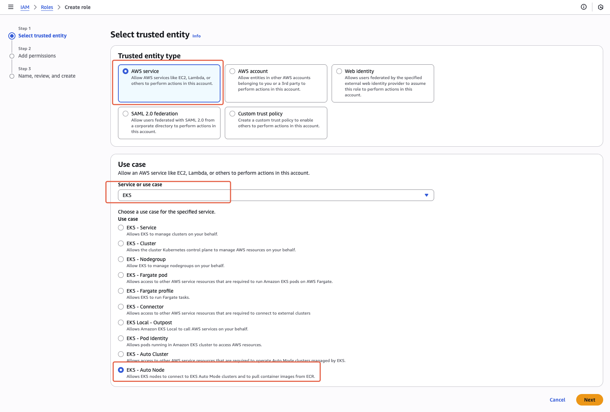

---
   * **Add permissions**默认即可
   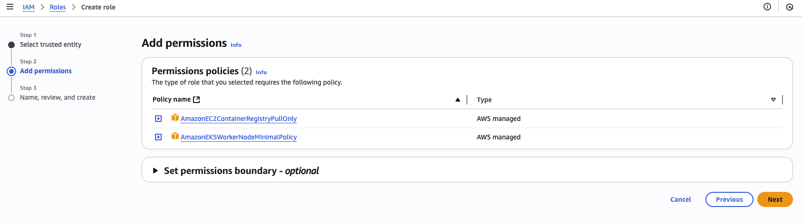
---
   * **Role name**填写：EKS-Auto-Node-Role
   * **Select trusted entities**：会自动生成。
   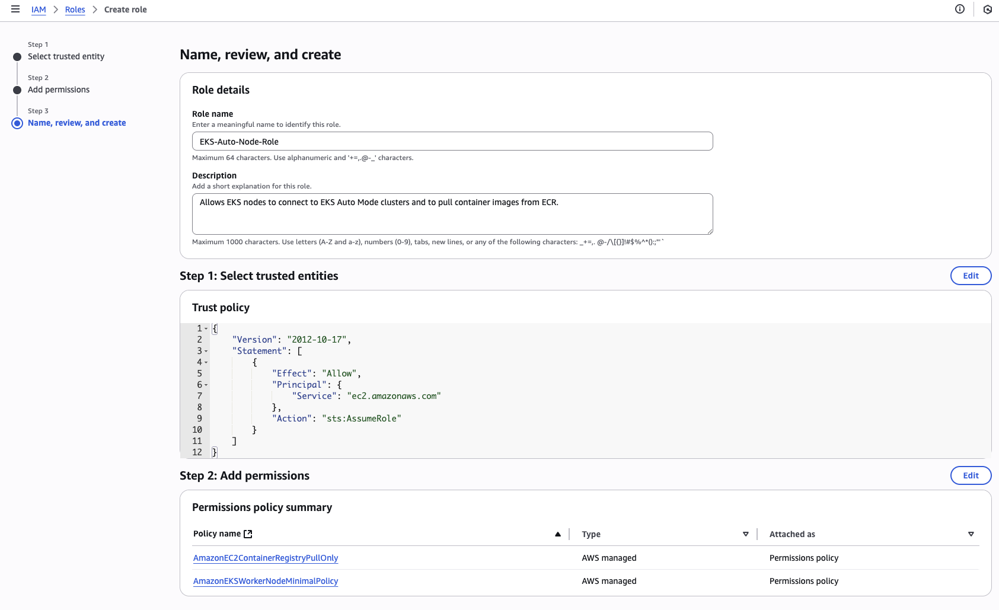
---
   * **Attach Permission:**
   * 进入[AWS IAM Role Console](https://us-east-1.console.aws.amazon.com/iam/home?/roles#/roles)
   * 找到上一步创建的**EKS-Auto-Node-Role**。
   * 点击**Add permissions**并选择**Attach policies**
   * 搜索选中如下图中的四个策略(**AmazonEC2ContainerRegistryReadOnly, AmazonEKS_CNI_Policy, AmazonEKSWorkerNodePolicy, CloudWatchAgentServerPolicy**)进行添加：
   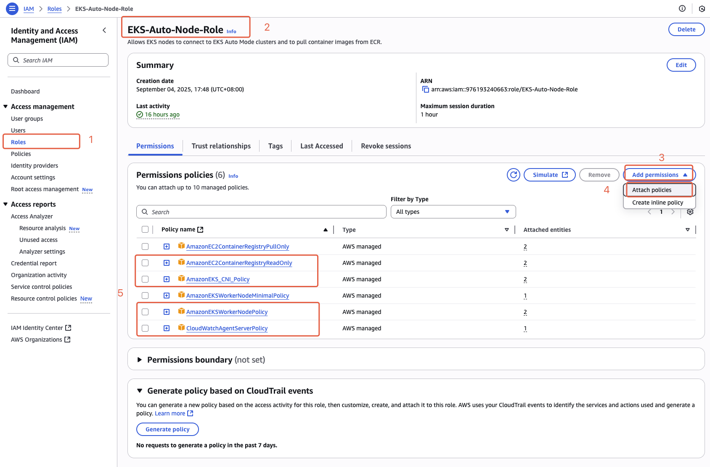
   
### 创建EKS
**创建EKS**  
   - 登录[AWS EKS Console](https://ap-southeast-1.console.aws.amazon.com/eks/clusters?region=ap-southeast-1)
   - 点击**Create cluster**。
   * **Configuration options**选择：`Custom configuration`（自定义配置，支持启用 Auto Mode 并调整集群参数）。
   * **EKS Auto Mode**选择：`Use EKS Auto Mode`（EKS 自动管理计算、存储和网络资源，按需扩展节点）。
   * **Cluster configuration → Name**填写：`aws-bu0-dev-cell2-sg_EKS`（集群名称，创建后不可修改）。
   * **Cluster IAM role**选择：`EKS-Auto-Cluster-Role`（上一步创建的IAM Role）。
   * **Kubernetes version**选择：`1.33`（可根据需求变动）。
   * **Node IAM role**选择：`EKS-Node-Role`（上一步创建的IAM Role）。
   * **其余配置**：保持默认即可
   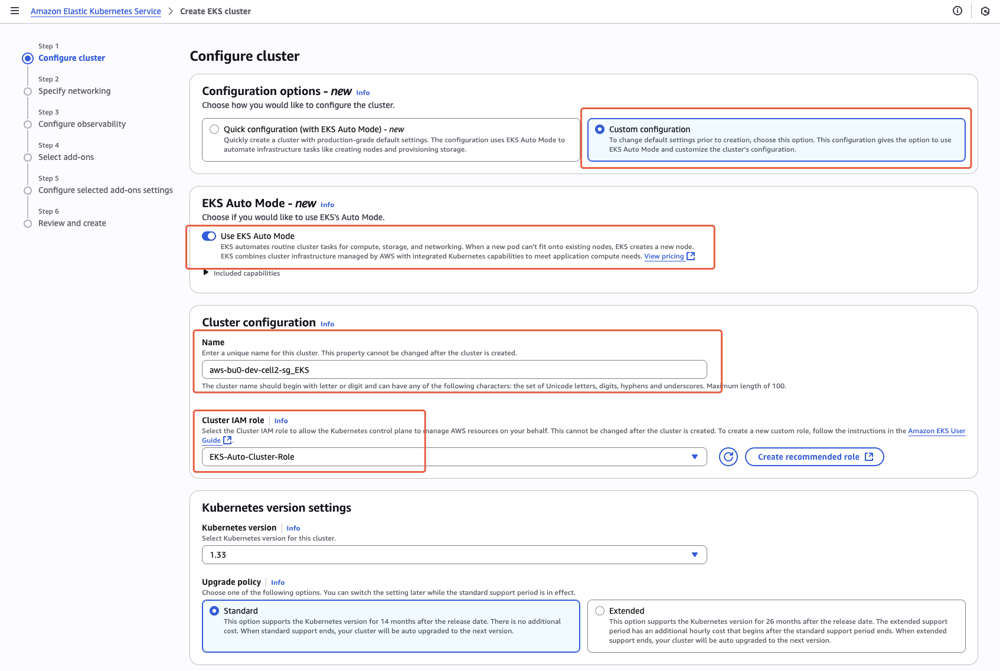
   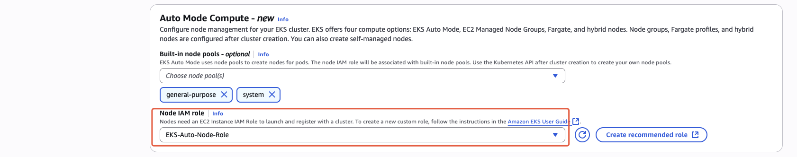
---
   * **VPC**选择：`aws-bu0-dev-cell2-sg_vpc`
   * **Subnets**选择：三个可用区的`node subnets`和`pod subnets`，用于承载EKS节点和控制面接口。
   * **Security groups**选择：`aws-bu0-dev-cell2-sg_security_group`
   * **Cluster endpoint access**选择：`Private`(API访问，生产环境使用Private，只能内部访问)
   * 其余选项保持默认，不作额外配置。
   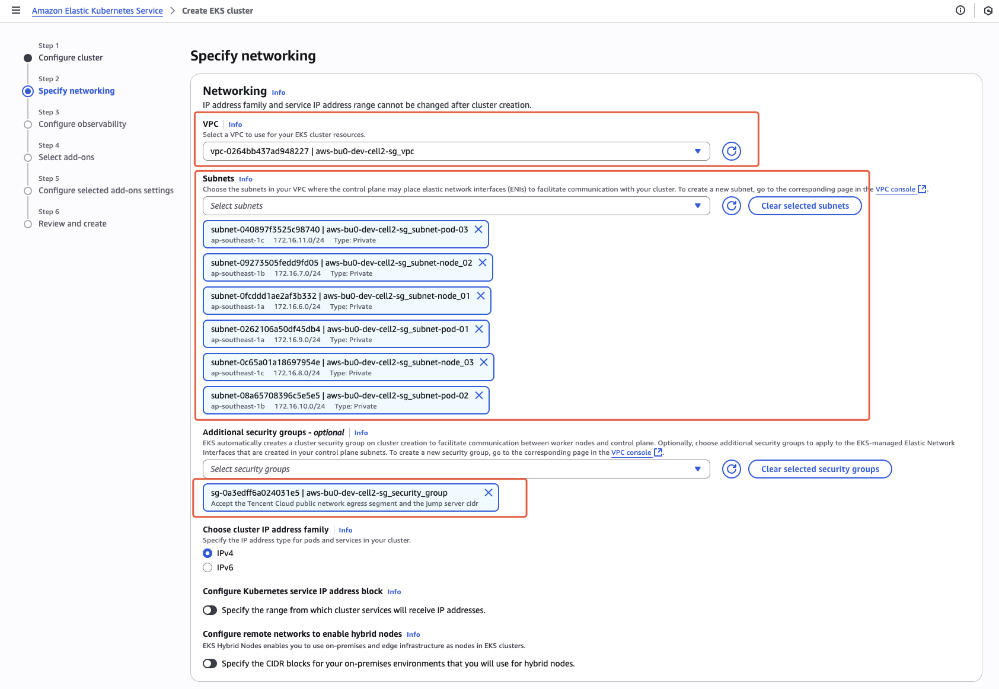
   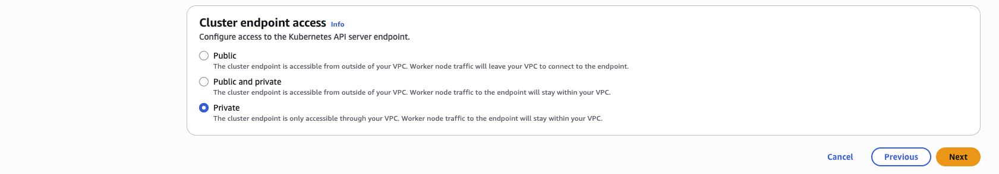

---
   * **Add-ons**配置：
      * **Amazon VPC CNI**：为Pod提供VPC内网IP地址，使Pod能直接使用VPC网段进行通信。
      * **CoreDNS**：集群内的DNS服务，提Service解析和服务发现。
      * **Node monitoring agent**：采集节点健康状态和基础监控数据。
      * **kube-proxy**：实现Kubernetes Service的流量转发和负载均衡。
      * **Amazon EBS CSI Driver**：允许Pod使用**Amazon EBS 块存储**（挂载云硬盘）。
      * **Amazon EFS CSI Driver**：允许Pod使用**Amazon EFS 文件存储**（支持多节点共享存储）。
      * **Amazon CloudWatch Observability**：安装CloudWatch Agent，启用**Container Insights**和**应用监控 (Application Signals)**。
      * **Metrics Server**：安装metrics-server以收集集群范围的资源使用情况数据，用于自动扩缩和监控。
   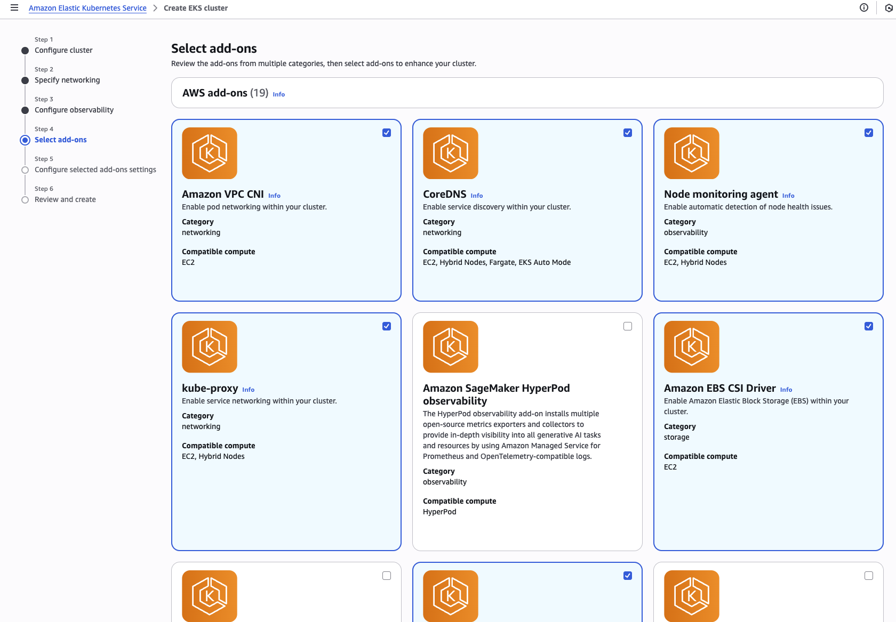
      * **其余默认，点击next后create完成创建**

### EKS连接方法
```bash
# [local host] 连接到跳板机
ssh -i @/path/to/Jump_Server_Key_pair.pem ubuntu@ec2-18-143-160-189.ap-southeast-1.compute.amazonaws.com
sudo su
apt-get update
# 前提条件：安装aws-cli
apt install unzip
curl -fsSLO "https://awscli.amazonaws.com/awscli-exe-linux-x86_64.zip"
unzip -q awscli-exe-linux-x86_64.zip
sudo ./aws/install --update
aws --version
# 配置awscli身份信息，填入文档开头操作中创建的AKSK信息，Default region name [None]: ap-southeast-1，Default output format [None]: json
aws configure
# 通过awscli根据EKS名称连接
aws eks update-kubeconfig --region ap-southeast-1 --name aws-bu0-dev-cell2-sg_EKS
# 测试集群连接
kubectl get nodes
```

---
### 创建EKS Node Groups
**创建EKS Node Groups Role**
   - 登录[AWS IAM Console](https://us-east-1.console.aws.amazon.com/iam/home?/roles#/roles)
   - 点击**Create role**。
   * **Select trusted entity**选择：`AWS service`
   * **Use case**下拉选择：`EC2`。
   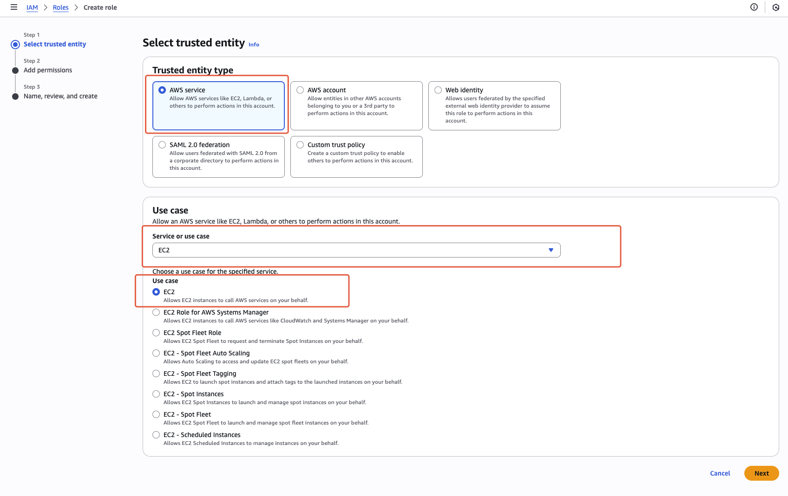
---
   * **Add permissions**: 选择如下permissions
   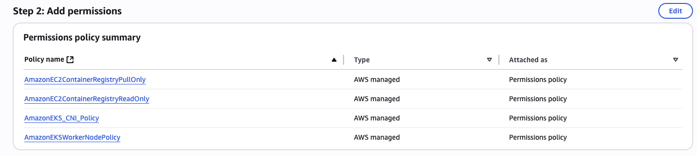
---
   * **Role name**填写：EKS-Auto-Cluster-Role
   * **Select trusted entities**：会自动生成。
   


**创建EKS-Node**
   - 登录[AWS EKS Console](https://ap-southeast-1.console.aws.amazon.com/eks/clusters?region=ap-southeast-1)
   - 点击选择创建的集群**aws-bu0-dev-cell2-sg_EKS**
   - 待集群创建完成后，进入**Compute**栏点击**Add node group**
   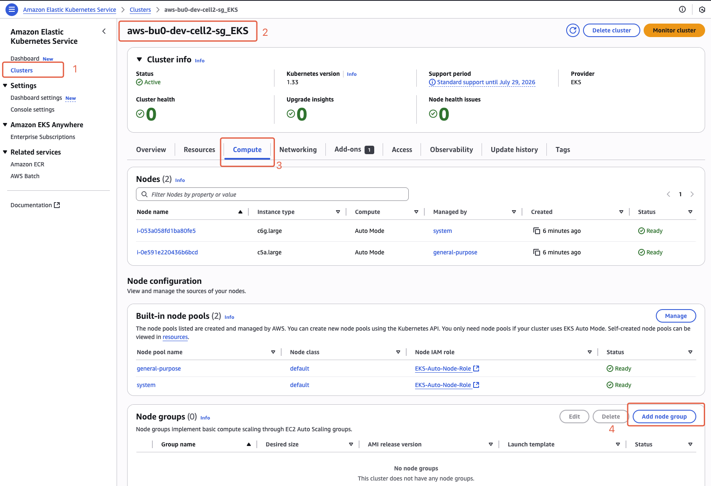
   * **Name**填写：`aws-bu0-dev-cell2-sg_EKS_node_group`（节点组名称，创建后不可更改）。
   * **Node IAM role**点击：`Create recommended role`（根据默认指引完成IAM role创建）。可以取名为`EKS-Node-Group-Role`，刷新Node IAM role后选择该角色。
   * **Launch template**：(可选)已有的EC2 Launch Template，用于自定义节点配置。
   * **Tags**：添加了标签`Project=AWS-IaC`，方便后续资源管理与成本归类。
   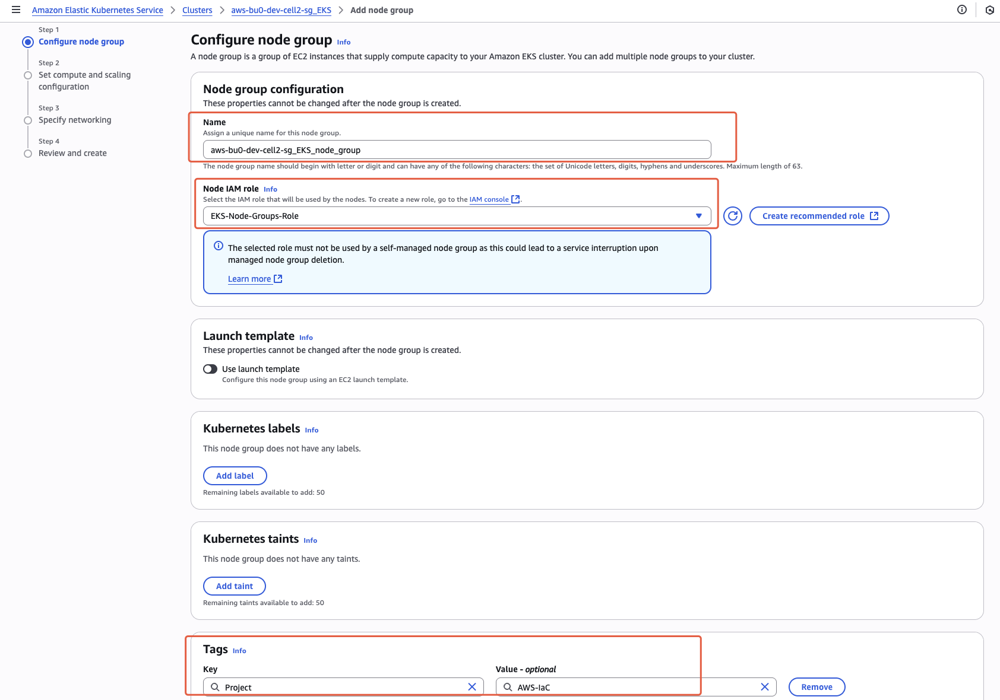
---
   * **AMI type**选择：`Amazon Linux 2023 (x86_64) Standard`。
   * **Capacity type**选择：`On-Demand`（按需实例，保证稳定性，适合生产环境）。
   * **Instance types**选择：`c5.xlarge`（4 vCPU，8 GiB内存，最高10Gbps网络带宽）。
   * **Disk size**填写：`50 GiB`（每个节点挂载的EBS云盘大小）。
   * **Node group scaling configuration**（节点组扩缩容配置）：
      * **Desired size**：`2`（期望节点数量，默认启动2个节点）。
      * **Minimum size**：`1`（最少保持1个节点）。
      * **Maximum size**：`3`（最多可扩展到3个节点）。
   * **Enable node auto repair**：启动节点自修功能。
   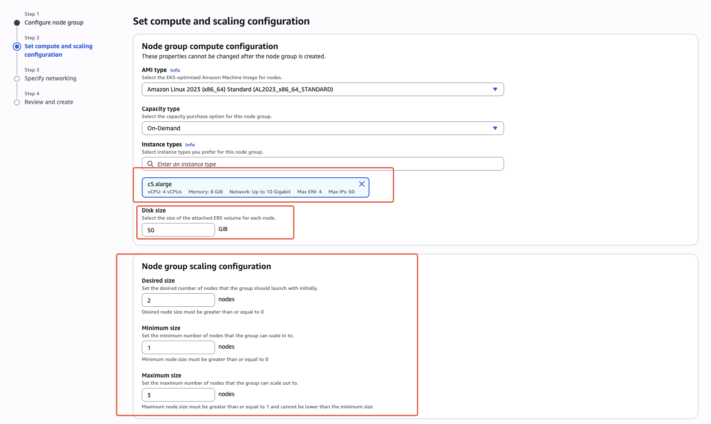
   * **Subnets**：配置选择`Node`的三个网段
   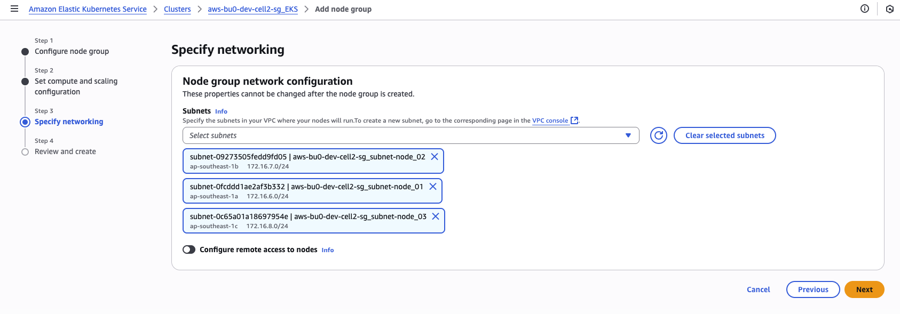
   * **其余配置**默认即可，点击`Create`创建Node Group


## 9. 部署Auto Scaling

以下步骤创建Amazon Auto Scaling

### 创建Launch template
**创建EC2 Launch template**
   - 登录[AWS EC2 template Console](https://ap-southeast-1.console.aws.amazon.com/ec2/home?region=ap-southeast-1#LaunchTemplates:)
   - 点击**Create launch template**。
   * **Launch template name** 填写：`aws-bu0-dev-cell2-sg_app0_template`。
   * **Template version description** 可选，填写版本说明，例如：`v0.0.0`。
   * **Application and OS Images (Amazon Machine Image)** 部分：此处为示例选择，可以根据实际应用需求配置自定义镜像。
   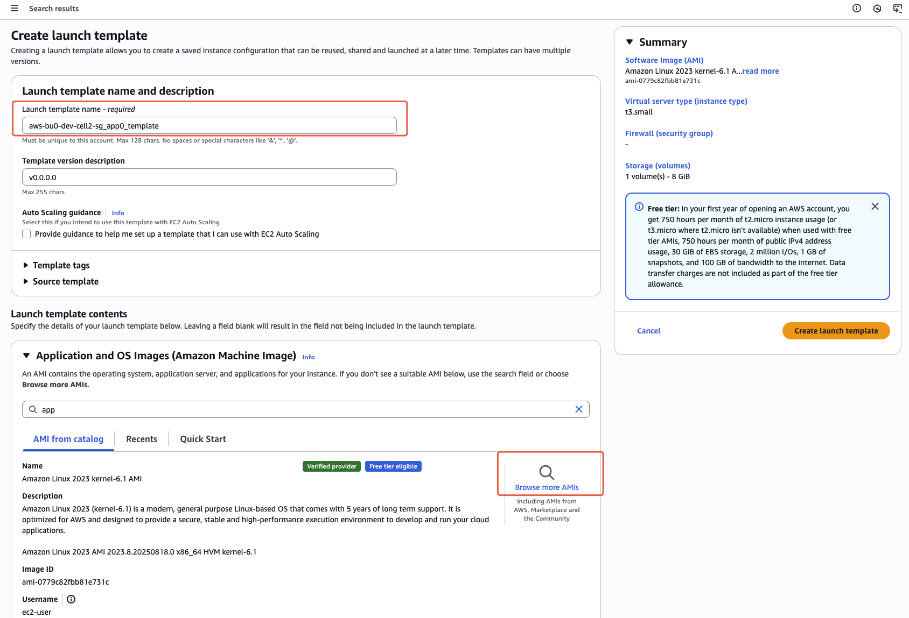
---
   * **Key pair (login)**：可以新建一个密钥对：`AS_bu0_app0_key_pair`作为登录密钥对。
  * **Firewall (security groups)**：选择已存在的安全组 `aws-bu0-dev-cell2-sg_security_group`，用来控制实例的入站/出站流量。
   * **Storage (volumes) Size (GiB)**：设置为 `50`，即为根卷分配 50GB 存储空间。。
   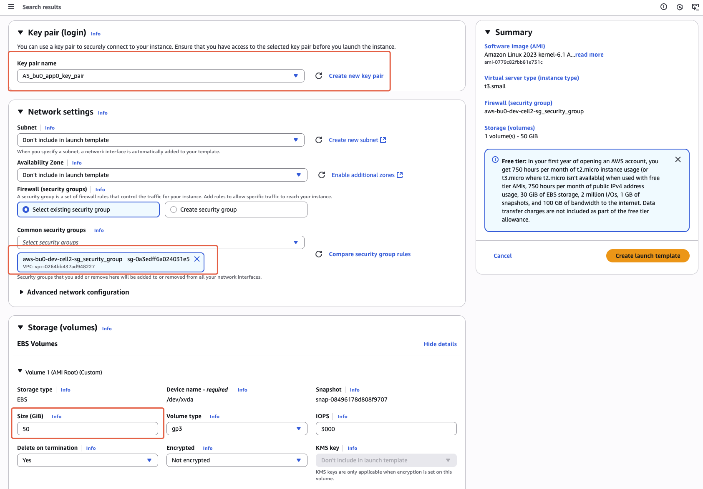

### 创建Auto Scaling groups
**创建EC2 Auto Scaling groups**
   - 登录[AWS EC2 Scaling groups Console](https://ap-southeast-1.console.aws.amazon.com/ec2/home?region=ap-southeast-1#AutoScalingGroups:)
   - 点击**Create Auto Scaling group**。
   * **Auto Scaling group name** 填写：`aws-bu0-dev-cell2-sg_app0_as_group`。
   * **Launch template**选择：`aws-bu0-dev-cell2-sg_app0_template`。
   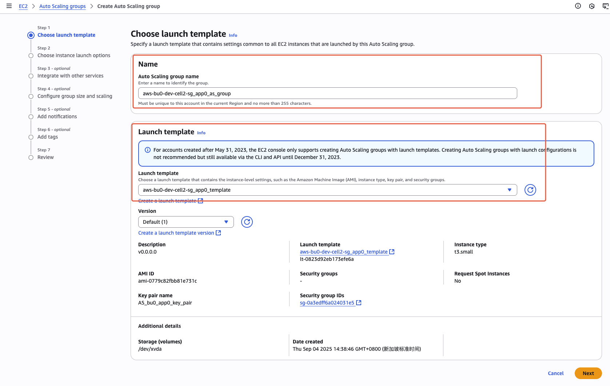

---
   - **VPC ID**选择：`aws-bu0-dev-cell2-sg_vpc`。
   - **Availability Zones and subnets**：添加三个subnets：`aws-bu0-dev-cell2-sg_subnet-mo_01`,`aws-bu0-dev-cell2-sg_subnet-mo_02`和`aws-bu0-dev-cell2-sg_subnet-mo_03`
   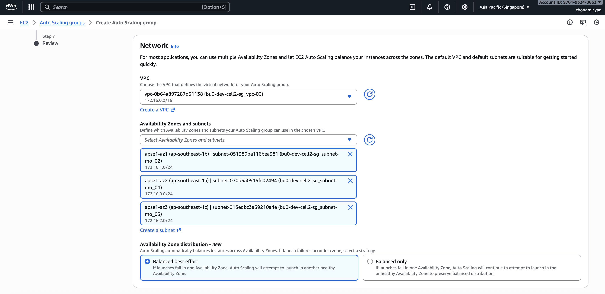
---
   * **Load balancing**选择：`Attach to a new load balancer`（会创建新的LB用作AS group）
   * **Load balancer type**选择：`Network Load Balancer`（NLB，支持TCP、UDP、TLS等协议，适合高性能网络转发）。
   * **Load balancer name**填写：`aws-bu0-dev-cell2-sg-app0-lb`（为负载均衡器定义名称）。
   * **Load balancer scheme**选择：`Internal`（内网型负载均衡，集群只在VPC内部访问，不对公网暴露）。
   * **Network mapping**选择：VPC `aws-bu0-dev-cell2-sg_vpc`，并在三个可用区（ap-southeast-1a、1b、1c）分别选择子网。
   * **Listeners and routing**协议填写：`TCP:80`，新建目标组并命名为：`app0-target-group`。
   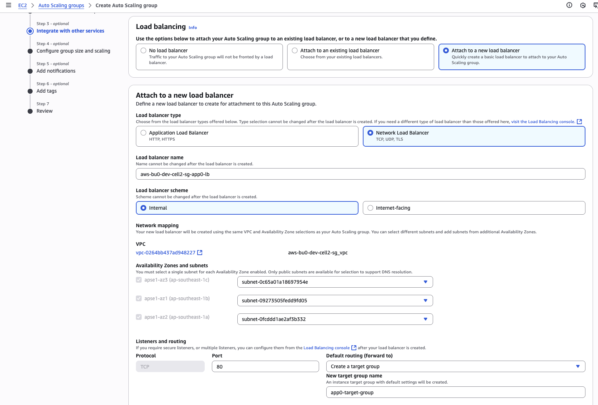

   * **Tags**添加：Key=`Project`，Value=`AWS-IaC`（便于资源分组和管理）。
   * **Health checks**：
      * **EC2 health checks**：默认启用（监控EC2实例状态）。
      * **Additional health check types**：启用`Elastic Load Balancing health checks`（推荐，可结合NLB/ALB检测应用可用性）。
   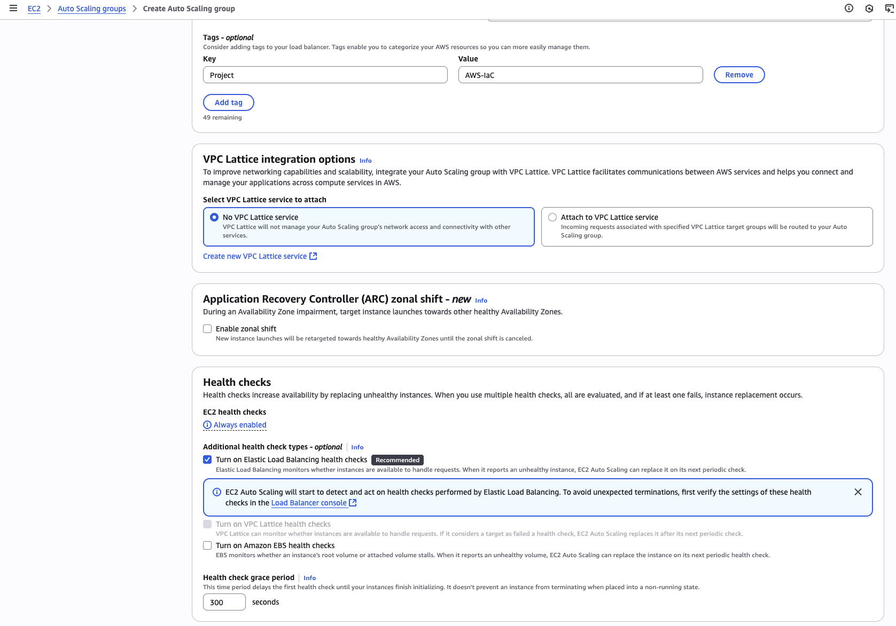
---
   * **Desired capacity**填写：`2`（期望组内运行2台实例）。
   * **Scaling limits**：

   * **Min desired capacity**填写：`1`（最少保持1台实例）。
   * **Max desired capacity**填写：`3`（最多扩展到3台实例）。
   * **Automatic scaling**选择：`No scaling policies`（不启用自动伸缩策略，保持固定大小，可后续再手动添加CloudWatch指标策略）。
   * **Instance maintenance policy**选择：`Launch before terminating`（优先保证可用性，新实例准备就绪后再终止旧实例，避免容量瞬时下降）。
   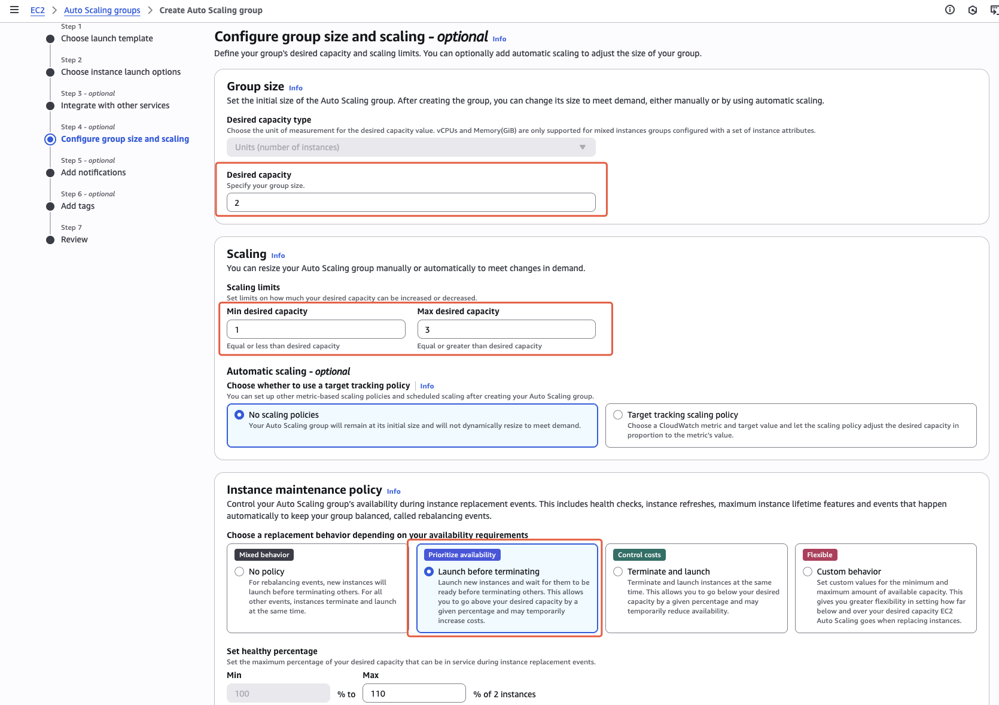
---


## 10. 部署ingress controller

以下步骤创建Amazon Load balancer(用于创建cluster ingress controller)，由于直接通过手动：创建Target groups > 创建LB的方法需要先手动在EKS完成ingress-controller pod的创建再编辑Target groups，操作过于麻烦，因此直接通过helm代码部署ingress controller并由EKS托管LB。
**查看subnet ID**
   - 登录[AWS Subnets Console](https://ap-southeast-1.console.aws.amazon.com/vpcconsole/home?region=ap-southeast-1#subnets:)
   - 点击查看**aws-bu0-dev-cell2-sg_subnet-node_01、aws-bu0-dev-cell2-sg_subnet-node_02和aws-bu0-dev-cell2-sg_subnet-node_03**的`Subnet ID`。
```bash
# [remote server]
# 安装helm
curl -fsSL -o get_helm.sh https://raw.githubusercontent.com/helm/helm/main/scripts/get-helm-3
chmod 700 get_helm.sh
./get_helm.sh

# 配置subnet标签
export CLUSTER_NAME=aws-bu0-dev-cell2-sg_EKS
export REGION=ap-southeast-1
export subnet-node_01=xxx
export subnet-node_02=xxx
export subnet-node_03=xxx

aws ec2 create-tags \
  --resources $subnet-node_01 $subnet-node_02 $subnet-node_03 \
  --tags Key=kubernetes.io/cluster/$CLUSTER_NAME,Value=shared \
         Key=kubernetes.io/role/internal-elb,Value=1 \
  --region $REGION

#部署Ingress Nginx Controller
kubectl create namespace ingress-nginx
helm repo add ingress-nginx https://kubernetes.github.io/ingress-nginx
helm repo update
helm upgrade --install ingress-nginx ingress-nginx/ingress-nginx \
  -n ingress-nginx \
  --set controller.kind=DaemonSet \
  --set controller.service.type=LoadBalancer \
  --set controller.service.annotations."service\.beta\.kubernetes\.io/aws-load-balancer-type"=nlb \
  --set controller.service.annotations."service\.beta\.kubernetes\.io/aws-load-balancer-scheme"=internal \
  --set controller.service.annotations."service\.beta\.kubernetes\.io/aws-load-balancer-nlb-target-type"=instance \
  --set controller.service.annotations."service\.beta\.kubernetes\.io/aws-load-balancer-cross-zone-enabled"="true" \
  --set controller.metrics.enabled=true
```