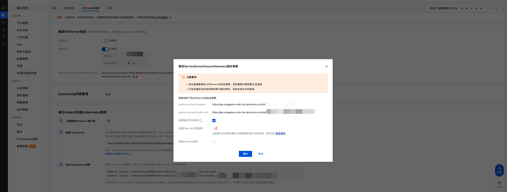
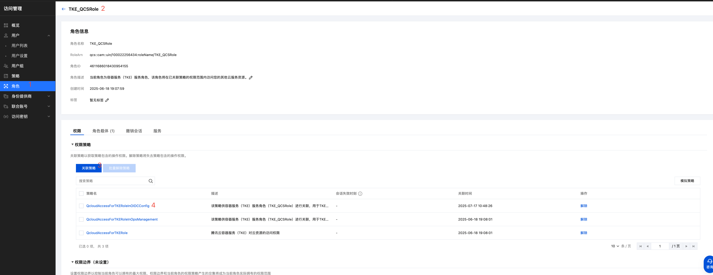
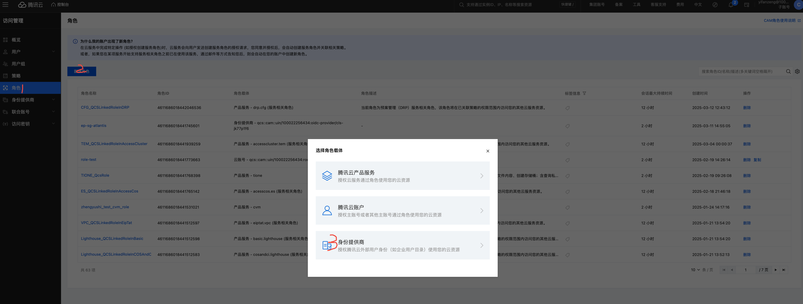
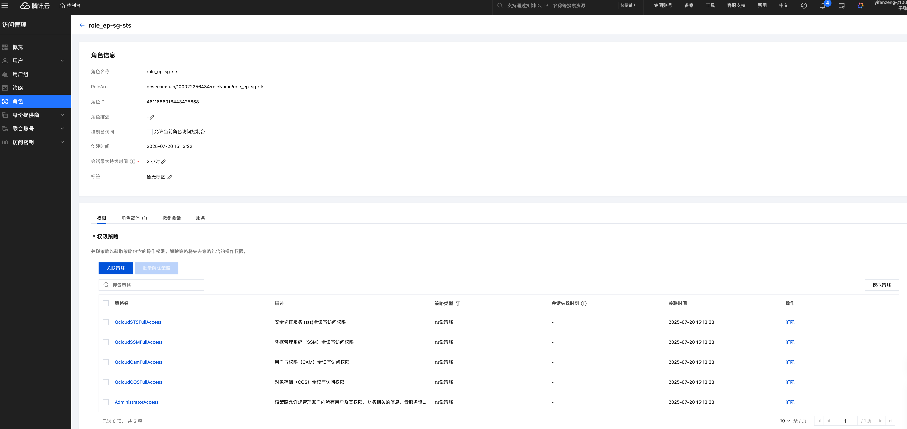
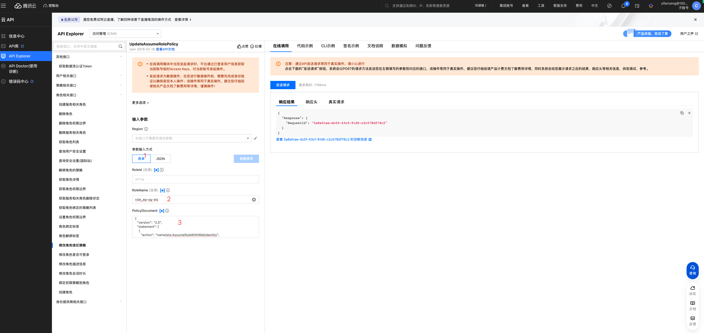
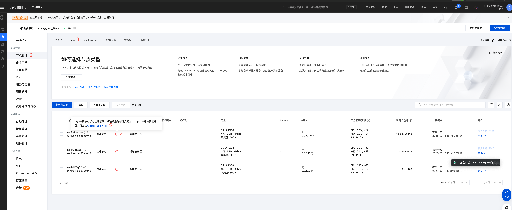
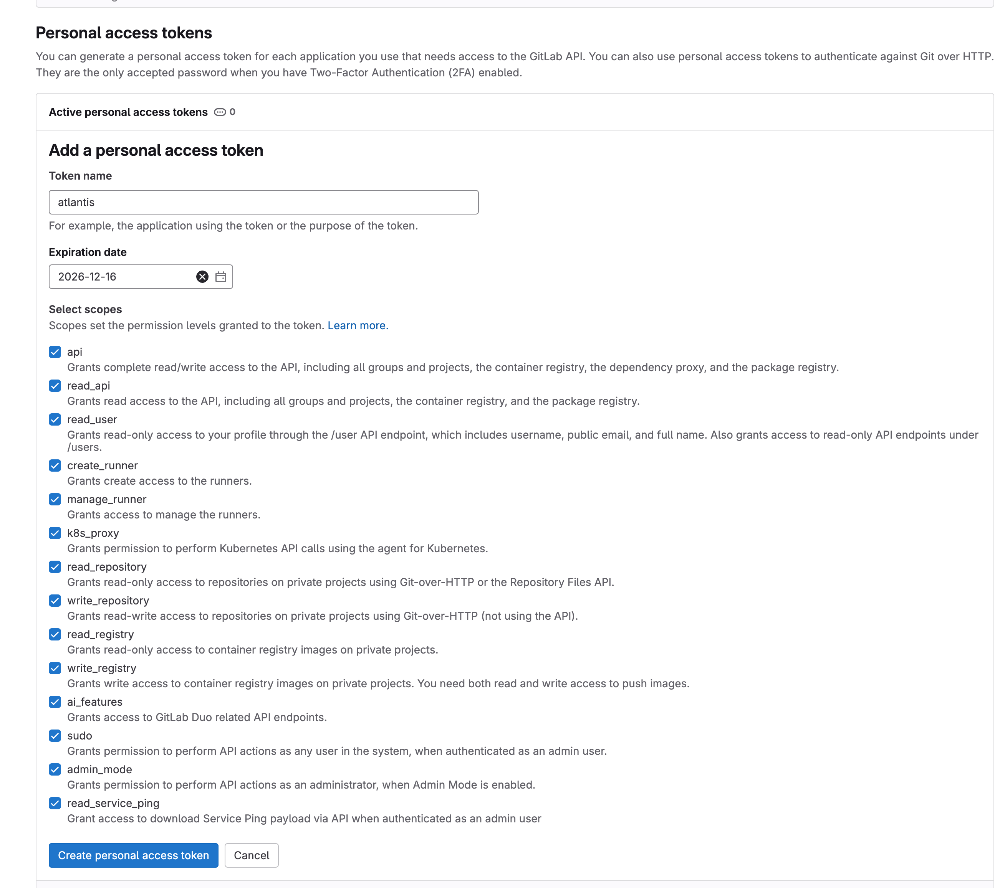

# 1. 前置流程准备

- 购买域名：由于官方没有提供该Terraform模块，需要手动购买
- 购买cos桶用于配置tf backend，配置路径version.tf
- 创建腾讯云角色role_ep-sg-iac管理ep-sg资源（当前还是个人账号）：https://console.cloud.tencent.com/cam/role

# 2. 创建腾讯云资源

目的：创建ep-sg的所有云资源，如vpc, subnet, security group, tke, clb, cvm等资源.
```bash
# [local server]部署依赖工具: terraform
wget https://releases.hashicorp.com/terraform/1.9.8/terraform_1.9.8_linux_amd64.zip
unzip terraform_1.9.8_linux_amd64.zip
cp terraform /usr/local/bin/
terraform -h
# [local server]配置env.tf(补全gitlab、atlantis、grafana等密码)
vim env.tf
# [local server]使用terraform命令创建资源
source /root/.tencentcloud/profile-singapore
terraform init
terraform apply
```

# 3. 配置TKE集群支持角色扮演

## 3.1 原理
由于Gitlab runner使用Packer打包腾讯云虚拟机镜像依赖STS，所以创建"role_ep-sg-sts"角色:
参考链接：https://www.tencentcloud.com/zh/document/product/457/57285#55813262-a0e5-40c6-a491-115038db0b33
原理简要说明：
- TKE集群创建CAM OIDC提供商(会创建腾讯云组件)
- 创建腾讯云角色并绑定角色载体为OIDC提供商
- 创建K8s serviceAccount
- Pod配置serviceAccount（mount到某个path下的加密文件）

## 3.2 开启OIDC提供商
tke集群创建CAM OIDC提供商(此步骤已通过tf代码自动完成)

如果是该账号第一次执行开启OIDC供应商，需要给tke角色TKE_QCSRole配置QcloudAccessForTKERoleInOIDCConfig策略：https://console.cloud.tencent.com/cam/role/detail?roleId=4611686018430954155


## 3.3 创建腾讯云角色
创建腾讯云角色role_ep-sg-sts

配置身份供应商
- iss: https://ap-singapore-oidc.tke.tencentcs.com/id/xxx(注意不需要后缀‘/openid/v1/jwks’)
- aud: sts.cloud.tencent.com

配置权限
- AdministratorAccess
- QcloudSTSFullAccess
- QcloudCamFullAccess
- QcloudSSMFullAccess
- QcloudCOSFullAccess


## 3.4 修改OIDC载体参数
调用openAPI修改AssumeRoleWithWebIdentity策略: https://console.cloud.tencent.com/api/explorer?Product=cam&Version=2019-01-16&Action=UpdateAssumeRolePolicy

- 1 选择表单
- 2 Role Name配置：role_ep-sg-sts
- 3 PolicyDocument配置2个参数
  - federated参数配置tke cluster id
  - oidc url参数配置tke cluster oidc的jwks URL
```json
{
  "version": "2.0",
  "statement": [
    {
      "action": "name/sts:AssumeRoleWithWebIdentity",
      "effect": "allow",
      "principal": {
        "federated": "qcs::cam::uin/100022256434:oidc-provider/cls-7a9vyodw"
      },
      "condition": {
        "string_equal": {
          "oidc:iss": [
            "https://ap-singapore-oidc.tke.tencentcs.com/id/7cbe7ca928b336f266bd6bf3"
          ],
          "oidc:aud": [
            "sts.cloud.tencent.com"
          ]
        }
      }
    }
  ]
}
```

# 4. 部署Gitlab
因为tke只开了内网连接没有开公网连接，所以通过公网IP远程ssh登录云上虚拟机才能操作tke。（注意terraform apply命令的output有tke和cvm的信息）
```bash
# [local server]拷贝本地ssh公钥到cvm
ssh-copy-id -i ~/.ssh/id_rsa.pub -p 22 ubuntu@{公网IP}
# [local server]远程拷贝
scp -P 22 -r gitlab ubuntu@{公网IP}:/home/ubuntu/
# [local server]登录cvm（腾讯云的ubuntu系统默认只能通过ubuntu用户登录）
ssh -p 22 ubuntu@{公网IP}
# [remote server]登录cvm成功后，已经默认安装部署好了kubectl, helm, jq, argocd等命令行工具
sudo su
# [remote server]配置ep的tke集群: $HOME/Downloads
export EP_TKE_ID_CONFIG="cls-xxx-config"
mkdir -p $HOME/Downloads/ep-tke/
vim $HOME/Downloads/ep-tke/${EP_TKE_ID_CONFIG}
unset KUBECONFIG; export EP_TKE_ID_CONFIG="cls-xxx-config"; export KUBECONFIG=$KUBECONFIG:$HOME/Downloads/ep-tke/${EP_TKE_ID_CONFIG}; kubectl get nodes
```
控制台获取tke集群权限（如果是其他人部署的集群，需要申请一次权限操作）

使用Helm部署Gitlab
```bash
# [remote server]指定集群环境并部署gitlab
kubectl create namespace gitlab
# [remote server] 使用腾讯云角色ep-sg-sts创建k8s service account并自动绑定到gitlab
kubectl apply -f gitlab-service-account.yaml
# [remote server]创建gitlab secret，添加申请的https://gitlab.gitlab-ops-ep-sg.overseasops.com证书
kubectl create secret tls gitlab-dashboard \
  --cert=gitlab-dashboard.crt \
  --key=gitlab-dashboard.key \
  -n gitlab
kubectl create secret tls gitlab-registry \
  --cert=gitlab-registry.crt \
  --key=gitlab-registry.key \
  -n gitlab
# [remote server]部署gitlab
helm repo add gitlab https://charts.gitlab.io/
helm upgrade -n gitlab --install -f gitlab-values.yaml gitlab gitlab/gitlab --version 9.0.0 --timeout 600s --create-namespace
# [remote server]helm post: 更新证书,将tls的secretName配置修改为gitlab-dashboard和gitlab-registry（不需要操作了：当前通过修改gitlab-values.yaml的模版文件指定这2个ingress的证书secret）
# kubectl -n gitlab edit ingress gitlab-webservice-default (已实现自动配置)
# kubectl -n gitlab edit ingress gitlab-registry (已实现自动配置)
# [remote server]获取gitlab的登录密码，用户名是root。并浏览器访问gitlab管理页面：https://gitlab.gitlab-ops-ep-sg.overseasops.com/
kubectl -n gitlab get secret gitlab-gitlab-initial-root-password -o json | jq -r '.data.password' | base64 -d && echo
```

# 5. 部署Argocd
使用Helm部署Argocd
```bash
# [local server]远程拷贝
scp -P 22 -r argocd ubuntu@{公网IP}:/home/ubuntu/
ssh -p 22 ubuntu@{公网IP}
# [remote server]指定集群环境部署argocd
sudo su
cd /home/ubuntu/argocd
unset KUBECONFIG; export EP_TKE_ID_CONFIG="cls-7a9vyodw-config"; export KUBECONFIG=$KUBECONFIG:$HOME/Downloads/ep-tke/${EP_TKE_ID_CONFIG}; kubectl get nodes
# [remote server]部署argocd
kubectl create namespace argocd
kubectl apply -f argocd-secret.yaml
helm repo add argo https://argoproj.github.io/argo-helm
helm upgrade -n argocd --install -f argocd-values.yaml argocd argo/argo-cd --version 8.0.3 --timeout 600s --create-namespace
# [remote server]获取argocd的登录密码，用户名是admin。并浏览器访问argocd管理页面：https://argocd-ops-ep-sg.overseasops.com/
kubectl -n argocd get secret argocd-initial-admin-secret -o jsonpath="{.data.password}" | base64 -d
```

# 6. 部署Atlantis
创建gitlab token: https://gitlab.gitlab-ops-ep-sg.overseasops.com/-/user_settings/personal_access_tokens
- 设置token name: atlantis
- 保存生成的token


修改Atlantis的Gitlab Webhook配置，并使用Helm部署Atlantis
```bash
# [local server]远程拷贝
scp -P 22 -r atlantis ubuntu@{公网IP}:/home/ubuntu/
ssh -p 22 ubuntu@{公网IP}
# [remote server]配置gitlab token到atlantis的配置文件中，文件名为atlantis-values.yaml
# 1. Gitlab的Webhook，默认不需要修改
# 2. Gitlab的token：参数GITLAB_USER设置为atlantis, GITLAB_SECRET和GITLAB_TOKEN设置为token
sudo su
cd /home/ubuntu/atlantis
vim atlantis-values.yaml
unset KUBECONFIG; export EP_TKE_ID_CONFIG="cls-7a9vyodw-config"; export KUBECONFIG=$KUBECONFIG:$HOME/Downloads/ep-tke/${EP_TKE_ID_CONFIG}; kubectl get nodes
kubectl create namespace atlantis
# 应用PVC，PV用于存放workspace以及provider plugin cache
kubectl apply -f atlantis-pvc.yaml
# 应用provider init job，实现IaC providers本地初始化
kubectl apply -f atlantis-provider-init-job.yaml
# [remote server] 使用腾讯云角色ep-sg-atlantis创建k8s service account并自动绑定到atlantis；使用腾讯云ssl证书id创建k8s secret并自动绑定到k8sservice
kubectl apply -f atlantis-service-account.yaml
# [remote server]由于需要从腾讯云镜像仓库pull安装了tccli工具的atlantis容器镜像，因此需要手动配置密码
# [remote server]腾讯云大客户账号镜像仓库地址：https://console.cloud.tencent.com/tcr/repository/tcr/tcr-dsecgbo6/images/atlantis/33/tagList
kubectl -n atlantis create secret docker-registry tencentcr \
  --docker-server=<registry-url> \
  --docker-username=<your-username> \
  --docker-password=<your-password>
helm repo add runatlantis https://runatlantis.github.io/helm-charts
helm upgrade -n atlantis --install -f atlantis-values.yaml atlantis runatlantis/atlantis --version 5.17.2 --timeout 600s --create-namespace
# [remote server] 查看配置的管理员用户名和密码，浏览器访问atlantis管理页面：https://atlantis-ops-ep-sg.overseasops.com/
cat /home/ubuntu/atlantis/atlantis-values.yaml | grep -A 2 'basicAuth'
```

# 7. 部署Consul
使用Helm部署Consul
```bash
# [local server]远程拷贝
scp -P 22 -r consul ubuntu@{公网IP}:/home/ubuntu/
ssh -p 22 ubuntu@{公网IP}
# [remote server]通过跳板机连接ep-sg的tke集群
sudo su
cd /home/ubuntu/consul
unset KUBECONFIG; export EP_TKE_ID_CONFIG="cls-7a9vyodw-config"; export KUBECONFIG=$KUBECONFIG:$HOME/Downloads/ep-tke/${EP_TKE_ID_CONFIG}; kubectl get nodes
[remote server]在tke集群部署consul
kubectl create namespace consul
# [remote server]创建SSL证书并将配置在CLB类型的Service
kubectl apply -f consul-secret.yaml
helm repo add hashicorp https://helm.releases.hashicorp.com
helm upgrade -n consul --install -f consul-values.yaml consul hashicorp/consul --version 1.7.1 --timeout 600s --create-namespace --set global.name=consul --set global.acls.manageSystemACLs=true --set global.acls.createBootstrapSecret=true
# 不需要用户名，只需要token就能登录, 浏览器访问atlantis管理页面：https://consul-ops-ep-sg.overseasops.com/
export CONSUL_HTTP_TOKEN=$(kubectl get --namespace consul secrets/consul-bootstrap-acl-token --template={{.data.token}} | base64 -d)
```

# 8. 卸载
```bash
# [remote server]卸载应用
export EP_TKE_ID_CONFIG=""
export KUBECONFIG=$KUBECONFIG:$HOME/Downloads/ep-tke/${EP_TKE_ID_CONFIG}
# [remote server]卸载gitlab
helm -n gitlab delete gitlab
kubectl -n gitlab get secret | grep gitlab | awk '{print $1}' | xargs kubectl -n gitlab delete secret
kubectl -n gitlab get pvc | grep pvc | awk '{print $1}' | xargs kubectl -n gitlab delete pvc
# [remote server]卸载argocd
helm -n argocd delete argocd
kubectl -n argocd get secret | grep argocd | awk '{print $1}' | xargs kubectl -n argocd delete secret
# [remote server]卸载atlantis
helm -n atlantis delete atlantis
kubectl -n atlantis get secret | grep atlantis | awk '{print $1}' | xargs kubectl -n atlantis delete secret
kubectl -n atlantis get pvc | grep pvc | awk '{print $1}' | xargs kubectl -n atlantis delete pvc
# [remote server]卸载consul
helm -n consul delete consul
kubectl -n consul get secret | grep consul | awk '{print $1}' | xargs kubectl -n consul delete secret
kubectl -n consul get pvc | grep pvc | awk '{print $1}' | xargs kubectl -n consul delete pvc
# [remote server]删除资源
terraform destroy
```

# 9. 代码结构说明
- env.tf: 部署前需要考虑修改的参数
- landingzone.tf: 创建账号、网络、安全等资源
- iaas.tf: 创建计算、存储等资源
- paas.tf: 创建tke资源
- saas.tf: 创建gitlab, atlantis, argocd依赖的clb, ssl, domain record等资源；以及渲染模板文件，比如values.yaml, Secret, ServiceAccount等
- tftpl: 模板文件，根据创建的公有云资源的实际id进行渲染，比如配置CLB类型的SVC需要CLB id
- gitlab: 渲染后的gitlab的values.yaml, Secret, ServiceAccount等
- argocd: 渲染后的atlantis的values.yaml, Secret, ServiceAccount等
- atlantis: 渲染后的argocd的values.yaml, Secret, ServiceAccount等
- consul: 渲染后的consul的values.yaml, Secret, ServiceAccount等

# 10. QA
- 本地和虚拟机网络不通
  - 原因：虚拟机配置了安全组
  - 解决办法：修改安全组，添加本地公网出口。通过“curl ifconfig.me”命令返回本地公网出口，然后追加该网段到配置文件，并重新执行apply操作。
- 手动安装ArgoCD,kubectl,helm,jq等命令行工具
  ```bash
  curl -sSL -o argocd-linux-amd64 https://github.com/argoproj/argo-cd/releases/latest/download/argocd-linux-amd64
  sudo install -m 555 argocd-linux-amd64 /usr/local/bin/argocd
  
  curl -LO "https://dl.k8s.io/release/$(curl -L -s https://dl.k8s.io/release/stable.txt)/bin/linux/amd64/kubectl"
  chmod +x kubectl
  cp kubectl /usr/local/bin/
  
  curl -fsSL -o get_helm.sh https://raw.githubusercontent.com/helm/helm/main/scripts/get-helm-3
  chmod 700 get_helm.sh
  ./get_helm.sh
  
  apt install jq
  ```
- terrform plan找不到资源
  - 报错内容
  ```bash
  # 直接terraform plan报错
  Error: [TencentCloudSDKError] Code=InvalidParameter, Message=cluster XXXXXX not found, RequestId=b6d8eba7-ecaf-4a59-b7cd-01556e27ad8c
  # 尝试import资源
  │ Error: Cannot import non-existent remote object
  │ 
  │ While attempting to import an existing object to "module.network.tencentcloud_vpc.vpc[0]", the provider detected
  │ that no object exists with the given id. Only pre-existing objects can be imported; check that the id is correct
  │ and that it is associated with the provider's configured region or endpoint, or use "terraform apply" to create a
  │ new remote object for this resource.
  ```
  - 报错原因
    - AKSK无权访问
    - region设置错误: terraform provider默认在guangzhou地域执行，而该架构处于Singapore地域
  - 解决方法
  ```bash
  # 方法一：严格执行
  source /root/.tencentcloud/profile-singapore
  # 方法二：添加provider region
  # 添加如下内容到version.tf末尾
  provider "tencentcloud" {
  region = "ap-singapore"
  }
  ```
